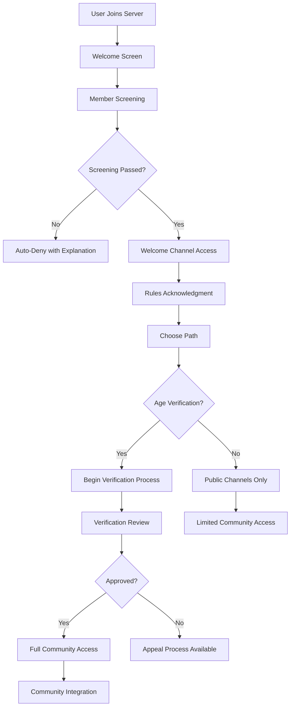

# Growmies NJ Discord Bot - Administrator Guide

## 👑 Complete Server Administration Guide for Cannabis Community Management

**Target Audience**: Server administrators, moderators, community managers  
**Estimated Time**: 60-90 minutes for complete understanding  
**Prerequisites**: Discord admin permissions, understanding of cannabis compliance requirements

---

## 📋 Table of Contents

1. [Administrator Roles & Responsibilities](#administrator-roles--responsibilities)
2. [Server Setup & Configuration](#server-setup--configuration)
3. [User Management & Moderation](#user-management--moderation)
4. [Age Verification Administration](#age-verification-administration)
5. [Content Moderation & Compliance](#content-moderation--compliance)
6. [Channel Management](#channel-management)
7. [Bot Management & Commands](#bot-management--commands)
8. [Community Events Administration](#community-events-administration)
9. [Legal Compliance Management](#legal-compliance-management)
10. [Emergency Procedures & Crisis Management](#emergency-procedures--crisis-management)

---

## 👑 Administrator Roles & Responsibilities

### Administrative Hierarchy

#### Role Structure & Permissions
```mermaid
graph TD
    A[Server Owner] --> B[Head Administrator]
    B --> C[Senior Administrator]
    C --> D[Administrator]
    D --> E[Senior Moderator]
    E --> F[Moderator]
    F --> G[Junior Moderator]
    G --> H[Community Helper]
    H --> I[@Verified 21+ Members]
    I --> J[@Unverified Members]
```

#### Role Definitions & Responsibilities

**Server Owner** 👑
```yaml
Permissions: Full server control
Responsibilities:
  - Ultimate legal and operational responsibility
  - Strategic direction and policy decisions
  - Emergency decision-making authority
  - Legal compliance oversight
  - Staff hiring and termination
  - Budget and resource management

Critical Tasks:
  - Legal document review and approval
  - Major policy changes
  - Crisis management leadership
  - External partnership decisions
  - Insurance and liability management
```

**Head Administrator** 🔰
```yaml
Permissions: Nearly full server control (minus owner transfer)
Responsibilities:
  - Daily operational management
  - Staff coordination and supervision
  - Policy implementation and enforcement
  - Community growth strategy
  - Legal compliance monitoring

Daily Tasks:
  - Staff performance review
  - Escalated issue resolution
  - Community health assessment
  - Strategic planning implementation
  - External communication management
```

**Senior Administrator** 🛡️
```yaml
Permissions: Full moderation + server configuration
Responsibilities:
  - Advanced server configuration
  - Bot management and updates
  - Channel and role management
  - Compliance system oversight
  - Staff training and development

Daily Tasks:
  - Bot performance monitoring
  - Advanced moderation cases
  - System configuration updates
  - Staff mentoring and training
  - Compliance audit coordination
```

**Administrator** ⚡
```yaml
Permissions: Advanced moderation + limited configuration
Responsibilities:
  - User management and verification
  - Content moderation supervision
  - Event planning and execution
  - Community engagement initiatives
  - Documentation maintenance

Daily Tasks:
  - Age verification review
  - Moderation case review
  - Event coordination
  - Community feedback analysis
  - Resource development oversight
```

**Senior Moderator** 🚨
```yaml
Permissions: Full moderation capabilities
Responsibilities:
  - Real-time content moderation
  - User behavior monitoring
  - Incident response coordination
  - New moderator training
  - Compliance violation handling

Daily Tasks:
  - Active moderation duties
  - User appeal reviews
  - Incident documentation
  - Team coordination
  - Escalation management
```

**Moderator** 🛡️
```yaml
Permissions: Standard moderation tools
Responsibilities:
  - Content monitoring and removal
  - User warnings and timeouts
  - Channel management support
  - Community guideline enforcement
  - Educational content promotion

Daily Tasks:
  - Real-time chat monitoring
  - Rule violation responses
  - User education and guidance
  - Report investigation
  - Community support
```

### Staff Selection & Training

#### Recruitment Criteria
```json
{
  "staffRequirements": {
    "mandatory": {
      "age": "21+ (legal cannabis age)",
      "location": "New Jersey or cannabis-legal state",
      "experience": "Discord server experience",
      "availability": "Minimum 10 hours/week",
      "background": "Clean background check",
      "cannabis": "Personal cannabis knowledge"
    },
    "preferred": {
      "moderation": "Previous moderation experience",
      "cannabis": "Growing or industry experience",
      "legal": "Legal or compliance background",
      "communication": "Strong written communication",
      "technology": "Technical aptitude",
      "community": "Community building experience"
    },
    "disqualifying": {
      "legal": "Cannabis-related criminal convictions",
      "behavior": "History of online harassment",
      "commercial": "Active cannabis business conflicts",
      "age": "Under 21 years old",
      "reliability": "Demonstrated unreliability"
    }
  }
}
```

#### Training Program
```yaml
New Staff Training (2-week program):

Week 1 - Foundation:
  Day 1-2: Server overview and community mission
  Day 3-4: Discord administration tools and features
  Day 5-6: Cannabis law compliance requirements
  Day 7: New Jersey specific regulations and updates

Week 2 - Practical:
  Day 8-9: Moderation techniques and de-escalation
  Day 10-11: Age verification and user management
  Day 12-13: Crisis response and emergency procedures
  Day 14: Final assessment and certification

Ongoing Training:
  - Monthly cannabis law updates
  - Quarterly Discord feature training
  - Annual crisis response drills
  - Specialized skill development opportunities
```

#### Performance Management
```yaml
Staff Evaluation Metrics:
  Response Time:
    - Average response to reports: <30 minutes
    - Availability during assigned shifts: >90%
    - Emergency response time: <15 minutes

  Decision Quality:
    - Moderation decision accuracy: >95%
    - Compliance violation detection: >98%
    - Appeal overturn rate: <10%
    - User satisfaction with interactions: >85%

  Community Impact:
    - Member retention in areas managed: >95%
    - Educational content contribution: Monthly minimum
    - Peer staff satisfaction: >90%
    - Professional development participation: 100%

  Legal Compliance:
    - Compliance violation detection: 100%
    - Documentation completeness: 100%
    - Training certification maintenance: Current
    - Legal update acknowledgment: <24hrs
```

---

## ⚙️ Server Setup & Configuration

### Initial Server Configuration

#### Basic Server Settings
```json
{
  "serverConfiguration": {
    "general": {
      "serverName": "Growmies NJ - Cannabis Education Community",
      "region": "US East",
      "verificationLevel": "High",
      "explicitContentFilter": "All members",
      "defaultNotifications": "Only @mentions",
      "afkTimeout": "15 minutes",
      "afkChannel": "AFK Lounge"
    },
    "security": {
      "twoFactorAuth": "Required for staff",
      "phoneVerification": "Required for age verification",
      "dmSpam": "Enabled",
      "inviteSpam": "Enabled",
      "mentionSpam": "Enabled",
      "serverJoinCooldown": "10 minutes"
    },
    "features": {
      "communityServer": true,
      "memberScreening": true,
      "welcomeScreen": true,
      "discoverable": false,
      "partnered": false,
      "verified": false
    }
  }
}
```

#### Welcome Screen Configuration
```yaml
Welcome Screen Setup:
  Title: "Welcome to Growmies NJ"
  Description: "New Jersey's Premier Cannabis Education Community"
  
  Welcome Channels:
    - #rules-and-info: "📋 Start here - Community guidelines and legal information"
    - #age-verification: "🔒 21+ Verification required for cannabis content"
    - #general-chat: "💬 General community discussions"
    - #introductions: "👋 Introduce yourself to the community"
    
  Requirements:
    - Read and accept server rules
    - Acknowledge 21+ age requirement for cannabis content
    - Agree to legal compliance and educational focus
    - Understand consequences of rule violations
```

#### Member Screening Setup
```yaml
Screening Questions:
  1. "Are you at least 21 years old?"
     Required: Yes
     Compliance: Age verification requirement
     
  2. "Do you understand this server is for educational purposes only?"
     Required: Yes
     Purpose: Set expectations for community focus
     
  3. "Will you comply with New Jersey cannabis laws and regulations?"
     Required: Yes
     Legal: Compliance commitment
     
  4. "Do you agree to respect other members and maintain civility?"
     Required: Yes
     Community: Behavior expectations

Auto-Actions:
  - "No" to any question: Automatic deny with explanation
  - "Yes" to all: Proceed to welcome screen
  - Incomplete: Hold for manual review
```

### Channel Structure & Organization

#### Cannabis Content Channels (21+ Only)
```yaml
Cannabis Education Category:
  #growing-basics:
    Type: Text
    Permissions: "@Verified 21+" read/write, others denied
    Slowmode: 30 seconds
    Topic: "Beginner-friendly cannabis cultivation education and support"
    
  #advanced-techniques:
    Type: Text  
    Permissions: "@Verified 21+" read/write, others denied
    Slowmode: 60 seconds
    Topic: "Expert-level growing methods and complex problem solving"
    
  #strain-discussion:
    Type: Text
    Permissions: "@Verified 21+" read/write, others denied
    Slowmode: 45 seconds
    Topic: "Cannabis genetics, strain reviews, and breeding education"
    
  #harvest-help:
    Type: Text
    Permissions: "@Verified 21+" read/write, others denied
    Slowmode: 30 seconds
    Topic: "Harvesting, drying, curing, and storage education"
    
  #equipment-reviews:
    Type: Text
    Permissions: "@Verified 21+" read/write, others denied
    Slowmode: 120 seconds
    Topic: "Growing equipment reviews and recommendations"

Cannabis Voice Channels:
  Growing Help Voice:
    Type: Voice
    Permissions: "@Verified 21+" connect/speak, others denied
    User Limit: 25
    Bitrate: 64kbps
    
  Expert Q&A Voice:
    Type: Voice  
    Permissions: "@Verified 21+" connect, "@Expert" speak
    User Limit: 50
    Bitrate: 96kbps
```

#### Public Community Channels
```yaml
Community Category:
  #general-chat:
    Type: Text
    Permissions: "@everyone" read/write
    Slowmode: 15 seconds
    Topic: "General community discussions - keep it friendly!"
    
  #introductions:
    Type: Text
    Permissions: "@everyone" read/write
    Slowmode: 300 seconds (5 minutes)
    Topic: "Introduce yourself to the Growmies NJ community"
    
  #off-topic:
    Type: Text
    Permissions: "@everyone" read/write
    Slowmode: 10 seconds
    Topic: "Gaming, music, hobbies, and non-cannabis discussions"
    
  #resources:
    Type: Text
    Permissions: "@everyone" read, "@Contributor+" write
    Slowmode: None
    Topic: "Educational resources, guides, and reference materials"

Voice Channels:
  General Hangout:
    Type: Voice
    Permissions: "@everyone" connect/speak
    User Limit: 15
    Bitrate: 64kbps
    
  Music & Chill:
    Type: Voice
    Permissions: "@everyone" connect/speak
    User Limit: 10
    Bitrate: 96kbps
```

#### Administrative Channels
```yaml
Staff Category:
  #staff-general:
    Type: Text
    Permissions: "@Staff" only
    Topic: "General staff coordination and discussions"
    
  #moderation-log:
    Type: Text
    Permissions: "@Moderator+" read, bot write
    Topic: "Automated moderation action logs"
    
  #age-verification-queue:
    Type: Text
    Permissions: "@Administrator+" only
    Topic: "Age verification reviews and approvals"
    
  #compliance-alerts:
    Type: Text
    Permissions: "@Senior Staff" only
    Topic: "Legal compliance notifications and alerts"
    
  #incident-reports:
    Type: Text
    Permissions: "@Administrator+" only
    Topic: "Serious incident documentation and response"

Staff Voice:
  Staff Meeting Room:
    Type: Voice
    Permissions: "@Staff" only
    User Limit: 20
    Bitrate: 128kbps
    
  Admin War Room:
    Type: Voice
    Permissions: "@Administrator+" only
    User Limit: 10
    Bitrate: 128kbps
```

### Role Configuration & Permissions

#### User Roles
```yaml
@Verified 21+:
  Color: Green (#00ff00)
  Permissions:
    - View channels (cannabis content)
    - Send messages
    - Embed links
    - Attach files
    - Read message history
    - Use external emojis
    - Add reactions
    - Connect to voice
    - Speak in voice
  Restrictions:
    - No mention everyone
    - No manage messages
    - No ban/kick members

@Community Helper:
  Color: Light Blue (#87ceeb)
  Permissions: All @Verified 21+ permissions plus:
    - Manage messages (own channels)
    - Move members (voice)
    - Priority speaker
  Purpose: Experienced members helping newcomers

@Contributor:
  Color: Orange (#ffa500)
  Permissions: All @Verified 21+ permissions plus:
    - Send messages in #resources
    - Create events
    - Use voice activity
  Purpose: Active educational content creators

@Expert:
  Color: Purple (#9370db)
  Permissions: All @Contributor permissions plus:
    - Manage messages (in expertise areas)
    - Mentioning @everyone in designated channels
    - Create instant invites
  Purpose: Recognized subject matter experts
```

#### Staff Roles
```yaml
@Junior Moderator:
  Color: Light Red (#ff6b6b)
  Permissions:
    - View audit log
    - Manage messages
    - Kick members
    - Manage nicknames
    - Mute members
    - Deafen members
    - Move members
  Restrictions:
    - No ban members
    - No manage channels
    - No manage server

@Moderator:
  Color: Red (#ff0000)
  Permissions: All Junior Moderator plus:
    - Ban members
    - View server insights
    - Manage emojis
    - Use slash commands (moderation)
  Additional: Age verification queue access

@Senior Moderator:
  Color: Dark Red (#8b0000)
  Permissions: All Moderator plus:
    - Manage channels (limited)
    - Manage webhooks
    - Create instant invites
    - Change nickname
  Additional: Training authorization

@Administrator:
  Color: Blue (#0000ff)
  Permissions: All Senior Moderator plus:
    - Manage server (limited)
    - Manage roles (below admin)
    - Manage channels (full)
    - Administrator (channel specific)
  Additional: Bot management authority

@Senior Administrator:
  Color: Dark Blue (#000080)
  Permissions: All Administrator plus:
    - Full administrator permissions
    - Manage server (full)
    - Manage roles (all non-owner)
  Additional: Legal compliance authority

@Head Administrator:
  Color: Gold (#ffd700)
  Permissions: All Senior Administrator plus:
    - Full server control (except ownership transfer)
    - Emergency powers
  Additional: Staff management authority
```

---

## 👥 User Management & Moderation

### User Lifecycle Management

#### New User Onboarding Process


#### User Status Tracking
```yaml
User Lifecycle Stages:
  New_Join:
    Duration: First 24 hours
    Monitoring: Increased attention to behavior
    Support: Welcome message and guidance
    Restrictions: Limited permissions while learning
    
  Unverified_Member:
    Duration: Until age verification or permanent
    Access: Public channels only
    Monitoring: Standard community guidelines
    Support: Age verification assistance available
    
  Pending_Verification:
    Duration: Up to 72 hours for review
    Access: Public channels only
    Monitoring: Increased privacy protection
    Support: Staff assistance with process
    
  Verified_Member:
    Duration: Permanent (unless revoked)
    Access: All cannabis content channels
    Monitoring: Standard monitoring
    Support: Full community features
    
  Probationary:
    Duration: 30-90 days depending on violation
    Access: Restricted based on violation type
    Monitoring: Enhanced monitoring
    Support: Rehabilitation focus
    
  Suspended:
    Duration: 1-30 days based on severity
    Access: No server access
    Monitoring: Appeal tracking
    Support: Appeal process available
    
  Banned:
    Duration: Permanent
    Access: No server access
    Monitoring: Ban evasion detection
    Support: Limited appeal process
```

### Moderation Tools & Commands

#### Essential Moderation Commands
```bash
# User Information Commands
/userinfo @user                    # Complete user profile and history
/warnings @user                    # View user's warning history
/modlogs @user                     # View all moderation actions for user
/alts @user                        # Check for alternative accounts

# Moderation Actions
/warn @user [reason]               # Issue warning with documentation
/timeout @user [duration] [reason] # Temporary mute (1m-28d)
/kick @user [reason]               # Remove user from server
/ban @user [duration] [reason]     # Ban user (temp or permanent)
/unban [user_id] [reason]          # Remove ban from user

# Content Moderation
/purge [count] [user]              # Delete multiple messages
/slowmode [channel] [seconds]      # Set channel slowmode
/lock [channel] [reason]           # Lock channel to staff only
/unlock [channel]                  # Restore channel permissions

# Age Verification Commands
/verify [user_id] approve          # Approve age verification
/verify [user_id] deny [reason]    # Deny age verification
/verify [user_id] pending          # Mark verification as pending review
/verify queue                      # View verification queue

# Cannabis Compliance Commands
/compliance scan @user             # Scan user for compliance violations
/compliance report [incident_id]  # Generate compliance report
/compliance alert [type] [details] # Trigger compliance alert
```

#### Advanced Moderation Features
```javascript
// Automated Moderation System Configuration
const moderationConfig = {
  automod: {
    enabled: true,
    strictness: 'high',
    channels: {
      cannabis: 'strict',      // Extra strict in cannabis channels
      public: 'medium',        // Standard moderation in public
      staff: 'low'            // Minimal moderation for staff
    }
  },
  
  spam_detection: {
    duplicate_messages: 3,      // 3 identical messages = auto-timeout
    message_frequency: 5,       // 5 messages in 10 seconds = slowmode
    mention_spam: 5,           // 5+ mentions = auto-timeout
    emoji_spam: 10,            // 10+ emojis = warning
    caps_threshold: 70         // 70%+ caps = auto-warn
  },
  
  content_filtering: {
    cannabis_sales: 'auto_delete',     // Immediate removal
    medical_advice: 'flag_review',     // Flag for staff review
    personal_info: 'auto_delete',      // Immediate removal + warn
    external_discord: 'flag_review',   // Review before removal
    cannabis_consumption: 'auto_warn'  // Warning + education
  },
  
  age_protection: {
    minor_keywords: 'immediate_ban',   // Underage claims = instant ban
    fake_id: 'immediate_ban',          // Fake ID discussion = ban
    age_circumvention: 'immediate_ban' // Bypass attempts = ban
  }
};
```

### User Appeals & Conflict Resolution

#### Appeal Process Framework
```yaml
Appeal Types & Procedures:

Moderation Action Appeals:
  Eligible Actions:
    - Warnings (if believed unfair)
    - Timeouts (if excessive or wrong)
    - Kicks (if based on misunderstanding)
    - Bans (if evidence disputes exist)
    
  Appeal Process:
    1. Submit via ModMail within 7 days
    2. Provide clear explanation and evidence
    3. Staff review within 24-48 hours
    4. Decision communicated with reasoning
    5. Final appeal to Head Administrator if needed
    
  Review Criteria:
    - Evidence quality and relevance
    - Staff action appropriateness
    - User history and intent
    - Community impact and safety
    - Legal compliance requirements

Age Verification Appeals:
  Eligible Situations:
    - Document rejected due to technical issues
    - Identity verification problems
    - System errors or processing delays
    - Alternative verification needs
    
  Appeal Process:
    1. Contact verification team via DM
    2. Provide additional documentation
    3. Explain verification challenges
    4. Alternative verification consultation
    5. Manual review by senior staff
    
  Alternative Options:
    - Sworn legal attestation
    - Video verification call
    - Third-party verification service
    - Delayed verification with probation
```

#### Conflict Mediation Procedures
```yaml
Interpersonal Conflict Resolution:

Level 1 - Community Mediation:
  Facilitator: Senior Community Helper or Moderator
  Process:
    - Private voice channel discussion
    - Structured conversation format
    - Agreement on communication guidelines
    - Follow-up check-ins
    - Documentation of resolution
    
Level 2 - Staff Mediation:
  Facilitator: Administrator or Senior Moderator
  Process:
    - Formal mediation session
    - Written agreements if needed
    - Temporary separation if required
    - Behavior modification plans
    - Regular progress reviews
    
Level 3 - Administrative Intervention:
  Authority: Head Administrator or Senior Staff
  Actions:
    - Formal warnings or restrictions
    - Probationary periods
    - Role or permission adjustments
    - Mandatory cooling-off periods
    - Final resolution decisions

Escalation Criteria:
  - Repeated conflicts between same users
  - Harassment or threatening behavior
  - Cannabis compliance implications
  - Staff disagreement on resolution
  - Legal or safety concerns
```

---

## 🔒 Age Verification Administration

### Verification Process Management

#### Verification Queue Management
```yaml
Daily Verification Tasks:
  Morning Review (9:00 AM EST):
    - Check overnight verification submissions
    - Prioritize urgent verification requests
    - Review any flagged submissions
    - Process standard verifications
    - Update verification statistics
    
  Afternoon Review (2:00 PM EST):
    - Process midday submissions
    - Handle verification appeals
    - Address technical issues
    - Coordinate with staff on complex cases
    - Update verification documentation
    
  Evening Review (7:00 PM EST):
    - Final daily verification processing
    - Prepare overnight queue for next day
    - Document any pending issues
    - Send user notifications
    - Complete daily verification report

Queue Management Commands:
  /verify queue list                 # View all pending verifications
  /verify queue priority [user_id]  # Move to priority review
  /verify queue statistics           # View daily/weekly stats
  /verify queue export              # Export verification data
```

#### Document Review Standards
```json
{
  "verificationStandards": {
    "acceptableDocuments": {
      "primary": [
        "US Driver's License",
        "State-issued ID card",
        "US Passport",
        "Military ID (CAC/dependent)"
      ],
      "secondary": [
        "Passport card",
        "Tribal identification",
        "Enhanced driver's license"
      ]
    },
    "documentRequirements": {
      "imageQuality": {
        "resolution": "Minimum 1080p",
        "lighting": "Well-lit, no shadows",
        "focus": "All text clearly readable",
        "orientation": "Proper orientation, not rotated"
      },
      "contentVisibility": {
        "required": [
          "Full name",
          "Date of birth",
          "Photo",
          "Government seal/watermark",
          "Expiration date"
        ],
        "optional": [
          "Address (can be covered)",
          "License/ID number (can be partially covered)",
          "Signature (can be covered)"
        ]
      },
      "securityFeatures": {
        "lookFor": [
          "Government seals or watermarks",
          "Holographic elements",
          "Raised text or surfaces",
          "Consistent font and formatting"
        ],
        "redFlags": [
          "Obvious editing or manipulation",
          "Inconsistent fonts or colors",
          "Missing security features",
          "Unusually perfect quality (possibly fake)"
        ]
      }
    }
  }
}
```

#### Verification Decision Matrix
```yaml
Approval Criteria:
  Automatic Approval:
    - Clear, high-quality document photo
    - All required elements visible
    - Age clearly shows 21+
    - No signs of tampering
    - Standard US government ID format
    
  Manual Review Required:
    - Partially obscured information
    - Older document format
    - International documents
    - Technical image quality issues
    - User has previous verification attempts
    
  Additional Verification Needed:
    - Suspicious document features
    - Age appears close to 21
    - Inconsistent user information
    - Previous compliance violations
    - Staff discretion required

Denial Criteria:
  Immediate Denial:
    - Age under 21
    - Obviously fake or edited document
    - Non-government issued ID
    - Completely illegible document
    - Expired document (>1 year)
    
  Denial with Resubmission Option:
    - Poor image quality
    - Missing required information
    - Wrong document type
    - Technical submission issues
    - Correctable problems

Appeal Process:
  User Appeal Rights:
    - One appeal per denial
    - Additional documentation allowed
    - Alternative verification methods
    - Technical issue consideration
    - Senior staff review available
```

### Privacy & Security Protocols

#### Document Handling Security
```yaml
Security Protocols:

Document Receipt:
  - Automatic encryption upon upload
  - Secure storage in encrypted database
  - Limited access to authorized staff only
  - Audit trail of all document access
  - Automatic deletion after verification

Staff Access Controls:
  - Two-person authorization for sensitive documents
  - Role-based access to verification systems
  - All access logged with timestamp and reason
  - Regular access permission audits
  - Immediate revocation for terminated staff

Data Retention:
  - Verification status: Permanent
  - Document images: Deleted after 30 days
  - Appeal documents: Deleted after 90 days
  - Verification logs: Retained for 2 years
  - Legal hold: Indefinite if required by law
```

#### Privacy Protection Measures
```json
{
  "privacyProtection": {
    "dataMinimization": {
      "collected": [
        "Date of birth (age verification)",
        "Document type (ID validation)",
        "Verification status (access control)",
        "Verification timestamp (audit trail)"
      ],
      "notCollected": [
        "Full name (unless legally required)",
        "Address (unless legally required)",
        "Social security number",
        "Financial information",
        "Unrelated personal information"
      ]
    },
    "accessControls": {
      "viewDocuments": ["Head Admin", "Senior Admin", "Designated Verifier"],
      "approveVerification": ["Administrator+", "Designated Verifier"],
      "viewLogs": ["Senior Moderator+"],
      "exportData": ["Head Admin", "Legal Compliance"],
      "deleteData": ["Head Admin", "Legal Compliance"]
    },
    "userRights": {
      "dataAccess": "Users can request copy of verification data",
      "dataCorrection": "Users can request correction of errors",
      "dataDeletion": "Users can request deletion (legal limits apply)",
      "dataPortability": "Users can receive data in portable format",
      "consentWithdrawal": "Users can withdraw consent (access revoked)"
    }
  }
}
```

---

## ⚖️ Content Moderation & Compliance

### Cannabis Content Guidelines

#### Educational Content Standards
```yaml
Approved Cannabis Content:
  
  Cultivation Education:
    Allowed Topics:
      - Growing techniques and methods
      - Equipment reviews and recommendations
      - Plant biology and science
      - Nutrient and feeding information
      - Environmental control systems
      - Pest and disease management
      - Harvest and curing techniques
      - Legal cultivation limits and compliance
      
    Required Framing:
      - Educational purpose clearly stated
      - Legal compliance emphasis
      - Scientific or factual basis
      - Personal experience for learning
      - Resource and reference citations
      
  Legal Information:
    Allowed Topics:
      - New Jersey cannabis laws
      - Federal vs state law differences
      - Compliance requirements
      - Legal updates and changes
      - Rights and responsibilities
      - Legal consequences of violations
      
    Required Disclaimers:
      - "Not legal advice"
      - "Consult attorney for legal questions"
      - "Laws subject to change"
      - "Individual circumstances vary"

  Scientific Research:
    Allowed Topics:
      - Cannabis plant biology
      - Cannabinoid and terpene research
      - Medical research (with disclaimers)
      - Agricultural science applications
      - Environmental impact studies
      
    Required Standards:
      - Peer-reviewed sources preferred
      - Clear citation of sources
      - Distinction between research and advice
      - Limitations and uncertainties noted
```

#### Prohibited Content Categories
```yaml
Strictly Prohibited:

Commercial Activity:
  - Sales offers or solicitations
  - Price discussions or negotiations
  - Commercial advertisements or promotions
  - Business referrals for profit
  - Product placement or endorsements
  - Vendor recommendations with affiliate links
  
Medical Advice:
  - Specific dosage recommendations
  - Treatment recommendations for conditions
  - Drug interaction information
  - Medical professional impersonation
  - Claims of medical benefits or cures
  - Prescription medication discussions
  
Consumption Content:
  - Photos or videos of consumption
  - "Stash pics" or quantity displays
  - Impairment or intoxication content
  - Party or recreational use stories
  - Consumption method tutorials
  - "Rate my weed" type posts
  
Illegal Activity:
  - Underage access information
  - Interstate transportation plans
  - Federal property cultivation
  - Tax evasion discussions
  - Unlicensed sales coordination
  - Fake ID creation or use

Personal Information:
  - Real names and addresses
  - Contact information sharing
  - Social media account linking
  - Photo sharing with identifiable features
  - Location-specific information
  - Financial or payment information
```

### Automated Moderation System

#### Content Filtering Configuration
```javascript
// Cannabis-Specific Content Filters
const cannabisFilters = {
  // Sales and Commercial Activity Detection
  salesKeywords: {
    triggers: [
      'selling', 'buying', 'for sale', 'price', '$', 'venmo', 'paypal', 
      'cashapp', 'trade', 'exchange', 'deal', 'cheap', 'quality'
    ],
    action: 'immediate_delete',
    punishment: 'timeout_24h',
    notification: 'dm_user_education'
  },
  
  // Medical Advice Detection
  medicalAdvice: {
    triggers: [
      'cure', 'treatment', 'medicine', 'doctor', 'prescription', 'dose',
      'mg', 'dosage', 'medical', 'condition', 'pain', 'anxiety'
    ],
    action: 'flag_for_review',
    context_analysis: true,
    educational_response: true
  },
  
  // Consumption Content Detection
  consumptionContent: {
    triggers: [
      'smoking', 'high', 'stoned', 'blazed', 'session', 'toke',
      'hit', 'joint', 'blunt', 'bong', 'dab', 'edible'
    ],
    action: 'context_dependent',
    educational_redirect: true,
    warning_threshold: 3
  },
  
  // Underage Protection
  ageProtection: {
    triggers: [
      'underage', 'under 21', 'fake id', 'minor', 'high school',
      'teenager', 'kid', 'young', 'parent', 'guardian'
    ],
    action: 'immediate_flag',
    escalation: 'admin_alert',
    investigation_required: true
  },
  
  // Legal Violation Detection
  legalViolations: {
    triggers: [
      'federal', 'illegal', 'transport', 'mail', 'ship', 'across state',
      'unlicensed', 'black market', 'federal land'
    ],
    action: 'immediate_delete',
    escalation: 'compliance_alert',
    documentation_required: true
  }
};

// Moderation Actions Configuration
const moderationActions = {
  immediate_delete: {
    action: 'delete_message',
    log: true,
    notify_user: true,
    escalate_repeated: true
  },
  
  flag_for_review: {
    action: 'flag_message',
    preserve_content: true,
    notify_staff: true,
    response_time: '30_minutes'
  },
  
  timeout_24h: {
    action: 'timeout_user',
    duration: '24_hours',
    reason: 'automated_violation',
    appeal_allowed: true
  },
  
  compliance_alert: {
    action: 'alert_compliance_team',
    preserve_evidence: true,
    legal_documentation: true,
    escalation_path: 'legal_team'
  }
};
```

#### Manual Review Procedures
```yaml
Content Review Workflow:

Level 1 - Automated Review:
  Triggers: AI content analysis, keyword detection
  Actions: Immediate deletion, timeouts, flags
  Escalation: Context-dependent content
  Documentation: All actions logged automatically
  
Level 2 - Moderator Review:
  Triggers: Flagged content, user reports, appeals
  Timeline: 30 minutes during active hours
  Authority: Standard moderation actions
  Escalation: Complex legal or compliance issues
  Documentation: Manual review notes required
  
Level 3 - Administrative Review:
  Triggers: Compliance violations, serious incidents
  Timeline: 1 hour for urgent, 24 hours standard
  Authority: Advanced moderation, policy decisions
  Escalation: Legal counsel, law enforcement
  Documentation: Comprehensive incident reports
  
Level 4 - Legal Review:
  Triggers: Legal compliance questions, law enforcement
  Timeline: 24-48 hours depending on urgency
  Authority: Legal decisions, policy development
  Escalation: External legal counsel
  Documentation: Legal compliance records
```

### Compliance Monitoring & Reporting

#### Daily Compliance Monitoring
```bash
#!/bin/bash
# Daily compliance monitoring script

echo "=== Daily Cannabis Compliance Check - $(date) ==="

# 1. Age Verification Compliance
echo "1. Checking age verification compliance..."
UNVERIFIED_IN_CANNABIS=$(curl -X GET "http://localhost:3001/api/compliance/unverified-cannabis-access" \
  -H "Authorization: Bearer $ADMIN_TOKEN")
echo "Unverified users in cannabis channels: $UNVERIFIED_IN_CANNABIS"

# 2. Content Compliance Scan
echo "2. Scanning for compliance violations..."
VIOLATIONS=$(curl -X GET "http://localhost:3001/api/compliance/daily-violations" \
  -H "Authorization: Bearer $ADMIN_TOKEN")
echo "Today's compliance violations: $VIOLATIONS"

# 3. Sales Activity Detection
echo "3. Checking for sales activity..."
SALES_ATTEMPTS=$(curl -X GET "http://localhost:3001/api/compliance/sales-detection" \
  -H "Authorization: Bearer $ADMIN_TOKEN")
echo "Sales attempts detected: $SALES_ATTEMPTS"

# 4. Medical Advice Monitoring
echo "4. Monitoring medical advice violations..."
MEDICAL_ADVICE=$(curl -X GET "http://localhost:3001/api/compliance/medical-advice" \
  -H "Authorization: Bearer $ADMIN_TOKEN")
echo "Medical advice flags: $MEDICAL_ADVICE"

# 5. Generate Daily Report
echo "5. Generating daily compliance report..."
node scripts/generate-compliance-report.js daily

echo "=== Daily compliance check completed ==="
```

#### Weekly Compliance Audits
```yaml
Weekly Audit Checklist:

User Compliance Review:
  - Age verification completion rates
  - New user onboarding compliance
  - Verification appeals and outcomes
  - User behavior pattern analysis
  - Compliance violation trends

Content Compliance Review:
  - Cannabis content educational quality
  - Prohibited content detection accuracy
  - False positive rate analysis
  - Manual review decision consistency
  - Educational resource effectiveness

System Compliance Review:
  - Automated moderation effectiveness
  - Channel access control verification
  - Role permission accuracy
  - Bot command audit trail
  - Security system functionality

Legal Compliance Review:
  - New Jersey law compliance status
  - Federal regulation adherence
  - Privacy policy compliance
  - Data retention policy compliance
  - Legal documentation completeness

Staff Compliance Review:
  - Staff training completion status
  - Decision-making consistency
  - Response time compliance
  - Documentation quality
  - Escalation procedure adherence
```

---

## 📺 Channel Management

### Channel Organization Strategy

#### Category Structure & Purpose
```yaml
Channel Categories:

📋 Information & Rules:
  Purpose: Essential server information and guidelines
  Channels:
    - #rules-and-info: Server rules and legal disclaimers
    - #announcements: Official server announcements
    - #faq: Frequently asked questions
    - #server-updates: Bot and feature updates
  Permissions: Read-only for most users, staff can post
  
👋 Community Welcome:
  Purpose: New member onboarding and introductions
  Channels:
    - #welcome: Automated welcome messages
    - #introductions: User introductions
    - #age-verification: Age verification process
    - #support: Technical and general support
  Permissions: Everyone can participate
  
💬 General Community:
  Purpose: General discussions and community building
  Channels:
    - #general-chat: Main community discussions
    - #off-topic: Non-cannabis discussions
    - #events: Community events and announcements
    - #feedback: Server feedback and suggestions
  Permissions: Everyone can participate
  
🌱 Cannabis Education (21+ Only):
  Purpose: Cannabis cultivation and education
  Channels:
    - #growing-basics: Beginner cultivation education
    - #advanced-techniques: Expert growing methods
    - #strain-discussion: Cannabis genetics education
    - #harvest-help: Harvesting and curing guidance
    - #equipment-reviews: Growing equipment discussions
    - #legal-updates: Cannabis law news and updates
  Permissions: Verified 21+ users only
  
📚 Resources & Learning:
  Purpose: Educational materials and references
  Channels:
    - #resources: Curated educational content
    - #research: Scientific studies and papers
    - #guides: Step-by-step tutorials
    - #tools: Calculators and helpful tools
  Permissions: Read for everyone, contribute with role
  
🎤 Voice Channels:
  Purpose: Real-time communication and events
  Channels:
    - General Hangout: Open community voice
    - Growing Help Voice: Cannabis cultivation assistance
    - Expert Q&A: Educational sessions
    - Music & Chill: Casual background music
    - Staff Meeting: Private staff discussions
  Permissions: Vary by channel purpose
  
🛡️ Staff & Administration:
  Purpose: Server management and moderation
  Channels:
    - #staff-general: Staff coordination
    - #moderation-log: Automated mod logs
    - #age-verification-queue: Verification reviews
    - #compliance-alerts: Legal compliance notifications
    - #incident-reports: Serious incident documentation
  Permissions: Staff only, varies by role level
```

### Advanced Channel Configuration

#### Channel-Specific Settings
```json
{
  "channelConfigurations": {
    "growing-basics": {
      "slowmode": 30,
      "userLimit": null,
      "nsfw": false,
      "autoArchive": 4320,
      "defaultReactionEmoji": "🌱",
      "pinnedMessages": [
        "Welcome to Growing Basics! Please read our beginner's guide before posting.",
        "Remember: All discussions must be educational and legal compliance focused."
      ],
      "automod": {
        "enabled": true,
        "strictness": "high",
        "cannabisFocus": true
      },
      "rolePermissions": {
        "@Verified 21+": ["view", "send", "embed", "attach", "history", "react"],
        "@Expert": ["view", "send", "embed", "attach", "history", "react", "manage"],
        "@Moderator+": ["view", "send", "embed", "attach", "history", "react", "manage", "pin"]
      }
    },
    
    "age-verification": {
      "slowmode": 300,
      "userLimit": null,
      "nsfw": false,
      "autoArchive": 60,
      "privateThread": true,
      "pinnedMessages": [
        "Age verification is required to access cannabis content. See pinned instructions.",
        "Your privacy is protected. Documents are encrypted and deleted after verification."
      ],
      "automod": {
        "enabled": true,
        "strictness": "maximum",
        "privacyProtection": true
      },
      "specialFeatures": {
        "dmOnlySubmission": true,
        "staffAlerts": true,
        "encryptedStorage": true,
        "auditLogging": true
      }
    },
    
    "staff-general": {
      "slowmode": 0,
      "userLimit": null,
      "nsfw": false,
      "autoArchive": 10080,
      "privateChannel": true,
      "rolePermissions": {
        "@Staff": ["view", "send", "embed", "attach", "history", "react"],
        "@Administrator+": ["view", "send", "embed", "attach", "history", "react", "manage", "pin"]
      },
      "specialFeatures": {
        "confidentialDiscussion": true,
        "incidentReporting": true,
        "escalationPath": true
      }
    }
  }
}
```

#### Channel Templates & Setup Scripts
```bash
#!/bin/bash
# Channel setup automation script

echo "=== Setting up Growmies NJ Channels ==="

# Function to create cannabis education channel
create_cannabis_channel() {
    local channel_name=$1
    local topic=$2
    local slowmode=$3
    
    echo "Creating cannabis channel: $channel_name"
    
    # Create channel with proper permissions
    discord-cli channel create \
        --name "$channel_name" \
        --type "text" \
        --topic "$topic" \
        --slowmode "$slowmode" \
        --category "Cannabis Education" \
        --permissions '@everyone:deny-all,@Verified 21+:allow-standard,@Staff:allow-management'
        
    # Set up channel-specific automod
    discord-cli automod setup \
        --channel "$channel_name" \
        --strictness "high" \
        --cannabis-filters "enabled" \
        --compliance-monitoring "enabled"
        
    # Add welcome message
    discord-cli message send \
        --channel "$channel_name" \
        --content "Welcome to #$channel_name! This channel is for educational cannabis discussions only. Please keep all content legal and educational."
        --pin
}

# Create all cannabis education channels
create_cannabis_channel "growing-basics" "Beginner-friendly cannabis cultivation education" 30
create_cannabis_channel "advanced-techniques" "Expert-level growing methods and problem solving" 60
create_cannabis_channel "strain-discussion" "Cannabis genetics and strain education" 45
create_cannabis_channel "harvest-help" "Harvesting, drying, and curing guidance" 30
create_cannabis_channel "equipment-reviews" "Growing equipment discussions and reviews" 120

echo "Cannabis education channels setup complete!"
```

### Channel Monitoring & Analytics

#### Activity Monitoring System
```javascript
// Channel activity monitoring
class ChannelMonitor {
  constructor() {
    this.metrics = new Map();
    this.alerts = new Map();
  }

  // Monitor channel health and activity
  async monitorChannelActivity() {
    const channels = await this.getMonitoredChannels();
    
    for (const channel of channels) {
      const metrics = await this.calculateChannelMetrics(channel);
      
      // Store metrics for analysis
      this.metrics.set(channel.id, {
        ...metrics,
        timestamp: Date.now()
      });
      
      // Check for alerts
      await this.checkChannelAlerts(channel, metrics);
    }
  }

  async calculateChannelMetrics(channel) {
    const now = Date.now();
    const oneDayAgo = now - (24 * 60 * 60 * 1000);
    const oneWeekAgo = now - (7 * 24 * 60 * 60 * 1000);
    
    return {
      messages_24h: await this.getMessageCount(channel, oneDayAgo),
      messages_7d: await this.getMessageCount(channel, oneWeekAgo),
      unique_users_24h: await this.getUniqueUserCount(channel, oneDayAgo),
      unique_users_7d: await this.getUniqueUserCount(channel, oneWeekAgo),
      avg_message_length: await this.getAverageMessageLength(channel, oneDayAgo),
      compliance_violations: await this.getComplianceViolations(channel, oneDayAgo),
      moderation_actions: await this.getModerationActions(channel, oneDayAgo),
      educational_content_ratio: await this.getEducationalContentRatio(channel, oneDayAgo)
    };
  }

  async checkChannelAlerts(channel, metrics) {
    const alerts = [];
    
    // Low activity alert
    if (metrics.messages_24h < this.getExpectedActivity(channel.name)) {
      alerts.push({
        type: 'low_activity',
        severity: 'info',
        message: `${channel.name} has unusually low activity: ${metrics.messages_24h} messages in 24h`
      });
    }
    
    // High violation rate alert
    if (metrics.compliance_violations > 5) {
      alerts.push({
        type: 'high_violations',
        severity: 'warning',
        message: `${channel.name} has high compliance violations: ${metrics.compliance_violations} in 24h`
      });
    }
    
    // Low educational content alert
    if (metrics.educational_content_ratio < 0.7 && channel.name.includes('cannabis')) {
      alerts.push({
        type: 'low_educational_content',
        severity: 'warning',
        message: `${channel.name} educational content ratio is low: ${(metrics.educational_content_ratio * 100).toFixed(1)}%`
      });
    }
    
    // Send alerts to staff
    for (const alert of alerts) {
      await this.sendStaffAlert(alert);
    }
  }

  generateChannelReport() {
    const report = {
      timestamp: new Date().toISOString(),
      channels: {},
      summary: {
        total_messages: 0,
        total_users: 0,
        compliance_score: 0,
        educational_quality: 0
      }
    };
    
    // Process each monitored channel
    this.metrics.forEach((metrics, channelId) => {
      report.channels[channelId] = metrics;
      report.summary.total_messages += metrics.messages_24h;
      report.summary.total_users += metrics.unique_users_24h;
    });
    
    // Calculate overall scores
    report.summary.compliance_score = this.calculateComplianceScore();
    report.summary.educational_quality = this.calculateEducationalQuality();
    
    return report;
  }
}
```

---

## 🤖 Bot Management & Commands

### Core Bot Administration

#### Essential Admin Commands
```bash
# Bot Status & Health
/bot status                        # Check bot health and uptime
/bot restart [component]           # Restart bot or specific component
/bot update                        # Update bot to latest version
/bot logs [level] [count]          # View bot logs with filtering
/bot metrics                       # View performance metrics

# User Management
/user info @user                   # Comprehensive user information
/user history @user                # User's server activity history  
/user verify @user [approve/deny]  # Age verification management
/user roles @user [add/remove] [role] # Manage user roles
/user notes @user [add/view] [note] # Staff notes about users

# Moderation Commands
/mod warn @user [reason]           # Issue warning to user
/mod timeout @user [duration] [reason] # Temporarily mute user
/mod ban @user [duration] [reason] # Ban user from server
/mod unban [user_id] [reason]      # Remove ban from user
/mod history @user                 # View moderation history

# Channel Management
/channel lock #channel [reason]    # Restrict channel to staff only
/channel unlock #channel           # Restore normal permissions
/channel slowmode #channel [seconds] # Set message rate limiting
/channel purge #channel [count] [@user] # Bulk delete messages
/channel clone #channel [name]     # Duplicate channel structure

# Cannabis Compliance
/compliance scan @user             # Check user for violations
/compliance report [type] [details] # Generate compliance report
/compliance alert [level] [message] # Send compliance alert
/compliance stats [timeframe]      # View compliance statistics

# Age Verification
/verify queue                      # View verification queue
/verify approve @user              # Approve pending verification
/verify deny @user [reason]        # Deny verification with reason
/verify stats [period]             # Verification statistics

# Event Management
/event create [title] [date] [description] # Create community event
/event edit [event_id] [field] [value] # Modify existing event
/event cancel [event_id] [reason]  # Cancel event with notification
/event attendees [event_id]        # View event attendance

# Server Analytics
/analytics users [period]          # User activity analytics
/analytics channels [period]       # Channel activity analytics
/analytics growth [period]         # Server growth statistics
/analytics compliance [period]     # Compliance metrics
```

#### Advanced Bot Configuration
```yaml
Bot Configuration System:

Core Settings:
  prefix: "/"
  case_sensitive: false
  dm_commands: true
  staff_bypass: true
  maintenance_mode: false
  debug_logging: false

Cannabis Module:
  age_verification:
    enabled: true
    strict_mode: true
    auto_timeout: "7_days"
    manual_review: true
    privacy_protection: "maximum"
    
  content_filtering:
    enabled: true
    strictness: "high"
    auto_moderation: true
    educational_focus: true
    compliance_monitoring: true
    
  legal_compliance:
    nj_laws: true
    federal_awareness: true
    auto_disclaimers: true
    violation_logging: true
    legal_alerts: true

Moderation Module:
  auto_moderation:
    enabled: true
    spam_protection: true
    raid_protection: true
    invite_filtering: true
    mention_limits: true
    
  manual_moderation:
    decision_logging: true
    appeal_system: true
    escalation_paths: true
    staff_collaboration: true
    user_education: true

Security Module:
  anti_raid:
    enabled: true
    new_account_monitoring: true
    mass_join_detection: true
    verification_bypass_protection: true
    
  privacy_protection:
    pii_detection: true
    auto_redaction: true
    staff_alerts: true
    user_education: true

Analytics Module:
  data_collection:
    user_activity: true
    channel_metrics: true
    compliance_tracking: true
    growth_analytics: true
    
  reporting:
    daily_reports: true
    weekly_summaries: true
    monthly_analytics: true
    compliance_audits: true
```

### Bot Maintenance & Updates

#### Update Management Process
```bash
#!/bin/bash
# Bot update management script

echo "=== Growmies NJ Bot Update Process ==="

# 1. Pre-update checks
echo "1. Performing pre-update checks..."
./scripts/pre-update-check.sh

# 2. Create backup
echo "2. Creating system backup..."
./scripts/create-backup.sh "pre-update-$(date +%Y%m%d-%H%M%S)"

# 3. Download and verify update
echo "3. Downloading update..."
wget https://releases.growmies-bot.com/latest/growmies-bot.tar.gz
wget https://releases.growmies-bot.com/latest/growmies-bot.tar.gz.sig

# Verify signature
gpg --verify growmies-bot.tar.gz.sig growmies-bot.tar.gz
if [ $? -ne 0 ]; then
    echo "❌ Update signature verification failed!"
    exit 1
fi

# 4. Test update in staging
echo "4. Testing update in staging environment..."
./scripts/test-update.sh growmies-bot.tar.gz

# 5. Apply update to production
echo "5. Applying update to production..."
systemctl stop growmies-bot
tar -xzf growmies-bot.tar.gz -C /opt/growmies-bot/
./scripts/migrate-config.sh
./scripts/update-database.sh
systemctl start growmies-bot

# 6. Post-update verification
echo "6. Performing post-update verification..."
sleep 30
./scripts/post-update-check.sh

# 7. Notify staff
echo "7. Notifying staff of successful update..."
curl -X POST "$DISCORD_WEBHOOK_URL" \
  -H "Content-Type: application/json" \
  -d '{
    "embeds": [{
      "title": "🤖 Bot Update Complete",
      "description": "Growmies NJ bot has been successfully updated to the latest version.",
      "color": 65280,
      "timestamp": "'$(date -u +%Y-%m-%dT%H:%M:%S.000Z)'"
    }]
  }'

echo "✅ Bot update completed successfully!"
```

#### Performance Monitoring
```javascript
// Bot performance monitoring system
class BotMonitor {
  constructor() {
    this.metrics = {
      uptime: 0,
      memory_usage: 0,
      cpu_usage: 0,
      command_response_time: [],
      api_rate_limit: 0,
      database_connections: 0,
      active_users: 0,
      message_processing_rate: 0
    };
  }

  async startMonitoring() {
    // Collect metrics every 30 seconds
    setInterval(() => {
      this.collectMetrics();
    }, 30000);

    // Generate reports every hour
    setInterval(() => {
      this.generateHourlyReport();
    }, 3600000);

    // Check for alerts every 5 minutes
    setInterval(() => {
      this.checkAlerts();
    }, 300000);
  }

  async collectMetrics() {
    this.metrics.uptime = process.uptime();
    this.metrics.memory_usage = process.memoryUsage();
    this.metrics.cpu_usage = await this.getCPUUsage();
    this.metrics.api_rate_limit = this.client.rest.globalRemaining;
    this.metrics.database_connections = await this.getDatabaseConnections();
    this.metrics.active_users = this.client.guilds.cache.first()?.memberCount || 0;
  }

  async checkAlerts() {
    const alerts = [];

    // High memory usage alert
    if (this.metrics.memory_usage.heapUsed > 1024 * 1024 * 1024) { // 1GB
      alerts.push({
        type: 'high_memory',
        severity: 'warning',
        message: `High memory usage: ${(this.metrics.memory_usage.heapUsed / 1024 / 1024).toFixed(2)}MB`
      });
    }

    // Low API rate limit alert
    if (this.metrics.api_rate_limit < 100) {
      alerts.push({
        type: 'low_rate_limit',
        severity: 'warning',
        message: `Low API rate limit remaining: ${this.metrics.api_rate_limit}`
      });
    }

    // Slow command response alert
    const avgResponseTime = this.getAverageResponseTime();
    if (avgResponseTime > 5000) { // 5 seconds
      alerts.push({
        type: 'slow_response',
        severity: 'warning',
        message: `Slow command response time: ${avgResponseTime}ms`
      });
    }

    // Send alerts to staff
    for (const alert of alerts) {
      await this.sendStaffAlert(alert);
    }
  }

  generatePerformanceReport() {
    return {
      timestamp: new Date().toISOString(),
      uptime: this.formatUptime(this.metrics.uptime),
      memory: {
        heap_used: `${(this.metrics.memory_usage.heapUsed / 1024 / 1024).toFixed(2)}MB`,
        heap_total: `${(this.metrics.memory_usage.heapTotal / 1024 / 1024).toFixed(2)}MB`,
        external: `${(this.metrics.memory_usage.external / 1024 / 1024).toFixed(2)}MB`
      },
      performance: {
        cpu_usage: `${this.metrics.cpu_usage.toFixed(2)}%`,
        avg_response_time: `${this.getAverageResponseTime()}ms`,
        api_rate_limit: this.metrics.api_rate_limit,
        message_processing_