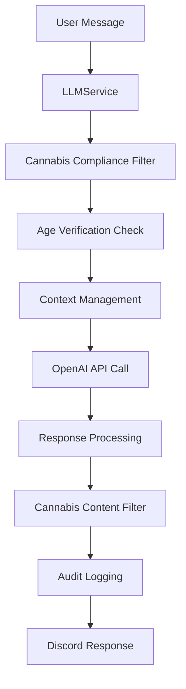
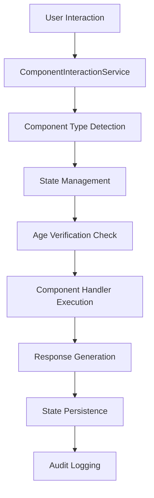

# 🏗️ Advanced Discord Bot Features Architecture

**GrowmiesNJ Discord Bot - Technical Architecture for Advanced Features**

## Executive Summary

This document provides comprehensive technical architecture for implementing three advanced Discord bot features:
1. **Music Bot System** with @discordjs/voice integration
2. **LLM Chat Integration** with OpenAI API
3. **Enhanced Component Interaction System** with modern Discord.js patterns

All features integrate seamlessly with existing cannabis compliance, age verification, and engagement systems.

---

## 📊 Current Architecture Analysis

### Existing Strengths
- **Discord.js v14.14.1** with modern slash command architecture
- **PostgreSQL + Sequelize ORM** with proper indexing and validation
- **Robust cannabis compliance** integration (21+ age verification)
- **Comprehensive audit logging** for legal compliance
- **Modular service layer** with clear separation of concerns
- **Engagement/leveling system** with XP calculation and tier progression
- **Modern event handling** patterns in interactionCreate.js

### Integration Points
- `User` model with leveling fields and cannabis compliance
- `AuditLog` model for compliance tracking
- Existing button interaction handling framework
- Service layer patterns ready for extension
- Age verification system for cannabis content protection

---

## 🎵 Music Bot System Architecture

### Core Components

#### Voice Connection Management
```mermaid
graph TB
    A[Voice Command] --> B[VoiceConnectionService]
    B --> C[Channel Validation]
    C --> D[Age Verification Check]
    D --> E[@discordjs/voice Connection]
    E --> F[Audio Player Creation]
    F --> G[Queue Management]
    G --> H[Playback Control]
```

#### Database Schema Extensions

**MusicSession Model**
```sql
CREATE TABLE music_sessions (
    id UUID PRIMARY KEY DEFAULT gen_random_uuid(),
    guild_id VARCHAR(20) NOT NULL,
    voice_channel_id VARCHAR(20) NOT NULL,
    text_channel_id VARCHAR(20) NOT NULL,
    created_by_user_id VARCHAR(20) NOT NULL,
    session_type ENUM('general', 'meditation', 'educational') DEFAULT 'general',
    is_cannabis_content BOOLEAN DEFAULT false,
    requires_21_plus BOOLEAN DEFAULT false,
    status ENUM('active', 'paused', 'ended') DEFAULT 'active',
    current_track_index INTEGER DEFAULT 0,
    volume_level INTEGER DEFAULT 50,
    session_metadata JSONB,
    started_at TIMESTAMP DEFAULT NOW(),
    ended_at TIMESTAMP,
    created_at TIMESTAMP DEFAULT NOW(),
    updated_at TIMESTAMP DEFAULT NOW()
);
```

**MusicQueue Model**
```sql
CREATE TABLE music_queues (
    id UUID PRIMARY KEY DEFAULT gen_random_uuid(),
    session_id UUID REFERENCES music_sessions(id) ON DELETE CASCADE,
    track_url VARCHAR(500) NOT NULL,
    track_title VARCHAR(200),
    track_duration_seconds INTEGER,
    requested_by_user_id VARCHAR(20) NOT NULL,
    queue_position INTEGER NOT NULL,
    track_source ENUM('youtube', 'local', 'url') DEFAULT 'youtube',
    is_cannabis_content BOOLEAN DEFAULT false,
    track_metadata JSONB,
    added_at TIMESTAMP DEFAULT NOW(),
    played_at TIMESTAMP,
    created_at TIMESTAMP DEFAULT NOW()
);
```

**UserMusicPreferences Model**
```sql
CREATE TABLE user_music_preferences (
    user_id VARCHAR(20) PRIMARY KEY,
    guild_id VARCHAR(20) NOT NULL,
    preferred_volume INTEGER DEFAULT 50,
    auto_queue_enabled BOOLEAN DEFAULT false,
    meditation_mode_enabled BOOLEAN DEFAULT false,
    explicit_content_filter BOOLEAN DEFAULT true,
    favorite_genres JSONB DEFAULT '[]',
    blocked_sources JSONB DEFAULT '[]',
    cannabis_music_enabled BOOLEAN DEFAULT false,
    created_at TIMESTAMP DEFAULT NOW(),
    updated_at TIMESTAMP DEFAULT NOW(),
    FOREIGN KEY (user_id) REFERENCES users(discord_id)
);
```

#### Service Architecture

**MusicService Class**
```javascript
class MusicService {
    constructor() {
        this.voiceConnections = new Map();
        this.audioPlayers = new Map();
        this.sessionQueues = new Map();
    }

    // Core music functionality
    async joinVoiceChannel(guildId, voiceChannelId, textChannelId)
    async leaveVoiceChannel(guildId)
    async playTrack(sessionId, trackUrl, metadata = {})
    async pausePlayback(sessionId)
    async resumePlayback(sessionId)
    async skipTrack(sessionId)
    async setVolume(sessionId, volume)

    // Queue management
    async addToQueue(sessionId, trackData)
    async removeFromQueue(sessionId, position)
    async shuffleQueue(sessionId)
    async clearQueue(sessionId)
    async getQueueStatus(sessionId)

    // Cannabis-specific features
    async startMeditationSession(guildId, voiceChannelId, duration)
    async playEducationalPodcast(sessionId, podcastUrl)
    async enableCannabisMode(sessionId, userId)

    // Integration with existing systems
    async validateAgeForCannabisContent(userId, guildId)
    async logMusicActivity(sessionId, action, metadata)
    async awardXPForMusicEngagement(userId, guildId, activityType)
}
```

#### Cannabis Community Features

**Meditation Sessions**
- Guided meditation tracks for cannabis users
- Timer-based sessions with automatic stopping
- Integration with engagement XP system
- Age verification required (21+)

**Educational Podcasts**
- Cannabis industry news and education
- Strain information audio guides
- Legal compliance updates for New Jersey
- Automatic transcription for accessibility

#### Security & Compliance Integration

```javascript
// Age verification for cannabis music content
async validateCannabisMusic(userId, guildId, trackData) {
    const user = await User.findOne({ 
        where: { discord_id: userId, guild_id: guildId } 
    });
    
    if (trackData.is_cannabis_content && !user.is_21_plus) {
        throw new Error('21+ age verification required for cannabis content');
    }
    
    await AuditLog.create({
        user_id: userId,
        guild_id: guildId,
        action_type: 'music_access',
        details: {
            track_title: trackData.title,
            is_cannabis_content: trackData.is_cannabis_content,
            age_verified: user.is_21_plus
        }
    });
}
```

---

## 🤖 LLM Chat Integration Architecture

### Core Components

#### OpenAI API Integration


#### Database Schema Extensions

**LLMConversation Model**
```sql
CREATE TABLE llm_conversations (
    id UUID PRIMARY KEY DEFAULT gen_random_uuid(),
    user_id VARCHAR(20) NOT NULL,
    guild_id VARCHAR(20) NOT NULL,
    channel_id VARCHAR(20) NOT NULL,
    conversation_type ENUM('general', 'cannabis_education', 'strain_advice', 'legal_info') DEFAULT 'general',
    requires_21_plus BOOLEAN DEFAULT false,
    context_window_size INTEGER DEFAULT 10,
    total_messages INTEGER DEFAULT 0,
    total_tokens_used INTEGER DEFAULT 0,
    started_at TIMESTAMP DEFAULT NOW(),
    last_message_at TIMESTAMP DEFAULT NOW(),
    ended_at TIMESTAMP,
    is_active BOOLEAN DEFAULT true,
    conversation_metadata JSONB,
    created_at TIMESTAMP DEFAULT NOW(),
    updated_at TIMESTAMP DEFAULT NOW(),
    FOREIGN KEY (user_id) REFERENCES users(discord_id)
);
```

**LLMMessage Model**
```sql
CREATE TABLE llm_messages (
    id UUID PRIMARY KEY DEFAULT gen_random_uuid(),
    conversation_id UUID REFERENCES llm_conversations(id) ON DELETE CASCADE,
    message_role ENUM('user', 'assistant', 'system') NOT NULL,
    message_content TEXT NOT NULL,
    tokens_used INTEGER,
    contains_cannabis_content BOOLEAN DEFAULT false,
    compliance_filtered BOOLEAN DEFAULT false,
    message_metadata JSONB,
    created_at TIMESTAMP DEFAULT NOW()
);
```

**LLMUserPreferences Model**
```sql
CREATE TABLE llm_user_preferences (
    user_id VARCHAR(20) PRIMARY KEY,
    guild_id VARCHAR(20) NOT NULL,
    cannabis_assistance_enabled BOOLEAN DEFAULT false,
    preferred_response_style ENUM('casual', 'educational', 'technical') DEFAULT 'casual',
    max_response_length INTEGER DEFAULT 2000,
    enable_strain_recommendations BOOLEAN DEFAULT false,
    enable_legal_advice BOOLEAN DEFAULT false,
    content_filter_level ENUM('strict', 'moderate', 'relaxed') DEFAULT 'moderate',
    conversation_history_enabled BOOLEAN DEFAULT true,
    created_at TIMESTAMP DEFAULT NOW(),
    updated_at TIMESTAMP DEFAULT NOW(),
    FOREIGN KEY (user_id) REFERENCES users(discord_id)
);
```

**CannabisKnowledgeBase Model**
```sql
CREATE TABLE cannabis_knowledge_base (
    id UUID PRIMARY KEY DEFAULT gen_random_uuid(),
    topic_category ENUM('strains', 'cultivation', 'legal', 'medical', 'consumption', 'safety') NOT NULL,
    topic_title VARCHAR(200) NOT NULL,
    content_text TEXT NOT NULL,
    requires_21_plus BOOLEAN DEFAULT true,
    source_url VARCHAR(500),
    last_verified_at TIMESTAMP,
    accuracy_rating INTEGER DEFAULT 5,
    usage_count INTEGER DEFAULT 0,
    is_active BOOLEAN DEFAULT true,
    created_by_user_id VARCHAR(20),
    approved_by_admin BOOLEAN DEFAULT false,
    tags JSONB DEFAULT '[]',
    created_at TIMESTAMP DEFAULT NOW(),
    updated_at TIMESTAMP DEFAULT NOW()
);
```

#### Service Architecture

**LLMService Class**
```javascript
class LLMService {
    constructor() {
        this.openai = new OpenAI({ apiKey: process.env.OPENAI_API_KEY });
        this.conversationCache = new Map();
        this.cannabisKnowledge = new CannabisKnowledgeCache();
    }

    // Core LLM functionality
    async processMessage(userId, guildId, channelId, message, options = {})
    async generateResponse(conversation, userMessage, context)
    async manageConversationContext(conversationId, newMessage)
    async endConversation(conversationId, reason = 'user_ended')

    // Cannabis-specific features
    async getStrainInformation(strainName, userId, guildId)
    async provideCultivationAdvice(question, userId, guildId)
    async getLegalGuidance(question, userId, guildId)
    async generateSafetyReminders(userId, guildId)

    // Compliance and filtering
    async filterCannabisContent(message, userId, guildId)
    async validateAgeForCannabisChat(userId, guildId)
    async applyCannabisCompliance(response, conversationType)
    async logLLMInteraction(userId, guildId, interaction, metadata)

    // Integration with existing systems
    async awardXPForLLMEngagement(userId, guildId, interactionType)
    async updateEngagementStats(userId, guildId, conversationMetrics)
}
```

#### Cannabis Knowledge Assistant Features

**Strain Information System**
```javascript
async getStrainInformation(strainName, userId, guildId) {
    // Age verification for cannabis content
    await this.validateAgeForCannabisChat(userId, guildId);
    
    const knowledgeData = await CannabisKnowledgeBase.findAll({
        where: { 
            topic_category: 'strains',
            is_active: true,
            approved_by_admin: true
        }
    });
    
    const prompt = `
        Provide educational information about the cannabis strain "${strainName}".
        Include: effects, THC/CBD content, growing characteristics, and legal considerations for New Jersey.
        Base your response on verified information and include appropriate disclaimers.
        Knowledge base: ${JSON.stringify(knowledgeData)}
    `;
    
    return await this.generateCannabisResponse(prompt, userId, guildId);
}
```

#### Compliance-Aware Response Filtering

```javascript
async applyCannabisCompliance(response, conversationType) {
    const complianceFilters = {
        medical_advice: 'This information is for educational purposes only and should not replace professional medical advice.',
        legal_advice: 'This information is general and may not reflect current laws. Consult with a legal professional for specific guidance.',
        cultivation: 'Cannabis cultivation laws vary by jurisdiction. Ensure compliance with all local, state, and federal laws.',
        consumption: 'Cannabis use is only legal for adults 21+ in New Jersey. Always consume responsibly.'
    };
    
    let filteredResponse = response;
    
    // Add appropriate disclaimers
    if (conversationType === 'cannabis_education') {
        filteredResponse += `\n\n⚖️ **Legal Disclaimer:** ${complianceFilters.legal_advice}`;
    }
    
    // Filter out potentially harmful content
    const harmfulPatterns = [
        /driving.*under.*influence/i,
        /sell.*cannabis.*illegal/i,
        /underage.*consumption/i
    ];
    
    for (const pattern of harmfulPatterns) {
        if (pattern.test(filteredResponse)) {
            filteredResponse = "I cannot provide information that may promote illegal or unsafe activities. Please consult with appropriate professionals for guidance.";
            break;
        }
    }
    
    return filteredResponse;
}
```

---

## 🎛️ Enhanced Component Interaction System Architecture

### Core Components

#### Modern Discord.js Component Architecture


#### Database Schema Extensions

**ComponentState Model**
```sql
CREATE TABLE component_states (
    id UUID PRIMARY KEY DEFAULT gen_random_uuid(),
    user_id VARCHAR(20) NOT NULL,
    guild_id VARCHAR(20) NOT NULL,
    channel_id VARCHAR(20) NOT NULL,
    message_id VARCHAR(20),
    component_type ENUM('button', 'select_menu', 'modal', 'autocomplete') NOT NULL,
    component_id VARCHAR(100) NOT NULL,
    state_data JSONB NOT NULL,
    expires_at TIMESTAMP,
    is_cannabis_content BOOLEAN DEFAULT false,
    requires_21_plus BOOLEAN DEFAULT false,
    interaction_count INTEGER DEFAULT 0,
    created_at TIMESTAMP DEFAULT NOW(),
    updated_at TIMESTAMP DEFAULT NOW(),
    FOREIGN KEY (user_id) REFERENCES users(discord_id)
);
```

**ComponentInteraction Model**
```sql
CREATE TABLE component_interactions (
    id UUID PRIMARY KEY DEFAULT gen_random_uuid(),
    user_id VARCHAR(20) NOT NULL,
    guild_id VARCHAR(20) NOT NULL,
    component_state_id UUID REFERENCES component_states(id) ON DELETE CASCADE,
    interaction_type VARCHAR(50) NOT NULL,
    interaction_data JSONB,
    response_time_ms INTEGER,
    success BOOLEAN DEFAULT true,
    error_message TEXT,
    created_at TIMESTAMP DEFAULT NOW(),
    FOREIGN KEY (user_id) REFERENCES users(discord_id)
);
```

#### Service Architecture

**ComponentInteractionService Class**
```javascript
class ComponentInteractionService {
    constructor() {
        this.stateManager = new ComponentStateManager();
        this.handlers = new Map();
        this.registerDefaultHandlers();
    }

    // Core component functionality
    async handleButtonInteraction(interaction)
    async handleSelectMenuInteraction(interaction)
    async handleModalSubmission(interaction)
    async handleAutocomplete(interaction)

    // State management
    async createComponentState(userId, guildId, componentData, options = {})
    async getComponentState(stateId)
    async updateComponentState(stateId, newData)
    async expireComponentState(stateId)
    async cleanupExpiredStates()

    // Cannabis-specific components
    async createStrainSelector(userId, guildId, strainCategories)
    async createCultivationWizard(userId, guildId, growStage)
    async createLegalComplianceForm(userId, guildId, formType)
    async createEducationalQuiz(userId, guildId, quizCategory)

    // Reusable UI patterns
    async createPaginatedEmbed(data, pageSize = 10)
    async createConfirmationDialog(message, options = {})
    async createMultiStepForm(formSchema, userId, guildId)
    async createDynamicSelectMenu(options, placeholder, customId)

    // Integration with existing systems
    async validateAgeForComponent(userId, guildId, componentData)
    async awardXPForComponentInteraction(userId, guildId, interactionType)
    async logComponentInteraction(userId, guildId, interactionData)
}
```

#### Reusable UI Component Library

**Strain Information Cards**
```javascript
class StrainInfoCard {
    static create(strainData, userId, requiresAge = true) {
        const embed = new EmbedBuilder()
            .setTitle(`🌿 ${strainData.name}`)
            .setDescription(strainData.description)
            .addFields(
                { name: 'Type', value: strainData.type, inline: true },
                { name: 'THC%', value: strainData.thc_percentage, inline: true },
                { name: 'CBD%', value: strainData.cbd_percentage, inline: true }
            );

        const row = new ActionRowBuilder()
            .addComponents(
                new ButtonBuilder()
                    .setCustomId(`strain_details_${strainData.id}_${userId}`)
                    .setLabel('More Details')
                    .setStyle(ButtonStyle.Primary),
                new ButtonBuilder()
                    .setCustomId(`strain_effects_${strainData.id}_${userId}`)
                    .setLabel('Effects')
                    .setStyle(ButtonStyle.Secondary),
                new ButtonBuilder()
                    .setCustomId(`strain_grow_info_${strainData.id}_${userId}`)
                    .setLabel('Growing Info')
                    .setStyle(ButtonStyle.Success)
            );

        return { embeds: [embed], components: [row] };
    }
}
```

**Educational Quiz Components**
```javascript
class CannabisQuizComponent {
    static async createQuizCard(question, userId, guildId) {
        const embed = new EmbedBuilder()
            .setTitle('🧠 Cannabis Knowledge Quiz')
            .setDescription(question.question_text)
            .setColor('#4CAF50');

        const components = [];
        const answers = question.answer_choices;
        
        // Create button rows (max 5 per row)
        for (let i = 0; i < answers.length; i += 5) {
            const row = new ActionRowBuilder();
            const rowAnswers = answers.slice(i, i + 5);
            
            rowAnswers.forEach((answer, index) => {
                const actualIndex = i + index;
                row.addComponents(
                    new ButtonBuilder()
                        .setCustomId(`quiz_answer_${question.id}_${actualIndex}_${userId}`)
                        .setLabel(`${String.fromCharCode(65 + actualIndex)}. ${answer}`)
                        .setStyle(ButtonStyle.Secondary)
                );
            });
            
            components.push(row);
        }

        return { embeds: [embed], components };
    }
}
```

#### Advanced Slash Command Structures

**Multi-Parameter Commands with Autocomplete**
```javascript
const advancedStrainCommand = new SlashCommandBuilder()
    .setName('strain')
    .setDescription('🌿 Advanced strain information and recommendations')
    .addSubcommand(subcommand =>
        subcommand
            .setName('info')
            .setDescription('Get detailed information about a specific strain')
            .addStringOption(option =>
                option
                    .setName('strain_name')
                    .setDescription('Name of the cannabis strain')
                    .setRequired(true)
                    .setAutocomplete(true)
            )
    )
    .addSubcommand(subcommand =>
        subcommand
            .setName('recommend')
            .setDescription('Get strain recommendations based on preferences')
            .addStringOption(option =>
                option
                    .setName('effect')
                    .setDescription('Desired effect')
                    .setRequired(true)
                    .addChoices(
                        { name: 'Relaxing', value: 'relaxing' },
                        { name: 'Energizing', value: 'energizing' },
                        { name: 'Focus', value: 'focus' },
                        { name: 'Sleep', value: 'sleep' }
                    )
            )
            .addStringOption(option =>
                option
                    .setName('experience_level')
                    .setDescription('Your cannabis experience level')
                    .addChoices(
                        { name: 'Beginner', value: 'beginner' },
                        { name: 'Intermediate', value: 'intermediate' },
                        { name: 'Expert', value: 'expert' }
                    )
            )
    );
```

---

## 🔒 Security & Cannabis Compliance Integration

### Age Verification Integration

All new features integrate with the existing age verification system:

```javascript
class SecurityIntegration {
    static async validateFeatureAccess(userId, guildId, featureType, contentData = {}) {
        const user = await User.findOne({
            where: { discord_id: userId, guild_id: guildId }
        });

        // Check basic verification status
        if (!user || user.verification_status !== 'verified') {
            throw new SecurityError('User verification required');
        }

        // Check cannabis content age requirements
        if (contentData.is_cannabis_content && !user.is_21_plus) {
            throw new SecurityError('21+ age verification required for cannabis content');
        }

        // Feature-specific validations
        switch (featureType) {
            case 'music_cannabis':
                if (!user.is_21_plus) {
                    throw new SecurityError('Cannabis music content requires 21+ verification');
                }
                break;
            
            case 'llm_cannabis':
                if (!user.is_21_plus) {
                    throw new SecurityError('Cannabis AI assistant requires 21+ verification');
                }
                break;
            
            case 'advanced_components':
                // Age verification for cannabis-specific components
                if (contentData.requires_cannabis_verification && !user.is_21_plus) {
                    throw new SecurityError('Cannabis components require 21+ verification');
                }
                break;
        }

        return true;
    }
}
```

### Audit Logging Integration

```javascript
class ComplianceLogging {
    static async logFeatureUsage(userId, guildId, featureType, action, metadata = {}) {
        await AuditLog.create({
            user_id: userId,
            guild_id: guildId,
            action_type: `${featureType}_usage`,
            target_type: 'feature',
            target_id: action,
            details: {
                feature_type: featureType,
                action: action,
                requires_21_plus: metadata.requires_21_plus || false,
                cannabis_content: metadata.is_cannabis_content || false,
                timestamp: new Date().toISOString(),
                ...metadata
            },
            metadata: {
                compliance_version: '2024.1',
                new_jersey_cannabis_law: 'compliant',
                audit_trail_complete: true
            }
        });
    }
}
```

---

## 📁 File Structure & Code Organization

### Directory Structure Extensions

```
src/
├── commands/
│   ├── music/                          # New music commands
│   │   ├── play.js                     # Play music command
│   │   ├── queue.js                    # Queue management
│   │   ├── volume.js                   # Volume control
│   │   ├── skip.js                     # Skip track
│   │   ├── meditation.js               # Cannabis meditation sessions
│   │   └── podcast.js                  # Educational podcasts
│   ├── ai-chat/                        # New LLM commands
│   │   ├── chat.js                     # General AI chat
│   │   ├── strain-assistant.js         # Cannabis strain AI
│   │   ├── cultivation-helper.js       # Growing advice AI
│   │   ├── legal-advisor.js            # Legal guidance AI
│   │   └── knowledge-base.js           # Cannabis knowledge queries
│   └── enhanced-ui/                    # New component commands
│       ├── strain-explorer.js          # Interactive strain browser
│       ├── cultivation-wizard.js       # Growing setup wizard
│       ├── compliance-checker.js       # Legal compliance tool
│       └── interactive-quiz.js         # Enhanced quiz system
├── services/
│   ├── musicService.js                 # New music bot service
│   ├── llmService.js                   # New LLM integration service
│   ├── componentService.js             # New component interaction service
│   ├── cannabisKnowledgeService.js     # Cannabis knowledge management
│   └── securityIntegrationService.js   # Enhanced security service
├── database/models/
│   ├── MusicSession.js                 # New music session model
│   ├── MusicQueue.js                   # New music queue model
│   ├── UserMusicPreferences.js         # New user music preferences
│   ├── LLMConversation.js              # New LLM conversation model
│   ├── LLMMessage.js                   # New LLM message model
│   ├── LLMUserPreferences.js           # New LLM user preferences
│   ├── CannabisKnowledgeBase.js        # New cannabis knowledge model
│   ├── ComponentState.js               # New component state model
│   └── ComponentInteraction.js         # New component interaction model
├── utils/
│   ├── musicHelpers.js                 # New music utility functions
│   ├── llmHelpers.js                   # New LLM utility functions
│   ├── componentHelpers.js             # New component utility functions
│   ├── cannabisCompliance.js           # Enhanced cannabis compliance utilities
│   └── advancedEmbeds.js               # Enhanced embed utilities
├── events/handlers/                    # Enhanced event handlers
│   ├── musicEvents.js                  # Music-specific event handlers
│   ├── llmEvents.js                    # LLM-specific event handlers
│   └── componentEvents.js              # Component-specific event handlers
└── config/
    ├── music-config.json               # Music bot configuration
    ├── llm-config.json                 # LLM service configuration
    ├── component-config.json           # Component system configuration
    └── cannabis-knowledge-config.json  # Cannabis knowledge base configuration
```

### Enhanced InteractionCreate Event Handler

```javascript
// Enhanced src/events/interactionCreate.js
module.exports = {
    name: Events.InteractionCreate,
    async execute(interaction) {
        try {
            // Route different interaction types
            if (interaction.isChatInputCommand()) {
                await handleSlashCommand(interaction);
            } else if (interaction.isButton()) {
                await handleButtonInteraction(interaction);
            } else if (interaction.isStringSelectMenu()) {
                await handleSelectMenuInteraction(interaction);
            } else if (interaction.isModalSubmit()) {
                await handleModalSubmission(interaction);
            } else if (interaction.isAutocomplete()) {
                await handleAutocomplete(interaction);
            }
        } catch (error) {
            console.error('Enhanced interaction error:', error);
            await handleInteractionError(interaction, error);
        }
    }
};

async function handleButtonInteraction(interaction) {
    const customId = interaction.customId;
    
    // Route to appropriate service based on button ID prefix
    if (customId.startsWith('music_')) {
        const musicService = require('../services/musicService');
        await musicService.handleButtonInteraction(interaction);
    } else if (customId.startsWith('llm_')) {
        const llmService = require('../services/llmService');
        await llmService.handleButtonInteraction(interaction);
    } else if (customId.startsWith('component_')) {
        const componentService = require('../services/componentService');
        await componentService.handleButtonInteraction(interaction);
    } else if (customId.startsWith('quiz_')) {
        const { handleQuizAnswer } = require('../commands/engagement/quiz');
        await handleQuizAnswer(interaction);
    } else if (customId === 'verify_confirm' || customId === 'verify_deny') {
        // Existing age verification handling
        await handleAgeVerification(interaction);
    }
}
```

---

## 🔄 Implementation Roadmap

### Phase 1: Foundation & Database (Week 1-2)
1. **Database Schema Implementation**
   - Create new models for all three systems
   - Add database migrations
   - Implement model relationships and validations
   - Add proper indexing for performance

2. **Base Service Classes**
   - Implement core service class structures
   - Add basic dependency injection
   - Integrate with existing age verification
   - Set up audit logging integration

### Phase 2: Music Bot System (Week 3-4)
1. **Voice Connection Infrastructure**
   - Implement VoiceConnectionService
   - Add @discordjs/voice integration
   - Create basic audio player functionality
   - Add voice channel validation

2. **Queue Management System**
   - Implement queue data structures
   - Add persistence to database
   - Create queue manipulation commands
   - Add cannabis content filtering

3. **Music Commands**
   - Implement basic music commands (play, pause, skip, queue)
   - Add volume control and user preferences
   - Create meditation session functionality
   - Add educational podcast features

### Phase 3: LLM Chat Integration (Week 5-6)
1. **OpenAI API Integration**
   - Implement LLMService with OpenAI SDK
   - Add conversation context management
   - Create message filtering and compliance
   - Add token usage tracking

2. **Cannabis Knowledge System**
   - Implement cannabis knowledge base
   - Add strain information responses
   - Create cultivation advice functionality
   - Add legal guidance with disclaimers

3. **LLM Commands**
   - Implement chat commands with context
   - Add cannabis-specific AI assistants
   - Create conversation management
   - Add user preference controls

### Phase 4: Enhanced Component System (Week 7-8)
1. **Component Infrastructure**
   - Implement ComponentInteractionService
   - Add state management system
   - Create reusable component library
   - Add expiration and cleanup

2. **Advanced UI Components**
   - Implement strain explorer interface
   - Create cultivation wizard
   - Add interactive quiz system
   - Create compliance checker tool

3. **Integration & Polish**
   - Integrate all systems with existing codebase
   - Add comprehensive error handling
   - Implement performance optimizations
   - Add monitoring and analytics

### Phase 5: Testing & Deployment (Week 9-10)
1. **Comprehensive Testing**
   - Unit tests for all new services
   - Integration tests for system interactions
   - Load testing for voice connections and LLM
   - Compliance testing for cannabis features

2. **Documentation & Training**
   - Complete technical documentation
   - Create user guides and admin documentation
   - Implement monitoring dashboards
   - Prepare deployment procedures

---

## 📈 Performance Considerations

### Database Optimization
- **Proper indexing** on frequently queried fields
- **Connection pooling** for high-traffic operations
- **Query optimization** for complex joins
- **Automated cleanup** of expired sessions and conversations

### Memory Management
- **Voice connection pooling** to prevent memory leaks
- **LLM conversation context** trimming for long sessions
- **Component state cleanup** with TTL-based expiration
- **Cache strategies** for frequently accessed data

### Rate Limiting & Compliance
- **OpenAI API rate limiting** with exponential backoff
- **Voice connection limits** per guild
- **Cannabis content access** tracking and compliance
- **User interaction throttling** to prevent abuse

---

## 🔧 Required Dependencies

### New Package Dependencies
```json
{
  "dependencies": {
    "@discordjs/voice": "^0.16.0",
    "ytdl-core": "^4.11.5",
    "openai": "^4.20.1",
    "node-cache": "^5.1.2",
    "stream-transcoder": "^0.0.6"
  }
}
```

### Environment Variables
```bash
# OpenAI Integration
OPENAI_API_KEY=sk-...
OPENAI_MODEL=gpt-4
OPENAI_MAX_TOKENS=2000

# Music Bot Configuration
YOUTUBE_API_KEY=...
MAX_QUEUE_SIZE=50
DEFAULT_VOLUME=50

# Cannabis Compliance
CANNABIS_CONTENT_STRICT_MODE=true
LEGAL_DISCLAIMER_REQUIRED=true
NJ_CANNABIS_LAW_VERSION=2024.1
```

---

This architecture provides a comprehensive foundation for implementing advanced Discord bot features while maintaining strict cannabis compliance and integrating seamlessly with your existing high-quality codebase.