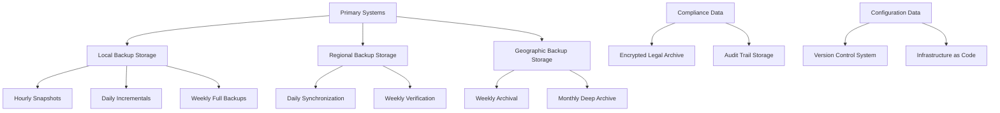
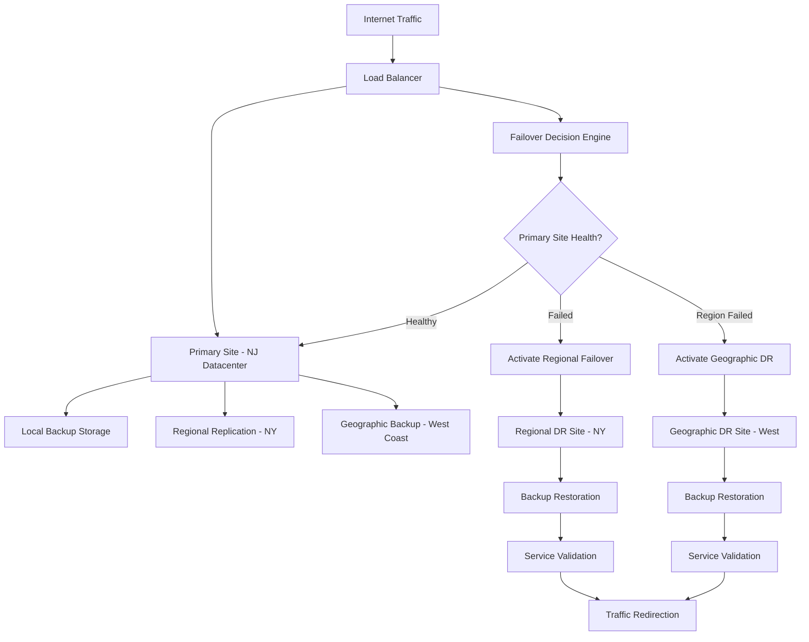

# Growmies NJ Discord Bot - Backup & Disaster Recovery

## 💾 Complete Backup Strategy & Disaster Recovery Procedures

**Target Audience**: System administrators, DevOps engineers, IT management  
**Estimated Time**: 90-120 minutes for complete implementation  
**Prerequisites**: Server admin access, understanding of backup technologies, disaster recovery concepts

---

## 📋 Table of Contents

1. [Backup Strategy Overview](#backup-strategy-overview)
2. [Data Classification & Protection Levels](#data-classification--protection-levels)
3. [Automated Backup Systems](#automated-backup-systems)
4. [Manual Backup Procedures](#manual-backup-procedures)
5. [Disaster Recovery Planning](#disaster-recovery-planning)
6. [Recovery Procedures](#recovery-procedures)
7. [Business Continuity Planning](#business-continuity-planning)
8. [Backup Testing & Validation](#backup-testing--validation)
9. [Compliance & Legal Requirements](#compliance--legal-requirements)
10. [Emergency Response Procedures](#emergency-response-procedures)

---

## 🎯 Backup Strategy Overview

### Business Requirements & Objectives

#### Recovery Point Objective (RPO) & Recovery Time Objective (RTO)
```yaml
Service Level Objectives:

Critical Systems (Discord Bot Core):
  RPO: 1 hour maximum data loss
  RTO: 2 hours maximum downtime
  Availability: 99.9% (8.77 hours downtime/year)
  Backup Frequency: Every 30 minutes

Important Systems (Age Verification):
  RPO: 4 hours maximum data loss  
  RTO: 4 hours maximum downtime
  Availability: 99.5% (43.8 hours downtime/year)
  Backup Frequency: Every 2 hours

Standard Systems (General Data):
  RPO: 24 hours maximum data loss
  RTO: 8 hours maximum downtime
  Availability: 99.0% (87.6 hours downtime/year)
  Backup Frequency: Daily

Archival Systems (Historical Data):
  RPO: 7 days maximum data loss
  RTO: 48 hours maximum downtime
  Availability: 95.0% (438 hours downtime/year)
  Backup Frequency: Weekly
```

#### Cannabis Community Specific Requirements
```json
{
  "cannabisComplianceRequirements": {
    "ageVerificationData": {
      "retention": "2 years minimum (legal requirement)",
      "encryption": "AES-256 encryption at rest and in transit",
      "access": "Restricted to authorized compliance personnel",
      "auditTrail": "Complete access logging with immutable records",
      "geographicRestrictions": "Must remain within US jurisdiction"
    },
    "moderationLogs": {
      "retention": "7 years for compliance violations",
      "encryption": "Standard enterprise encryption",
      "access": "Legal team and senior administrators",
      "auditTrail": "Standard access logging",
      "legalHold": "Indefinite retention for ongoing legal matters"
    },
    "userCommunications": {
      "retention": "90 days standard, 2 years for violations",
      "encryption": "Standard encryption",
      "access": "Moderation team and administrators",
      "privacy": "GDPR/CCPA compliance required",
      "deletion": "Right to erasure with legal exceptions"
    },
    "systemConfiguration": {
      "retention": "5 years for audit purposes",
      "encryption": "Configuration-specific encryption",
      "access": "Technical team and administrators",
      "versioning": "Full configuration history maintained",
      "rollback": "Ability to restore any configuration version"
    }
  }
}
```

### Backup Architecture Design

#### Multi-Tier Backup Strategy


#### Storage Technology Stack
```yaml
Backup Storage Tiers:

Tier 1 - Hot Storage (Immediate Recovery):
  Technology: "NVMe SSD RAID 10"
  Capacity: "2TB usable"
  Performance: "High IOPS, low latency"
  Retention: "7 days"
  Purpose: "Rapid recovery, hourly snapshots"
  Location: "Primary datacenter"
  
Tier 2 - Warm Storage (Daily Recovery):
  Technology: "SATA SSD RAID 6"
  Capacity: "10TB usable"
  Performance: "Medium IOPS, moderate latency"
  Retention: "30 days"
  Purpose: "Daily backups, system recovery"
  Location: "Primary and secondary datacenter"
  
Tier 3 - Cold Storage (Weekly/Monthly):
  Technology: "Enterprise HDD RAID 6"
  Capacity: "50TB usable"
  Performance: "Lower IOPS, higher latency"
  Retention: "1 year"
  Purpose: "Weekly full backups, compliance"
  Location: "Geographic distribution"
  
Tier 4 - Archive Storage (Long-term):
  Technology: "Cloud object storage (S3 Glacier)"
  Capacity: "Unlimited"
  Performance: "Minutes to hours retrieval"
  Retention: "7 years (legal requirement)"
  Purpose: "Compliance archival, disaster recovery"
  Location: "Multiple cloud regions"
```

---

## 🔐 Data Classification & Protection Levels

### Cannabis Community Data Classification

#### Highly Sensitive Data (Maximum Protection)
```yaml
Age Verification Documents:
  Classification: "Highly Sensitive"
  Legal Requirement: "NJ Cannabis Law Compliance"
  Encryption: "AES-256-GCM with HSM key management"
  Access Control: "Multi-person authorization required"
  Backup Frequency: "Real-time replication + hourly snapshots"
  Geographic Restrictions: "US only, no international storage"
  Retention: "2 years active, 5 years archive"
  Disposal: "Cryptographic erasure + physical destruction"
  
Personal Identification Information:
  Classification: "Highly Sensitive"
  Legal Requirement: "GDPR/CCPA Compliance"
  Encryption: "AES-256-GCM with per-record keys"
  Access Control: "Role-based with audit logging"
  Backup Frequency: "Real-time replication"
  Privacy Rights: "Right to erasure, data portability"
  Retention: "Minimum required by law"
  Disposal: "Secure deletion with verification"
```

#### Sensitive Data (Enhanced Protection)
```yaml
Moderation Actions & Compliance Violations:
  Classification: "Sensitive"
  Legal Requirement: "Legal discovery compliance"
  Encryption: "AES-256-CBC with database-level keys"
  Access Control: "Senior staff + legal team"
  Backup Frequency: "Hourly snapshots"
  Retention: "7 years for violations, 2 years standard"
  Legal Hold: "Indefinite retention when required"
  
User Communications in Cannabis Channels:
  Classification: "Sensitive"
  Legal Requirement: "Content compliance monitoring"
  Encryption: "Standard database encryption"
  Access Control: "Moderation team + administrators"
  Backup Frequency: "Daily backups"
  Retention: "90 days standard, extended for violations"
  Privacy: "Anonymization after retention period"
```

#### Standard Data (Normal Protection)
```yaml
General Server Configuration:
  Classification: "Standard"
  Business Requirement: "Operational continuity"
  Encryption: "Transport layer encryption"
  Access Control: "Technical team access"
  Backup Frequency: "Daily configuration backups"
  Retention: "5 years for audit purposes"
  Versioning: "Full change history maintained"
  
Community Content & Resources:
  Classification: "Standard"
  Business Requirement: "Community service"
  Encryption: "Standard encryption"
  Access Control: "Community members + staff"
  Backup Frequency: "Daily content backups"
  Retention: "Indefinite (community asset)"
  Migration: "Platform-independent format"
```

### Protection Implementation

#### Encryption Standards
```json
{
  "encryptionStandards": {
    "dataAtRest": {
      "highlyIenitive": {
        "algorithm": "AES-256-GCM",
        "keyManagement": "Hardware Security Module (HSM)",
        "keyRotation": "90 days",
        "keyEscrow": "Secure multi-party key recovery"
      },
      "sensitive": {
        "algorithm": "AES-256-CBC",
        "keyManagement": "Database-level key management",
        "keyRotation": "180 days",
        "keyEscrow": "Administrative key recovery"
      },
      "standard": {
        "algorithm": "AES-256",
        "keyManagement": "Application-level keys",
        "keyRotation": "365 days",
        "keyEscrow": "Standard key recovery procedures"
      }
    },
    "dataInTransit": {
      "all": {
        "protocol": "TLS 1.3",
        "cipherSuites": "ChaCha20-Poly1305, AES-256-GCM",
        "certificateValidation": "Extended Validation (EV)",
        "perfectForwardSecrecy": "Required"
      }
    },
    "backupSpecific": {
      "compressionEncryption": "Encrypt-then-compress",
      "integrityChecking": "HMAC-SHA256",
      "authentication": "Digital signatures for backup files",
      "tamperEvidence": "Immutable backup logs"
    }
  }
}
```

#### Access Control Matrix
```yaml
Access Control by Role and Data Type:

Server Owner:
  - All data types: Full access
  - Emergency override: Available
  - Audit exemption: None (all access logged)
  - Legal authority: Final decision maker

Senior Administrator:
  - Highly Sensitive: Read access with approval
  - Sensitive: Full access
  - Standard: Full access
  - Backup operations: Full control

Compliance Officer:
  - Age verification data: Full access
  - Violation records: Full access
  - Legal hold data: Full access
  - Audit trail: Read-only access

Legal Team:
  - All data during legal proceedings
  - Privileged attorney-client data: Separate access
  - Discovery materials: Controlled access
  - External counsel: Limited, supervised access

Technical Team:
  - System configuration: Full access
  - User data: No direct access
  - Backup systems: Operational access only
  - Logs and diagnostics: Read access

Moderation Team:
  - User communications: Limited to moderation scope
  - Violation records: Create and read access
  - Personal data: No direct access
  - Backup access: None
```

---

## 🤖 Automated Backup Systems

### Real-Time Backup Implementation

#### Continuous Data Protection (CDP)
```bash
#!/bin/bash
# Continuous backup service for cannabis compliance data

# CDP Configuration
CDP_SERVICE="growmies-cdp"
PRIMARY_DB="postgresql://growmies_primary"
REPLICA_DB="postgresql://growmies_replica"
BACKUP_DESTINATION="/backup/real-time"
ENCRYPTION_KEY_PATH="/secure/keys/backup.key"

# Age verification data - Real-time replication
setup_age_verification_cdp() {
    echo "Setting up real-time backup for age verification data..."
    
    # Configure streaming replication
    postgres-setup-streaming-replication \
        --primary="$PRIMARY_DB" \
        --replica="$REPLICA_DB" \
        --sync-mode="synchronous" \
        --encryption="AES-256-GCM" \
        --key-file="$ENCRYPTION_KEY_PATH"
    
    # Setup Write-Ahead Log (WAL) shipping
    postgres-configure-wal-shipping \
        --archive-destination="$BACKUP_DESTINATION/wal-archive" \
        --compression="gzip" \
        --encryption="enabled" \
        --verification="checksum"
    
    # Configure point-in-time recovery
    postgres-setup-pitr \
        --retention="72 hours" \
        --granularity="1 second" \
        --verification-interval="15 minutes"
    
    echo "✅ Age verification CDP configured"
}

# Application state backup
setup_application_backup() {
    echo "Setting up application state backup..."
    
    # Discord bot state
    rsync-setup-continuous \
        --source="/opt/growmies-bot/state/" \
        --destination="$BACKUP_DESTINATION/bot-state/" \
        --frequency="5 minutes" \
        --encryption="enabled" \
        --verification="enabled"
    
    # Configuration files
    git-auto-backup-setup \
        --repository="/opt/growmies-bot/config/" \
        --backup-repo="git@backup-server:growmies-config.git" \
        --frequency="on-change" \
        --signing="gpg-key"
    
    # Log files with rotation
    logrotate-backup-setup \
        --source="/var/log/growmies/" \
        --destination="$BACKUP_DESTINATION/logs/" \
        --rotation="hourly" \
        --compression="xz" \
        --retention="30 days"
    
    echo "✅ Application backup configured"
}

# Compliance data special handling
setup_compliance_backup() {
    echo "Setting up compliance-specific backup procedures..."
    
    # Legal hold data isolation
    lvm-snapshot-setup \
        --volume-group="compliance-vg" \
        --logical-volume="legal-hold-lv" \
        --snapshot-frequency="hourly" \
        --retention="indefinite" \
        --encryption="HSM-managed"
    
    # Audit trail immutable storage
    immutable-backup-setup \
        --source="/var/log/audit/" \
        --destination="$BACKUP_DESTINATION/audit-immutable/" \
        --hash-chain="SHA-256" \
        --timestamping="RFC3161" \
        --verification="blockchain"
    
    echo "✅ Compliance backup configured"
}

# Execute setup
main() {
    echo "=== Setting up Growmies NJ Automated Backup Systems ==="
    
    setup_age_verification_cdp
    setup_application_backup
    setup_compliance_backup
    
    # Start services
    systemctl enable --now $CDP_SERVICE
    systemctl enable --now growmies-backup-agent
    
    # Verify operation
    sleep 30
    systemctl status $CDP_SERVICE
    test-backup-systems
    
    echo "✅ Automated backup systems operational"
}

main "$@"
```

#### Scheduled Backup Jobs
```yaml
Backup Schedule Configuration:

Hourly Backups (Critical Data):
  Schedule: "0 * * * *"  # Every hour at minute 0
  Scope:
    - Age verification queue and recent approvals
    - Active moderation actions and violations
    - Real-time compliance monitoring data
    - Discord bot state and active sessions
  Retention: "72 hours locally, 7 days replicated"
  Verification: "Automated integrity check within 15 minutes"
  
Daily Backups (Full System):
  Schedule: "0 2 * * *"  # Daily at 2:00 AM EST
  Scope:
    - Complete database dump (encrypted)
    - All configuration files and scripts
    - User data and community content
    - System logs and application logs
    - Bot code and dependencies
  Retention: "30 days locally, 90 days archival"
  Verification: "Full backup test restore daily"
  
Weekly Backups (Comprehensive):
  Schedule: "0 1 * * 0"  # Weekly on Sunday at 1:00 AM EST
  Scope:
    - Full system image backups
    - Complete configuration snapshots
    - Historical data compilation
    - Legal compliance archives
    - Disaster recovery testing data
  Retention: "1 year locally, 7 years archival"
  Verification: "Weekly disaster recovery drill"

Monthly Backups (Archival):
  Schedule: "0 0 1 * *"  # Monthly on 1st at midnight EST
  Scope:
    - Long-term archival packages
    - Compliance audit packages
    - Historical analytics data
    - System performance baselines
    - Legal discovery preparation
  Retention: "Indefinite (legal compliance)"
  Verification: "Monthly archive integrity audit"
```

### Backup Automation Scripts

#### Master Backup Orchestration
```python
#!/usr/bin/env python3
# Master backup orchestration system

import logging
import subprocess
import datetime
import hashlib
import json
import boto3
from cryptography.fernet import Fernet
from pathlib import Path

class GrowmiesBackupOrchestrator:
    def __init__(self):
        self.config = self.load_config()
        self.logger = self.setup_logging()
        self.encryption_key = self.load_encryption_key()
        self.s3_client = boto3.client('s3')
        
    def load_config(self):
        """Load backup configuration"""
        with open('/etc/growmies/backup-config.json', 'r') as f:
            return json.load(f)
    
    def setup_logging(self):
        """Configure comprehensive logging"""
        logging.basicConfig(
            level=logging.INFO,
            format='%(asctime)s - %(levelname)s - %(message)s',
            handlers=[
                logging.FileHandler('/var/log/growmies/backup-orchestrator.log'),
                logging.StreamHandler()
            ]
        )
        return logging.getLogger(__name__)
    
    def load_encryption_key(self):
        """Load encryption key from secure storage"""
        key_path = self.config['encryption']['key_path']
        with open(key_path, 'rb') as key_file:
            return Fernet(key_file.read())
    
    def backup_age_verification_data(self):
        """Backup age verification data with maximum security"""
        self.logger.info("Starting age verification data backup...")
        
        try:
            # Create encrypted database dump
            dump_command = [
                'pg_dump',
                '--dbname=growmies_main',
                '--table=age_verifications',
                '--no-password',
                '--compress=9',
                '--format=custom'
            ]
            
            timestamp = datetime.datetime.now().strftime('%Y%m%d_%H%M%S')
            dump_file = f"/tmp/age_verification_backup_{timestamp}.dump"
            
            with open(dump_file, 'wb') as f:
                subprocess.run(dump_command, stdout=f, check=True)
            
            # Encrypt the backup
            encrypted_file = f"{dump_file}.encrypted"
            with open(dump_file, 'rb') as original:
                encrypted_data = self.encryption_key.encrypt(original.read())
                with open(encrypted_file, 'wb') as encrypted:
                    encrypted.write(encrypted_data)
            
            # Generate integrity hash
            hash_sha256 = hashlib.sha256()
            with open(encrypted_file, 'rb') as f:
                for chunk in iter(lambda: f.read(4096), b""):
                    hash_sha256.update(chunk)
            
            integrity_hash = hash_sha256.hexdigest()
            
            # Store backup with metadata
            backup_metadata = {
                'timestamp': timestamp,
                'file_path': encrypted_file,
                'integrity_hash': integrity_hash,
                'backup_type': 'age_verification',
                'classification': 'highly_sensitive',
                'retention_years': 2,
                'legal_compliance': 'NJ_Cannabis_Law'
            }
            
            # Upload to secure storage
            self.upload_to_secure_storage(encrypted_file, backup_metadata)
            
            # Clean up temporary files
            Path(dump_file).unlink()
            Path(encrypted_file).unlink()
            
            self.logger.info("Age verification backup completed successfully")
            return True
            
        except Exception as e:
            self.logger.error(f"Age verification backup failed: {str(e)}")
            return False
    
    def backup_moderation_data(self):
        """Backup moderation actions and compliance violations"""
        self.logger.info("Starting moderation data backup...")
        
        try:
            # Export moderation logs
            moderation_query = """
                SELECT m.*, u.user_id, u.verification_status 
                FROM moderation_actions m 
                JOIN users u ON m.target_user_id = u.user_id 
                WHERE m.created_at >= NOW() - INTERVAL '24 hours'
            """
            
            timestamp = datetime.datetime.now().strftime('%Y%m%d_%H%M%S')
            export_file = f"/tmp/moderation_backup_{timestamp}.json"
            
            # Execute query and export to JSON
            result = subprocess.run([
                'psql', 'growmies_main', '-c', moderation_query, '--json'
            ], capture_output=True, text=True, check=True)
            
            with open(export_file, 'w') as f:
                f.write(result.stdout)
            
            # Encrypt and store
            encrypted_file = f"{export_file}.encrypted"
            with open(export_file, 'rb') as original:
                encrypted_data = self.encryption_key.encrypt(original.read())
                with open(encrypted_file, 'wb') as encrypted:
                    encrypted.write(encrypted_data)
            
            backup_metadata = {
                'timestamp': timestamp,
                'file_path': encrypted_file,
                'backup_type': 'moderation_data',
                'classification': 'sensitive',
                'retention_years': 7,
                'legal_compliance': 'compliance_violations'
            }
            
            self.upload_to_secure_storage(encrypted_file, backup_metadata)
            
            # Clean up
            Path(export_file).unlink()
            Path(encrypted_file).unlink()
            
            self.logger.info("Moderation data backup completed successfully")
            return True
            
        except Exception as e:
            self.logger.error(f"Moderation data backup failed: {str(e)}")
            return False
    
    def backup_configuration(self):
        """Backup system configuration and infrastructure as code"""
        self.logger.info("Starting configuration backup...")
        
        try:
            timestamp = datetime.datetime.now().strftime('%Y%m%d_%H%M%S')
            config_archive = f"/tmp/config_backup_{timestamp}.tar.gz"
            
            # Create configuration archive
            config_paths = [
                '/etc/growmies/',
                '/opt/growmies-bot/config/',
                '/etc/systemd/system/growmies*',
                '/etc/nginx/sites-available/growmies*',
                '/etc/ssl/certs/growmies*'
            ]
            
            tar_command = ['tar', 'czf', config_archive] + config_paths
            subprocess.run(tar_command, check=True)
            
            # Include Git repository state
            git_bundle = f"/tmp/git_backup_{timestamp}.bundle"
            subprocess.run([
                'git', 'bundle', 'create', git_bundle, '--all'
            ], cwd='/opt/growmies-bot', check=True)
            
            # Combine archives
            combined_archive = f"/tmp/complete_config_{timestamp}.tar.gz"
            subprocess.run([
                'tar', 'czf', combined_archive, config_archive, git_bundle
            ], check=True)
            
            backup_metadata = {
                'timestamp': timestamp,
                'file_path': combined_archive,
                'backup_type': 'system_configuration',
                'classification': 'standard',
                'retention_years': 5,
                'version_info': self.get_version_info()
            }
            
            self.upload_to_secure_storage(combined_archive, backup_metadata)
            
            # Clean up temporary files
            for temp_file in [config_archive, git_bundle, combined_archive]:
                Path(temp_file).unlink()
            
            self.logger.info("Configuration backup completed successfully")
            return True
            
        except Exception as e:
            self.logger.error(f"Configuration backup failed: {str(e)}")
            return False
    
    def upload_to_secure_storage(self, file_path, metadata):
        """Upload backup to secure cloud storage with metadata"""
        try:
            bucket_name = self.config['storage']['s3_bucket']
            object_key = f"backups/{metadata['backup_type']}/{Path(file_path).name}"
            
            # Upload file
            self.s3_client.upload_file(
                file_path, 
                bucket_name, 
                object_key,
                ExtraArgs={
                    'ServerSideEncryption': 'aws:kms',
                    'SSEKMSKeyId': self.config['storage']['kms_key_id'],
                    'Metadata': {
                        'backup-timestamp': metadata['timestamp'],
                        'backup-type': metadata['backup_type'],
                        'classification': metadata['classification'],
                        'retention-years': str(metadata.get('retention_years', 1))
                    }
                }
            )
            
            # Store metadata
            metadata_key = f"{object_key}.metadata.json"
            metadata_json = json.dumps(metadata, indent=2)
            
            self.s3_client.put_object(
                Bucket=bucket_name,
                Key=metadata_key,
                Body=metadata_json,
                ServerSideEncryption='aws:kms',
                SSEKMSKeyId=self.config['storage']['kms_key_id']
            )
            
            self.logger.info(f"Backup uploaded to {bucket_name}/{object_key}")
            
        except Exception as e:
            self.logger.error(f"Upload to secure storage failed: {str(e)}")
            raise
    
    def get_version_info(self):
        """Get current system version information"""
        try:
            git_hash = subprocess.run([
                'git', 'rev-parse', 'HEAD'
            ], cwd='/opt/growmies-bot', capture_output=True, text=True).stdout.strip()
            
            return {
                'git_commit': git_hash,
                'backup_script_version': '1.0.0',
                'timestamp': datetime.datetime.now().isoformat()
            }
        except:
            return {'version': 'unknown'}
    
    def run_backup_cycle(self, backup_type='daily'):
        """Execute complete backup cycle"""
        self.logger.info(f"Starting {backup_type} backup cycle...")
        
        results = {
            'age_verification': False,
            'moderation_data': False,
            'configuration': False
        }
        
        try:
            if backup_type in ['hourly', 'daily']:
                results['age_verification'] = self.backup_age_verification_data()
                results['moderation_data'] = self.backup_moderation_data()
            
            if backup_type in ['daily', 'weekly']:
                results['configuration'] = self.backup_configuration()
            
            # Additional backup types for weekly/monthly cycles
            if backup_type == 'weekly':
                results['full_system'] = self.backup_full_system()
                results['compliance_archive'] = self.backup_compliance_archive()
            
            success_count = sum(results.values())
            total_count = len(results)
            
            self.logger.info(f"Backup cycle completed: {success_count}/{total_count} successful")
            
            if success_count == total_count:
                self.logger.info("All backups completed successfully")
                return True
            else:
                self.logger.warning("Some backups failed - check logs for details")
                return False
                
        except Exception as e:
            self.logger.error(f"Backup cycle failed: {str(e)}")
            return False

if __name__ == "__main__":
    import sys
    
    backup_type = sys.argv[1] if len(sys.argv) > 1 else 'daily'
    orchestrator = GrowmiesBackupOrchestrator()
    
    success = orchestrator.run_backup_cycle(backup_type)
    sys.exit(0 if success else 1)
```

#### Backup Verification System
```bash
#!/bin/bash
# Automated backup verification and integrity checking

BACKUP_BASE="/backup"
LOG_FILE="/var/log/growmies/backup-verification.log"
S3_BUCKET="growmies-backup-primary"
ENCRYPTION_KEY="/secure/keys/backup.key"

log_message() {
    echo "[$(date '+%Y-%m-%d %H:%M:%S')] $1" | tee -a "$LOG_FILE"
}

verify_backup_integrity() {
    local backup_file="$1"
    local expected_hash="$2"
    
    log_message "Verifying integrity of $backup_file"
    
    # Calculate current hash
    current_hash=$(sha256sum "$backup_file" | cut -d' ' -f1)
    
    # Compare hashes
    if [ "$current_hash" = "$expected_hash" ]; then
        log_message "✅ Integrity check passed for $backup_file"
        return 0
    else
        log_message "❌ Integrity check FAILED for $backup_file"
        log_message "Expected: $expected_hash"
        log_message "Current:  $current_hash"
        return 1
    fi
}

test_backup_restoration() {
    local backup_file="$1"
    local backup_type="$2"
    
    log_message "Testing restoration of $backup_file ($backup_type)"
    
    case "$backup_type" in
        "age_verification")
            test_age_verification_restore "$backup_file"
            ;;
        "moderation_data")
            test_moderation_data_restore "$backup_file"
            ;;
        "configuration")
            test_configuration_restore "$backup_file"
            ;;
        *)
            log_message "Unknown backup type: $backup_type"
            return 1
            ;;
    esac
}

test_age_verification_restore() {
    local backup_file="$1"
    
    log_message "Testing age verification data restoration..."
    
    # Create temporary test database
    TEST_DB="growmies_test_$(date +%s)"
    createdb "$TEST_DB"
    
    # Decrypt backup
    TEMP_DECRYPT="/tmp/test_decrypt_$(date +%s).dump"
    openssl enc -aes-256-cbc -d -in "$backup_file" -out "$TEMP_DECRYPT" -pass file:"$ENCRYPTION_KEY"
    
    if [ $? -ne 0 ]; then
        log_message "❌ Failed to decrypt backup file"
        return 1
    fi
    
    # Restore to test database
    pg_restore --dbname="$TEST_DB" --no-owner --no-privileges "$TEMP_DECRYPT"
    
    if [ $? -eq 0 ]; then
        # Verify data integrity
        RECORD_COUNT=$(psql "$TEST_DB" -t -c "SELECT COUNT(*) FROM age_verifications;")
        
        if [ "$RECORD_COUNT" -gt 0 ]; then
            log_message "✅ Age verification restore test passed ($RECORD_COUNT records)"
            RESULT=0
        else
            log_message "❌ Age verification restore test failed (no records found)"
            RESULT=1
        fi
    else
        log_message "❌ Age verification restore test failed (pg_restore error)"
        RESULT=1
    fi
    
    # Cleanup
    dropdb "$TEST_DB"
    rm -f "$TEMP_DECRYPT"
    
    return $RESULT
}

test_moderation_data_restore() {
    local backup_file="$1"
    
    log_message "Testing moderation data restoration..."
    
    # Decrypt and validate JSON structure
    TEMP_DECRYPT="/tmp/test_moderation_$(date +%s).json"
    openssl enc -aes-256-cbc -d -in "$backup_file" -out "$TEMP_DECRYPT" -pass file:"$ENCRYPTION_KEY"
    
    if [ $? -ne 0 ]; then
        log_message "❌ Failed to decrypt moderation backup"
        return 1
    fi
    
    # Validate JSON structure
    if jq empty "$TEMP_DECRYPT" 2>/dev/null; then
        RECORD_COUNT=$(jq length "$TEMP_DECRYPT")
        log_message "✅ Moderation data restore test passed ($RECORD_COUNT records)"
        RESULT=0
    else
        log_message "❌ Moderation data restore test failed (invalid JSON)"
        RESULT=1
    fi
    
    # Cleanup
    rm -f "$TEMP_DECRYPT"
    
    return $RESULT
}

test_configuration_restore() {
    local backup_file="$1"
    
    log_message "Testing configuration restoration..."
    
    # Create temporary extraction directory
    TEMP_DIR="/tmp/config_test_$(date +%s)"
    mkdir -p "$TEMP_DIR"
    
    # Extract archive
    tar -xzf "$backup_file" -C "$TEMP_DIR"
    
    if [ $? -eq 0 ]; then
        # Verify key configuration files exist
        CONFIG_FILES=(
            "growmies-bot.conf"
            "discord-config.json"
            "database.conf"
        )
        
        MISSING_FILES=0
        for config_file in "${CONFIG_FILES[@]}"; do
            if ! find "$TEMP_DIR" -name "$config_file" -type f | grep -q .; then
                log_message "❌ Missing configuration file: $config_file"
                MISSING_FILES=$((MISSING_FILES + 1))
            fi
        done
        
        if [ $MISSING_FILES -eq 0 ]; then
            log_message "✅ Configuration restore test passed"
            RESULT=0
        else
            log_message "❌ Configuration restore test failed ($MISSING_FILES missing files)"
            RESULT=1
        fi
    else
        log_message "❌ Configuration restore test failed (extraction error)"
        RESULT=1
    fi
    
    # Cleanup
    rm -rf "$TEMP_DIR"
    
    return $RESULT
}

verify_cloud_backups() {
    log_message "Verifying cloud backup availability..."
    
    # List recent backups
    aws s3 ls "s3://$S3_BUCKET/backups/" --recursive | tail -20 | while read -r line; do
        backup_path=$(echo "$line" | awk '{print $4}')
        backup_size=$(echo "$line" | awk '{print $3}')
        
        if [ "$backup_size" -gt 0 ]; then
            log_message "✅ Cloud backup verified: $backup_path ($backup_size bytes)"
        else
            log_message "❌ Cloud backup issue: $backup_path (0 bytes)"
        fi
    done
}

run_daily_verification() {
    log_message "=== Starting Daily Backup Verification ==="
    
    VERIFICATION_FAILURES=0
    
    # Verify local backups
    find "$BACKUP_BASE" -name "*.backup" -mtime -1 | while read -r backup_file; do
        # Extract metadata
        METADATA_FILE="${backup_file}.metadata.json"
        
        if [ -f "$METADATA_FILE" ]; then
            EXPECTED_HASH=$(jq -r '.integrity_hash' "$METADATA_FILE")
            BACKUP_TYPE=$(jq -r '.backup_type' "$METADATA_FILE")
            
            # Verify integrity
            if verify_backup_integrity "$backup_file" "$EXPECTED_HASH"; then
                # Test restoration
                if ! test_backup_restoration "$backup_file" "$BACKUP_TYPE"; then
                    VERIFICATION_FAILURES=$((VERIFICATION_FAILURES + 1))
                fi
            else
                VERIFICATION_FAILURES=$((VERIFICATION_FAILURES + 1))
            fi
        else
            log_message "❌ Missing metadata for $backup_file"
            VERIFICATION_FAILURES=$((VERIFICATION_FAILURES + 1))
        fi
    done
    
    # Verify cloud backups
    verify_cloud_backups
    
    log_message "=== Daily Backup Verification Complete ==="
    
    if [ $VERIFICATION_FAILURES -eq 0 ]; then
        log_message "✅ All backup verifications passed"
        exit 0
    else
        log_message "❌ $VERIFICATION_FAILURES backup verification failures"
        exit 1
    fi
}

# Execute verification based on command line argument
case "${1:-daily}" in
    "daily")
        run_daily_verification
        ;;
    "integrity")
        verify_backup_integrity "$2" "$3"
        ;;
    "restore")
        test_backup_restoration "$2" "$3"
        ;;
    "cloud")
        verify_cloud_backups
        ;;
    *)
        echo "Usage: $0 {daily|integrity|restore|cloud}"
        exit 1
        ;;
esac
```

---

## 📋 Manual Backup Procedures

### Emergency Backup Procedures

#### Critical Data Emergency Backup
```bash
#!/bin/bash
# Emergency backup procedure for critical system failure

echo "=== EMERGENCY BACKUP PROCEDURE ==="
echo "WARNING: This should only be used during system emergencies"
echo "Timestamp: $(date)"

# Emergency configuration
EMERGENCY_BACKUP_DIR="/emergency-backup/$(date +%Y%m%d_%H%M%S)"
CRITICAL_DATA_PATHS=(
    "/var/lib/postgresql/data"
    "/opt/growmies-bot/config"
    "/etc/growmies"
    "/var/log/growmies"
    "/backup/age-verification"
)

# Create emergency backup directory
mkdir -p "$EMERGENCY_BACKUP_DIR"
cd "$EMERGENCY_BACKUP_DIR"

echo "Creating emergency backup in: $EMERGENCY_BACKUP_DIR"

# 1. Stop services gracefully (if possible)
echo "1. Attempting graceful service shutdown..."
systemctl stop growmies-bot || echo "WARNING: Could not stop bot service"
systemctl stop postgresql || echo "WARNING: Could not stop database"

# 2. Create database dump (if database is accessible)
echo "2. Creating emergency database dump..."
if pg_isready; then
    pg_dumpall --clean --if-exists > "emergency_database_dump.sql"
    echo "✅ Database dump created"
else
    echo "❌ Database not accessible - copying data directory"
    cp -r /var/lib/postgresql/data ./postgresql_data/
fi

# 3. Archive critical files
echo "3. Archiving critical files..."
for path in "${CRITICAL_DATA_PATHS[@]}"; do
    if [ -e "$path" ]; then
        echo "Backing up: $path"
        tar -czf "$(basename $path)_emergency.tar.gz" -C "$(dirname $path)" "$(basename $path)"
    else
        echo "WARNING: Path not found: $path"
    fi
done

# 4. Copy age verification data with special handling
echo "4. Securing age verification data..."
if [ -d "/backup/age-verification" ]; then
    # Encrypt age verification data
    tar -czf - /backup/age-verification | \
    openssl enc -aes-256-cbc -salt -out "age_verification_emergency.enc" \
    -pass file:/secure/keys/backup.key
    echo "✅ Age verification data encrypted and backed up"
else
    echo "❌ Age verification backup directory not found"
fi

# 5. Create system information snapshot
echo "5. Creating system information snapshot..."
{
    echo "=== SYSTEM INFORMATION ==="
    echo "Hostname: $(hostname)"
    echo "Date: $(date)"
    echo "Uptime: $(uptime)"
    echo "Disk Usage:"
    df -h
    echo ""
    echo "=== PROCESS LIST ==="
    ps aux
    echo ""
    echo "=== NETWORK STATUS ==="
    netstat -tulpn
    echo ""
    echo "=== SYSTEM LOGS (last 100 lines) ==="
    tail -100 /var/log/syslog
} > "system_snapshot.txt"

# 6. Calculate checksums
echo "6. Calculating integrity checksums..."
find . -type f -exec sha256sum {} \; > "emergency_backup_checksums.txt"

# 7. Create final archive
echo "7. Creating final emergency archive..."
cd ..
FINAL_ARCHIVE="emergency_backup_$(date +%Y%m%d_%H%M%S).tar.gz"
tar -czf "$FINAL_ARCHIVE" "$(basename $EMERGENCY_BACKUP_DIR)"

echo "✅ Emergency backup completed: $FINAL_ARCHIVE"
echo "Size: $(du -h $FINAL_ARCHIVE | cut -f1)"
echo "Location: $(pwd)/$FINAL_ARCHIVE"

# 8. Upload to emergency cloud storage (if available)
if command -v aws &> /dev/null; then
    echo "8. Uploading to emergency cloud storage..."
    aws s3 cp "$FINAL_ARCHIVE" "s3://growmies-emergency-backup/" \
        --storage-class REDUCED_REDUNDANCY \
        --server-side-encryption aws:kms
    echo "✅ Emergency backup uploaded to cloud"
fi

echo "=== EMERGENCY BACKUP COMPLETE ==="
echo "Next steps:"
echo "1. Secure the backup files"
echo "2. Document the emergency situation"
echo "3. Begin disaster recovery procedures"
echo "4. Notify emergency contacts"
```

#### Pre-Maintenance Backup
```yaml
Pre-Maintenance Backup Checklist:

1. Notification and Coordination:
   - [ ] Notify all administrators of maintenance window
   - [ ] Announce maintenance to community with 24hr notice
   - [ ] Coordinate with legal team for compliance requirements
   - [ ] Verify emergency contacts are available

2. System State Documentation:
   - [ ] Document current system configuration
   - [ ] Record active user sessions and connections
   - [ ] Note any ongoing compliance investigations
   - [ ] Capture current performance baselines

3. Complete Data Backup:
   - [ ] Force immediate database backup
   - [ ] Backup all configuration files
   - [ ] Archive current log files
   - [ ] Backup age verification queue
   - [ ] Secure compliance data

4. Verification and Testing:
   - [ ] Verify backup integrity
   - [ ] Test restoration procedures
   - [ ] Confirm backup accessibility
   - [ ] Validate encryption functionality

5. Rollback Preparation:
   - [ ] Prepare rollback procedures
   - [ ] Document rollback triggers
   - [ ] Test rollback scenarios
   - [ ] Prepare emergency communication

Commands for Pre-Maintenance Backup:
```

```bash
# Pre-maintenance backup script
#!/bin/bash
echo "=== PRE-MAINTENANCE BACKUP ==="

# 1. Create maintenance backup directory
MAINT_BACKUP="/backup/maintenance/$(date +%Y%m%d_%H%M%S)"
mkdir -p "$MAINT_BACKUP"

# 2. Database backup with consistency
systemctl stop growmies-bot
pg_dumpall --clean --if-exists > "$MAINT_BACKUP/pre_maintenance_db.sql"

# 3. Configuration snapshot
tar -czf "$MAINT_BACKUP/pre_maintenance_config.tar.gz" \
    /etc/growmies/ \
    /opt/growmies-bot/config/ \
    /etc/systemd/system/growmies*

# 4. Age verification data backup
cp -r /backup/age-verification "$MAINT_BACKUP/"

# 5. Create restoration script
cat > "$MAINT_BACKUP/restore.sh" << 'EOF'
#!/bin/bash
echo "=== MAINTENANCE ROLLBACK ==="
systemctl stop growmies-bot
psql -c "DROP DATABASE IF EXISTS growmies_main;"
psql < pre_maintenance_db.sql
tar -xzf pre_maintenance_config.tar.gz -C /
systemctl start postgresql
systemctl start growmies-bot
echo "✅ Rollback completed"
EOF

chmod +x "$MAINT_BACKUP/restore.sh"

# 6. Verify backup
"$MAINT_BACKUP/restore.sh" --test

echo "✅ Pre-maintenance backup ready: $MAINT_BACKUP"
```

### Legal Hold Procedures

#### Legal Discovery Backup
```python
#!/usr/bin/env python3
# Legal hold and discovery backup procedures

import json
import datetime
import subprocess
import shutil
from pathlib import Path
import hashlib

class LegalHoldManager:
    def __init__(self):
        self.legal_hold_dir = Path("/legal-hold")
        self.legal_hold_dir.mkdir(exist_ok=True)
        
    def create_legal_hold(self, case_id, scope, requestor, legal_basis):
        """Create a new legal hold with immutable backup"""
        
        hold_id = f"LH_{case_id}_{datetime.datetime.now().strftime('%Y%m%d_%H%M%S')}"
        hold_dir = self.legal_hold_dir / hold_id
        hold_dir.mkdir(exist_ok=True)
        
        # Legal hold metadata
        metadata = {
            'hold_id': hold_id,
            'case_id': case_id,
            'created_date': datetime.datetime.now().isoformat(),
            'requestor': requestor,
            'legal_basis': legal_basis,
            'scope': scope,
            'status': 'active',
            'data_locations': [],
            'integrity_hashes': {}
        }
        
        # Age verification data (if in scope)
        if 'age_verification' in scope:
            self.backup_age_verification_legal(hold_dir, metadata)
        
        # Moderation and compliance data (if in scope)
        if 'moderation' in scope:
            self.backup_moderation_legal(hold_dir, metadata)
        
        # User communications (if in scope)
        if 'communications' in scope:
            self.backup_communications_legal(hold_dir, metadata, scope)
        
        # System logs (if in scope)
        if 'system_logs' in scope:
            self.backup_system_logs_legal(hold_dir, metadata)
        
        # Save metadata
        with open(hold_dir / 'legal_hold_metadata.json', 'w') as f:
            json.dump(metadata, f, indent=2)
        
        # Create immutable archive
        archive_path = self.legal_hold_dir / f"{hold_id}.tar.gz"
        subprocess.run([
            'tar', 'czf', str(archive_path), '-C', str(self.legal_hold_dir), hold_id
        ], check=True)
        
        # Calculate and store integrity hash
        with open(archive_path, 'rb') as f:
            archive_hash = hashlib.sha256(f.read()).hexdigest()
        
        # Store hash in separate file for verification
        with open(f"{archive_path}.hash", 'w') as f:
            f.write(f"{archive_hash}  {archive_path.name}\n")
        
        print(f"Legal hold created: {hold_id}")
        print(f"Archive: {archive_path}")
        print(f"Hash: {archive_hash}")
        
        return hold_id
    
    def backup_age_verification_legal(self, hold_dir, metadata):
        """Backup age verification data for legal hold"""
        
        # Query age verification data
        query = """
            SELECT av.*, u.discord_id, u.join_date 
            FROM age_verifications av 
            JOIN users u ON av.user_id = u.user_id 
            WHERE av.created_at >= %s AND av.created_at <= %s
        """
        
        # Export to encrypted file
        export_file = hold_dir / 'age_verification_legal.json'
        subprocess.run([
            'psql', 'growmies_main', 
            '-c', query,
            '--json', '-o', str(export_file)
        ], check=True)
        
        # Encrypt the export
        encrypted_file = f"{export_file}.enc"
        subprocess.run([
            'openssl', 'enc', '-aes-256-cbc', '-salt',
            '-in', str(export_file),
            '-out', encrypted_file,
            '-pass', 'file:/secure/keys/legal-hold.key'
        ], check=True)
        
        export_file.unlink()  # Remove unencrypted version
        
        metadata['data_locations'].append('age_verification_legal.json.enc')
        
    def backup_communications_legal(self, hold_dir, metadata, scope):
        """Backup user communications for legal hold"""
        
        # Determine date range and users from scope
        start_date = scope.get('start_date', '2020-01-01')
        end_date = scope.get('end_date', datetime.date.today().isoformat())
        user_list = scope.get('users', [])
        
        # Query communications data
        user_filter = ""
        if user_list:
            user_ids = "','".join(user_list)
            user_filter = f"AND m.user_id IN ('{user_ids}')"
        
        query = f"""
            SELECT m.*, c.name as channel_name, u.verification_status
            FROM messages m 
            JOIN channels c ON m.channel_id = c.channel_id 
            JOIN users u ON m.user_id = u.user_id 
            WHERE m.created_at >= '{start_date}' 
            AND m.created_at <= '{end_date}'
            {user_filter}
            ORDER BY m.created_at ASC
        """
        
        # Export communications
        export_file = hold_dir / 'communications_legal.json'
        subprocess.run([
            'psql', 'growmies_main',
            '-c', query,
            '--json', '-o', str(export_file)
        ], check=True)
        
        # Encrypt export
        encrypted_file = f"{export_file}.enc"
        subprocess.run([
            'openssl', 'enc', '-aes-256-cbc', '-salt',
            '-in', str(export_file),
            '-out', encrypted_file,
            '-pass', 'file:/secure/keys/legal-hold.key'
        ], check=True)
        
        export_file.unlink()
        
        metadata['data_locations'].append('communications_legal.json.enc')
    
    def verify_legal_hold_integrity(self, hold_id):
        """Verify the integrity of a legal hold archive"""
        
        archive_path = self.legal_hold_dir / f"{hold_id}.tar.gz"
        hash_file = Path(f"{archive_path}.hash")
        
        if not archive_path.exists() or not hash_file.exists():
            return False, "Archive or hash file missing"
        
        # Read expected hash
        with open(hash_file, 'r') as f:
            expected_hash = f.read().split()[0]
        
        # Calculate current hash
        with open(archive_path, 'rb') as f:
            current_hash = hashlib.sha256(f.read()).hexdigest()
        
        if current_hash == expected_hash:
            return True, "Integrity verified"
        else:
            return False, f"Hash mismatch: expected {expected_hash}, got {current_hash}"

# Example usage
if __name__ == "__main__":
    manager = LegalHoldManager()
    
    # Create legal hold for compliance investigation
    scope = {
        'start_date': '2024-01-01',
        'end_date': '2024-12-31',
        'users': ['user123', 'user456'],
        'channels': ['cannabis-discussion', 'growing-help'],
        'data_types': ['age_verification', 'moderation', 'communications']
    }
    
    hold_id = manager.create_legal_hold(
        case_id="COMP-2024-001",
        scope=scope,
        requestor="Legal Department",
        legal_basis="NJ Cannabis Law Compliance Investigation"
    )
    
    # Verify integrity
    is_valid, message = manager.verify_legal_hold_integrity(hold_id)
    print(f"Integrity check: {message}")
```

---

## 🚨 Disaster Recovery Planning

### Disaster Scenarios & Response Plans

#### Critical System Failure Scenarios
```yaml
Disaster Recovery Scenarios:

Scenario 1 - Complete Server Hardware Failure:
  Probability: Medium
  Impact: High (24-48 hour outage)
  Detection: Monitoring alerts, user reports
  Response Time: 4 hours to alternative infrastructure
  Recovery Steps:
    1. Activate emergency communication plan
    2. Provision replacement hardware/cloud infrastructure
    3. Restore from most recent backup
    4. Reconfigure networking and security
    5. Test all systems before going live
    6. Notify community of restoration

Scenario 2 - Database Corruption/Failure:
  Probability: Low
  Impact: Critical (age verification data loss)
  Detection: Application errors, backup verification
  Response Time: 2 hours to operational database
  Recovery Steps:
    1. Isolate corrupted database
    2. Assess scope of corruption
    3. Restore from most recent clean backup
    4. Replay transaction logs if possible
    5. Verify data integrity
    6. Resume operations with monitoring

Scenario 3 - Ransomware/Security Breach:
  Probability: Medium
  Impact: Critical (legal compliance breach)
  Detection: Security monitoring, unusual activity
  Response Time: 1 hour to isolation, 24 hours to recovery
  Recovery Steps:
    1. Immediate system isolation
    2. Activate incident response team
    3. Preserve forensic evidence
    4. Notify law enforcement and legal counsel
    5. Restore from clean, verified backups
    6. Implement additional security measures
    7. Comply with breach notification requirements

Scenario 4 - Natural Disaster (Regional Outage):
  Probability: Low
  Impact: Medium (geographic infrastructure loss)
  Detection: Regional communication loss
  Response Time: 8 hours to geographic failover
  Recovery Steps:
    1. Activate geographic disaster recovery site
    2. Restore from replicated backups
    3. Redirect DNS and traffic
    4. Verify all systems operational
    5. Communicate with staff and community
    6. Plan for return to primary site

Scenario 5 - Legal/Regulatory Emergency:
  Probability: Low
  Impact: High (compliance shutdown required)
  Detection: Legal notice, regulatory action
  Response Time: Immediate compliance, 48 hours to resolution
  Recovery Steps:
    1. Immediate compliance with legal requirements
    2. Preserve all relevant data
    3. Coordinate with legal counsel
    4. Implement required changes
    5. Demonstrate compliance
    6. Resume operations when legally cleared
```

#### Recovery Site Architecture


### Recovery Time Objectives (RTO) Planning

#### Service Priority Matrix
```json
{
  "servicePriorities": {
    "tier1_critical": {
      "rto": "2 hours",
      "rpo": "1 hour",
      "services": [
        "Discord bot core functionality",
        "Age verification system",
        "Database (user data, compliance)",
        "Authentication and authorization"
      ],
      "requirements": [
        "24/7 monitoring",
        "Automatic failover",
        "Real-time replication",
        "Immediate staff notification"
      ]
    },
    "tier2_important": {
      "rto": "4 hours", 
      "rpo": "4 hours",
      "services": [
        "Third-party bot integrations",
        "Content moderation systems",
        "Analytics and reporting",
        "Event management"
      ],
      "requirements": [
        "Business hours monitoring",
        "Manual failover acceptable",
        "Hourly backups",
        "4-hour notification window"
      ]
    },
    "tier3_standard": {
      "rto": "8 hours",
      "rpo": "24 hours", 
      "services": [
        "Community resources",
        "Educational content",
        "Instagram integration",
        "Historical analytics"
      ],
      "requirements": [
        "Standard monitoring",
        "Manual restoration",
        "Daily backups",
        "Next business day notification"
      ]
    }
  }
}
```

#### Recovery Procedures Automation
```bash
#!/bin/bash
# Automated disaster recovery orchestration

DR_CONFIG="/etc/growmies/disaster-recovery.conf"
DR_LOG="/var/log/growmies/disaster-recovery.log"

source "$DR_CONFIG"

log_dr_event() {
    echo "[$(date '+%Y-%m-%d %H:%M:%S')] [DR] $1" | tee -a "$DR_LOG"
}

assess_disaster_scope() {
    local disaster_type="$1"
    
    log_dr_event "Assessing disaster scope: $disaster_type"
    
    case "$disaster_type" in
        "hardware_failure")
            check_hardware_availability
            ;;
        "database_corruption")
            assess_database_damage
            ;;
        "security_breach")
            isolate_compromised_systems
            ;;
        "regional_outage")
            check_geographic_alternatives
            ;;
        *)
            log_dr_event "Unknown disaster type: $disaster_type"
            return 1
            ;;
    esac
}

activate_emergency_communications() {
    log_dr_event "Activating emergency communications..."
    
    # Notify staff via multiple channels
    curl -X POST "$EMERGENCY_SLACK_WEBHOOK" \
        -H "Content-Type: application/json" \
        -d "{\"text\":\"🚨 DISASTER RECOVERY ACTIVATED - All hands required\"}"
    
    # Send emergency emails
    echo "Disaster recovery has been activated. Please check emergency procedures." | \
        mail -s "EMERGENCY: DR Activated" "$EMERGENCY_EMAIL_LIST"
    
    # Update status page
    curl -X POST "$STATUS_PAGE_API" \
        -H "Authorization: Bearer $STATUS_PAGE_TOKEN" \
        -d '{"status":"major_outage","message":"System recovery in progress"}'
}

restore_from_backup() {
    local backup_tier="$1"
    local restore_target="$2"
    
    log_dr_event "Starting restore from $backup_tier to $restore_target"
    
    case "$backup_tier" in
        "local")
            restore_from_local_backup "$restore_target"
            ;;
        "regional")
            restore_from_regional_backup "$restore_target"
            ;;
        "geographic")
            restore_from_geographic_backup "$restore_target"
            ;;
        *)
            log_dr_event "Invalid backup tier: $backup_tier"
            return 1
            ;;
    esac
}

restore_from_local_backup() {
    local target="$1"
    
    log_dr_event "Restoring from local backup to $target"
    
    # Find most recent backup
    LATEST_BACKUP=$(find /backup/local -name "*.backup" -type f -printf '%T@ %p\n' | sort -n | tail -1 | cut -d' ' -f2-)
    
    if [ -z "$LATEST_BACKUP" ]; then
        log_dr_event "❌ No local backup found"
        return 1
    fi
    
    log_dr_event "Using backup: $LATEST_BACKUP"
    
    # Restore database
    systemctl stop postgresql
    rm -rf /var/lib/postgresql/data/*
    pg_restore --dbname=template1 --create "$LATEST_BACKUP"
    systemctl start postgresql
    
    # Restore configuration
    tar -xzf "${LATEST_BACKUP%.*}_config.tar.gz" -C /
    
    # Restore application files
    systemctl stop growmies-bot
    tar -xzf "${LATEST_BACKUP%.*}_app.tar.gz" -C /opt/growmies-bot/
    systemctl start growmies-bot
    
    log_dr_event "✅ Local restore completed"
}

validate_recovery() {
    log_dr_event "Validating disaster recovery..."
    
    VALIDATION_FAILURES=0
    
    # Test database connectivity
    if psql -c "SELECT 1;" >/dev/null 2>&1; then
        log_dr_event "✅ Database connectivity verified"
    else
        log_dr_event "❌ Database connectivity failed"
        VALIDATION_FAILURES=$((VALIDATION_FAILURES + 1))
    fi
    
    # Test Discord bot functionality
    if curl -f "http://localhost:3001/health" >/dev/null 2>&1; then
        log_dr_event "✅ Discord bot health check passed"
    else
        log_dr_event "❌ Discord bot health check failed"
        VALIDATION_FAILURES=$((VALIDATION_FAILURES + 1))
    fi
    
    # Test age verification system
    if curl -f "http://localhost:3001/api/verify/status" >/dev/null 2>&1; then
        log_dr_event "✅ Age verification system operational"
    else
        log_dr_event "❌ Age verification system failed"
        VALIDATION_FAILURES=$((VALIDATION_FAILURES + 1))
    fi
    
    # Test external connectivity
    if curl -f "https://discord.com/api/v10/gateway" >/dev/null 2>&1; then
        log_dr_event "✅ Discord API connectivity verified"
    else
        log_dr_event "❌ Discord API connectivity failed"
        VALIDATION_FAILURES=$((VALIDATION_