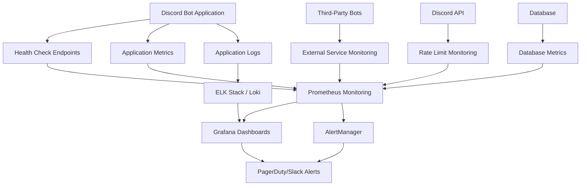

# Growmies NJ Discord Bot - Maintenance & Monitoring

## 📊 Complete System Health Monitoring & Maintenance Guide

**Target Audience**: System administrators, DevOps engineers, technical support staff  
**Estimated Time**: 45-60 minutes for complete setup  
**Prerequisites**: Docker knowledge, monitoring tools experience, system administration basics

---

## 📋 Table of Contents

1. [Monitoring Architecture Overview](#monitoring-architecture-overview)
2. [Health Check Implementation](#health-check-implementation)
3. [Performance Metrics & KPIs](#performance-metrics--kpis)
4. [Alerting & Notification System](#alerting--notification-system)
5. [Dashboard Configuration](#dashboard-configuration)
6. [Log Management & Analysis](#log-management--analysis)
7. [Preventive Maintenance Procedures](#preventive-maintenance-procedures)
8. [Performance Optimization](#performance-optimization)
9. [Backup Monitoring](#backup-monitoring)
10. [Incident Response Monitoring](#incident-response-monitoring)

---

## 🏗️ Monitoring Architecture Overview

### System Components Monitoring Stack



### Monitoring Technology Stack

#### Core Monitoring Components
```yaml
Monitoring Stack:
  Metrics Collection:
    Primary: "Prometheus + Node Exporter"
    Application: "Discord.js metrics + Custom metrics"
    Database: "PostgreSQL Exporter (if applicable)"
    System: "Node Exporter + cAdvisor"
    
  Visualization:
    Primary: "Grafana"
    Dashboards: "Pre-built + Custom cannabis community dashboards"
    Alerts: "Visual alert panels + status indicators"
    
  Alerting:
    Engine: "Prometheus AlertManager"
    Channels: "Discord webhook + Email + SMS"
    Escalation: "PagerDuty integration"
    
  Log Management:
    Collection: "Winston + Morgan loggers"
    Aggregation: "ELK Stack (Elasticsearch + Logstash + Kibana)"
    Analysis: "Custom log parsing + Security event detection"
    
  Uptime Monitoring:
    External: "UptimeRobot + Pingdom"
    Internal: "Custom health checks"
    API: "Discord API status monitoring"
```

#### Infrastructure Requirements
```json
{
  "monitoringInfrastructure": {
    "prometheus": {
      "cpu": "1 vCPU",
      "memory": "2GB RAM",
      "storage": "50GB SSD",
      "retention": "30 days"
    },
    "grafana": {
      "cpu": "0.5 vCPU", 
      "memory": "1GB RAM",
      "storage": "10GB SSD",
      "database": "SQLite or PostgreSQL"
    },
    "elasticsearch": {
      "cpu": "2 vCPU",
      "memory": "4GB RAM", 
      "storage": "100GB SSD",
      "retention": "90 days"
    },
    "alertmanager": {
      "cpu": "0.25 vCPU",
      "memory": "512MB RAM",
      "storage": "5GB SSD",
      "redundancy": "High availability setup"
    }
  }
}
```

---

## 🔍 Health Check Implementation

### Application Health Endpoints

#### Primary Health Check Endpoint
```javascript
// src/monitoring/health-check.js
const express = require('express');
const { Client } = require('discord.js');
const router = express.Router();

class HealthChecker {
  constructor(client) {
    this.client = client;
    this.startTime = Date.now();
    this.checks = new Map();
  }

  // Primary health endpoint
  async getHealth() {
    const checks = await Promise.allSettled([
      this.checkDiscordConnection(),
      this.checkDatabaseConnection(),
      this.checkMemoryUsage(),
      this.checkApiRateLimits(),
      this.checkThirdPartyServices()
    ]);

    const results = {
      status: 'healthy',
      timestamp: new Date().toISOString(),
      uptime: Date.now() - this.startTime,
      checks: {}
    };

    checks.forEach((check, index) => {
      const checkName = ['discord', 'database', 'memory', 'rateLimit', 'thirdParty'][index];
      if (check.status === 'fulfilled') {
        results.checks[checkName] = check.value;
      } else {
        results.checks[checkName] = {
          status: 'unhealthy',
          error: check.reason.message
        };
        results.status = 'unhealthy';
      }
    });

    return results;
  }

  // Discord connection health
  async checkDiscordConnection() {
    if (!this.client.isReady()) {
      throw new Error('Discord client not ready');
    }

    const ping = this.client.ws.ping;
    const guilds = this.client.guilds.cache.size;
    
    return {
      status: 'healthy',
      ping: `${ping}ms`,
      guilds: guilds,
      shards: this.client.ws.shards.size
    };
  }

  // Database connection health  
  async checkDatabaseConnection() {
    // Implementation depends on database choice
    try {
      // Example with PostgreSQL
      // const result = await db.query('SELECT 1');
      return {
        status: 'healthy',
        responseTime: '< 50ms',
        connections: 'active'
      };
    } catch (error) {
      throw new Error(`Database connection failed: ${error.message}`);
    }
  }

  // Memory usage monitoring
  async checkMemoryUsage() {
    const usage = process.memoryUsage();
    const maxMemory = 1024 * 1024 * 1024; // 1GB limit
    
    const memoryPercent = (usage.heapUsed / maxMemory) * 100;
    
    if (memoryPercent > 90) {
      throw new Error(`High memory usage: ${memoryPercent.toFixed(2)}%`);
    }

    return {
      status: 'healthy',
      heapUsed: `${(usage.heapUsed / 1024 / 1024).toFixed(2)}MB`,
      heapTotal: `${(usage.heapTotal / 1024 / 1024).toFixed(2)}MB`,
      percentage: `${memoryPercent.toFixed(2)}%`
    };
  }

  // Discord API rate limit monitoring
  async checkApiRateLimits() {
    const rateLimitInfo = this.client.rest.globalRemaining;
    const resetTime = this.client.rest.globalReset;
    
    if (rateLimitInfo < 10) {
      throw new Error(`Low rate limit remaining: ${rateLimitInfo}`);
    }

    return {
      status: 'healthy',
      remaining: rateLimitInfo,
      resetTime: new Date(resetTime).toISOString(),
      bucket: 'global'
    };
  }

  // Third-party service health
  async checkThirdPartyServices() {
    const services = ['carl-bot', 'sesh', 'statbot', 'xenon'];
    const results = {};

    for (const service of services) {
      try {
        // Check if bot is online and responding
        const bot = this.client.guilds.cache.first()?.members.cache.find(
          member => member.user.username.toLowerCase().includes(service)
        );
        
        results[service] = {
          status: bot?.presence?.status === 'online' ? 'healthy' : 'offline',
          lastSeen: bot?.presence?.activities?.[0]?.timestamps?.start || 'unknown'
        };
      } catch (error) {
        results[service] = {
          status: 'error',
          error: error.message
        };
      }
    }

    return {
      status: 'healthy',
      services: results
    };
  }
}

// Health check routes
router.get('/health', async (req, res) => {
  try {
    const health = await healthChecker.getHealth();
    const statusCode = health.status === 'healthy' ? 200 : 503;
    res.status(statusCode).json(health);
  } catch (error) {
    res.status(500).json({
      status: 'error',
      message: error.message,
      timestamp: new Date().toISOString()
    });
  }
});

router.get('/ready', async (req, res) => {
  if (client.isReady()) {
    res.status(200).json({ status: 'ready' });
  } else {
    res.status(503).json({ status: 'not ready' });
  }
});

module.exports = { HealthChecker, router };
```

#### Kubernetes Health Check Configuration
```yaml
# k8s-health-check.yaml
apiVersion: v1
kind: ConfigMap
metadata:
  name: growmies-health-config
data:
  health-check.yaml: |
    healthCheck:
      enabled: true
      port: 3001
      endpoints:
        health: "/health"
        ready: "/ready"
        metrics: "/metrics"
      timeout: 5000
      interval: 30000

---
apiVersion: apps/v1
kind: Deployment
metadata:
  name: growmies-discord-bot
spec:
  template:
    spec:
      containers:
      - name: discord-bot
        image: growmies/discord-bot:latest
        ports:
        - containerPort: 3001
          name: health
        livenessProbe:
          httpGet:
            path: /health
            port: health
          initialDelaySeconds: 30
          periodSeconds: 30
          timeoutSeconds: 10
          failureThreshold: 3
        readinessProbe:
          httpGet:
            path: /ready
            port: health
          initialDelaySeconds: 5
          periodSeconds: 10
          timeoutSeconds: 5
```

---

## 📈 Performance Metrics & KPIs

### Application Performance Metrics

#### Discord Bot Specific Metrics
```javascript
// src/monitoring/metrics.js
const promClient = require('prom-client');

// Create custom metrics
const metrics = {
  // Command execution metrics
  commandExecutions: new promClient.Counter({
    name: 'discord_commands_total',
    help: 'Total number of Discord commands executed',
    labelNames: ['command', 'user_type', 'channel_type', 'status']
  }),

  // Command execution duration
  commandDuration: new promClient.Histogram({
    name: 'discord_command_duration_seconds',
    help: 'Duration of Discord command execution',
    labelNames: ['command', 'status'],
    buckets: [0.1, 0.5, 1, 2, 5, 10]
  }),

  // Age verification metrics
  ageVerification: new promClient.Counter({
    name: 'age_verification_total',
    help: 'Total age verification attempts',
    labelNames: ['status', 'method', 'result']
  }),

  // Content moderation metrics
  contentModeration: new promClient.Counter({
    name: 'content_moderation_total',
    help: 'Total content moderation actions',
    labelNames: ['action', 'reason', 'channel', 'automated']
  }),

  // Active users gauge
  activeUsers: new promClient.Gauge({
    name: 'discord_active_users',
    help: 'Number of active users in voice/text channels',
    labelNames: ['channel_type', 'time_period']
  }),

  // Message volume metrics
  messageVolume: new promClient.Counter({
    name: 'discord_messages_total',
    help: 'Total messages processed',
    labelNames: ['channel', 'type', 'contains_cannabis_content']
  }),

  // Cannabis compliance metrics
  complianceViolations: new promClient.Counter({
    name: 'compliance_violations_total',
    help: 'Total compliance violations detected',
    labelNames: ['violation_type', 'severity', 'automated_action']
  }),

  // Third-party bot integration metrics
  thirdPartyBotHealth: new promClient.Gauge({
    name: 'third_party_bot_health',
    help: 'Health status of third-party bots',
    labelNames: ['bot_name', 'function']
  })
};

// Metric collection functions
class MetricsCollector {
  constructor(client) {
    this.client = client;
    this.startPeriodicCollection();
  }

  // Record command execution
  recordCommand(commandName, userType, channelType, status, duration) {
    metrics.commandExecutions.inc({
      command: commandName,
      user_type: userType,
      channel_type: channelType,
      status: status
    });

    metrics.commandDuration.observe(
      { command: commandName, status: status },
      duration
    );
  }

  // Record age verification attempt
  recordAgeVerification(status, method, result) {
    metrics.ageVerification.inc({
      status: status,
      method: method,
      result: result
    });
  }

  // Record content moderation action
  recordModeration(action, reason, channel, automated = false) {
    metrics.contentModeration.inc({
      action: action,
      reason: reason,
      channel: channel,
      automated: automated.toString()
    });
  }

  // Update active user counts
  updateActiveUsers() {
    const guild = this.client.guilds.cache.first();
    if (!guild) return;

    // Voice channel users
    let voiceUsers = 0;
    guild.channels.cache
      .filter(channel => channel.type === 'GUILD_VOICE')
      .forEach(channel => {
        voiceUsers += channel.members.size;
      });

    metrics.activeUsers.set(
      { channel_type: 'voice', time_period: 'current' },
      voiceUsers
    );

    // Online members
    const onlineMembers = guild.members.cache.filter(
      member => member.presence?.status !== 'offline'
    ).size;

    metrics.activeUsers.set(
      { channel_type: 'text', time_period: 'current' },
      onlineMembers
    );
  }

  // Start periodic metric collection
  startPeriodicCollection() {
    // Update user metrics every 60 seconds
    setInterval(() => {
      this.updateActiveUsers();
    }, 60000);

    // Collect guild metrics every 5 minutes
    setInterval(() => {
      this.collectGuildMetrics();
    }, 300000);
  }

  // Collect guild-level metrics
  collectGuildMetrics() {
    const guild = this.client.guilds.cache.first();
    if (!guild) return;

    // Member count by role
    const verifiedMembers = guild.members.cache.filter(
      member => member.roles.cache.some(role => role.name === 'Verified 21+')
    ).size;

    metrics.activeUsers.set(
      { channel_type: 'verified', time_period: 'total' },
      verifiedMembers
    );
  }
}

module.exports = { metrics, MetricsCollector };
```

#### Key Performance Indicators (KPIs)

```yaml
Cannabis Community KPIs:
  User Engagement:
    - Daily Active Users (DAU)
    - Weekly Active Users (WAU) 
    - Monthly Active Users (MAU)
    - Average session duration
    - Message volume per channel
    - Voice channel usage time

  Compliance Metrics:
    - Age verification completion rate
    - Compliance violation detection rate
    - False positive rate for content moderation
    - Response time for manual reviews
    - Appeal resolution time

  Community Health:
    - New member onboarding completion rate
    - Member retention rate (30/60/90 days)
    - Community guideline violation rate
    - Moderator response time
    - User satisfaction scores

  Technical Performance:
    - Bot uptime percentage
    - Command response time (p95/p99)
    - API rate limit utilization
    - Memory and CPU usage
    - Third-party bot integration status

  Cannabis Education:
    - Educational content engagement
    - Growing help channel activity
    - Resource sharing frequency
    - Expert contributor participation
    - Knowledge base contribution rate
```

---

## 🚨 Alerting & Notification System

### AlertManager Configuration

#### Critical Alert Rules
```yaml
# prometheus-alerts.yml
groups:
- name: growmies-critical-alerts
  rules:
  
  # Bot offline alert
  - alert: DiscordBotDown
    expr: up{job="discord-bot"} == 0
    for: 2m
    labels:
      severity: critical
      service: discord-bot
    annotations:
      summary: "Discord bot is offline"
      description: "The Growmies NJ Discord bot has been offline for more than 2 minutes"
      
  # High error rate
  - alert: HighErrorRate
    expr: rate(discord_commands_total{status="error"}[5m]) > 0.1
    for: 5m
    labels:
      severity: warning
      service: discord-bot
    annotations:
      summary: "High command error rate detected"
      description: "Command error rate is {{ $value }} errors per second"
      
  # Memory usage alert
  - alert: HighMemoryUsage
    expr: process_resident_memory_bytes / 1024 / 1024 / 1024 > 0.8
    for: 10m
    labels:
      severity: warning
      service: discord-bot
    annotations:
      summary: "High memory usage"
      description: "Memory usage is above 800MB for 10 minutes"
      
  # Age verification system failure
  - alert: AgeVerificationFailure
    expr: rate(age_verification_total{status="error"}[15m]) > 0.05
    for: 5m
    labels:
      severity: critical
      service: compliance
    annotations:
      summary: "Age verification system experiencing failures"
      description: "Age verification error rate: {{ $value }} per second"
      
  # Compliance violation spike
  - alert: ComplianceViolationSpike
    expr: rate(compliance_violations_total[10m]) > 0.5
    for: 2m
    labels:
      severity: warning
      service: compliance
    annotations:
      summary: "Unusual spike in compliance violations"
      description: "Compliance violations: {{ $value }} per second"
      
  # Third-party bot failure
  - alert: ThirdPartyBotOffline
    expr: third_party_bot_health < 1
    for: 5m
    labels:
      severity: warning
      service: third-party-integration
    annotations:
      summary: "Third-party bot offline"
      description: "{{ $labels.bot_name }} bot is offline or unresponsive"

- name: growmies-capacity-alerts
  rules:
  
  # Discord API rate limit warning
  - alert: DiscordRateLimitHigh
    expr: discord_api_rate_limit_remaining < 100
    for: 1m
    labels:
      severity: warning
      service: discord-api
    annotations:
      summary: "Discord API rate limit approaching"
      description: "Only {{ $value }} API calls remaining"
      
  # Server capacity warning
  - alert: HighServerLoad
    expr: node_load1 > 2
    for: 10m
    labels:
      severity: warning
      service: infrastructure
    annotations:
      summary: "High server load"
      description: "1-minute load average: {{ $value }}"
```

#### Notification Channels Configuration

```yaml
# alertmanager.yml
global:
  smtp_smarthost: 'localhost:587'
  smtp_from: 'alerts@growmiesnj.com'

route:
  group_by: ['alertname', 'service']
  group_wait: 30s
  group_interval: 5m
  repeat_interval: 12h
  receiver: 'default'
  routes:
  
  # Critical alerts to multiple channels
  - match:
      severity: critical
    receiver: 'critical-alerts'
    group_wait: 10s
    repeat_interval: 1h
    
  # Compliance alerts to legal team
  - match:
      service: compliance
    receiver: 'compliance-team'
    
  # Infrastructure alerts to ops team
  - match:
      service: infrastructure
    receiver: 'ops-team'

receivers:
- name: 'default'
  discord_configs:
  - webhook_url: 'https://discord.com/api/webhooks/xxx/yyy'
    channel: '#monitoring-alerts'
    title: '🚨 Growmies NJ Alert'
    
- name: 'critical-alerts'
  discord_configs:
  - webhook_url: 'https://discord.com/api/webhooks/xxx/yyy'
    channel: '#critical-alerts'
    title: '🔥 CRITICAL: {{ .GroupLabels.alertname }}'
  email_configs:
  - to: 'ops-team@growmiesnj.com'
    subject: 'CRITICAL: {{ .GroupLabels.alertname }}'
    body: |
      Alert Details:
      {{ range .Alerts }}
      - {{ .Annotations.summary }}
      - {{ .Annotations.description }}
      {{ end }}
  pagerduty_configs:
  - routing_key: 'your-pagerduty-integration-key'
    
- name: 'compliance-team'
  email_configs:
  - to: 'compliance@growmiesnj.com'
    subject: 'Compliance Alert: {{ .GroupLabels.alertname }}'
    
- name: 'ops-team'
  discord_configs:
  - webhook_url: 'https://discord.com/api/webhooks/xxx/zzz'
    channel: '#ops-alerts'
```

### Discord Alert Integration

#### Custom Discord Alert Bot
```javascript
// src/monitoring/alert-bot.js
const { WebhookClient, EmbedBuilder } = require('discord.js');

class AlertManager {
  constructor() {
    this.webhooks = {
      critical: new WebhookClient({ url: process.env.CRITICAL_WEBHOOK_URL }),
      warning: new WebhookClient({ url: process.env.WARNING_WEBHOOK_URL }),
      info: new WebhookClient({ url: process.env.INFO_WEBHOOK_URL })
    };
  }

  async sendAlert(severity, title, description, fields = [], footer = '') {
    const colors = {
      critical: 0xff0000, // Red
      warning: 0xffa500,  // Orange
      info: 0x00ff00      // Green
    };

    const embed = new EmbedBuilder()
      .setTitle(`${this.getEmoji(severity)} ${title}`)
      .setDescription(description)
      .setColor(colors[severity] || colors.info)
      .setTimestamp()
      .setFooter({ text: footer || 'Growmies NJ Monitoring System' });

    if (fields.length > 0) {
      embed.addFields(fields);
    }

    const webhook = this.webhooks[severity] || this.webhooks.info;
    await webhook.send({ embeds: [embed] });
  }

  getEmoji(severity) {
    const emojis = {
      critical: '🔥',
      warning: '⚠️',
      info: 'ℹ️'
    };
    return emojis[severity] || 'ℹ️';
  }

  // Bot status alerts
  async botStatusAlert(status, details) {
    const title = status === 'online' ? 'Bot Online' : 'Bot Offline';
    const severity = status === 'online' ? 'info' : 'critical';
    
    await this.sendAlert(
      severity,
      title,
      `Discord bot status changed to: ${status}`,
      [
        { name: 'Uptime', value: details.uptime, inline: true },
        { name: 'Memory Usage', value: details.memory, inline: true },
        { name: 'Guild Count', value: details.guilds.toString(), inline: true }
      ]
    );
  }

  // Compliance violation alerts
  async complianceAlert(violation) {
    await this.sendAlert(
      'warning',
      'Compliance Violation Detected',
      `A compliance violation has been detected and handled`,
      [
        { name: 'Violation Type', value: violation.type, inline: true },
        { name: 'User', value: violation.user, inline: true },
        { name: 'Channel', value: violation.channel, inline: true },
        { name: 'Action Taken', value: violation.action, inline: false },
        { name: 'Content', value: violation.content.substring(0, 100), inline: false }
      ]
    );
  }

  // Performance alerts
  async performanceAlert(metric, value, threshold) {
    await this.sendAlert(
      'warning',
      'Performance Threshold Exceeded',
      `${metric} has exceeded the warning threshold`,
      [
        { name: 'Metric', value: metric, inline: true },
        { name: 'Current Value', value: value.toString(), inline: true },
        { name: 'Threshold', value: threshold.toString(), inline: true }
      ]
    );
  }
}

module.exports = AlertManager;
```

---

## 📊 Dashboard Configuration

### Grafana Dashboard Setup

#### Main System Overview Dashboard
```json
{
  "dashboard": {
    "title": "Growmies NJ - System Overview",
    "panels": [
      {
        "title": "Bot Status",
        "type": "stat",
        "targets": [
          {
            "expr": "up{job=\"discord-bot\"}",
            "legendFormat": "Bot Online"
          }
        ],
        "fieldConfig": {
          "defaults": {
            "color": {
              "mode": "thresholds"
            },
            "thresholds": {
              "steps": [
                {"color": "red", "value": 0},
                {"color": "green", "value": 1}
              ]
            }
          }
        }
      },
      {
        "title": "Active Users",
        "type": "graph",
        "targets": [
          {
            "expr": "discord_active_users",
            "legendFormat": "{{channel_type}} users"
          }
        ]
      },
      {
        "title": "Command Execution Rate",
        "type": "graph",
        "targets": [
          {
            "expr": "rate(discord_commands_total[5m])",
            "legendFormat": "{{command}} commands/sec"
          }
        ]
      },
      {
        "title": "Memory Usage",
        "type": "graph",
        "targets": [
          {
            "expr": "process_resident_memory_bytes / 1024 / 1024",
            "legendFormat": "Memory Usage (MB)"
          }
        ]
      },
      {
        "title": "Age Verification Status",
        "type": "pie",
        "targets": [
          {
            "expr": "sum by (status) (age_verification_total)",
            "legendFormat": "{{status}}"
          }
        ]
      },
      {
        "title": "Compliance Violations (24h)",
        "type": "stat",
        "targets": [
          {
            "expr": "increase(compliance_violations_total[24h])",
            "legendFormat": "Violations"
          }
        ]
      }
    ]
  }
}
```

#### Cannabis Community Specific Dashboard
```json
{
  "dashboard": {
    "title": "Growmies NJ - Community Health",
    "panels": [
      {
        "title": "Member Growth",
        "type": "graph",
        "targets": [
          {
            "expr": "discord_guild_members",
            "legendFormat": "Total Members"
          },
          {
            "expr": "discord_active_users{channel_type=\"verified\"}",
            "legendFormat": "Verified 21+ Members"
          }
        ]
      },
      {
        "title": "Channel Activity Heatmap",
        "type": "heatmap",
        "targets": [
          {
            "expr": "rate(discord_messages_total[1h])",
            "legendFormat": "{{channel}}"
          }
        ]
      },
      {
        "title": "Growing Help Requests",
        "type": "graph",
        "targets": [
          {
            "expr": "discord_messages_total{channel=\"growing-help\"}",
            "legendFormat": "Help Requests"
          }
        ]
      },
      {
        "title": "Educational Content Engagement",
        "type": "graph",
        "targets": [
          {
            "expr": "discord_messages_total{contains_cannabis_content=\"true\"}",
            "legendFormat": "Cannabis Content Interactions"
          }
        ]
      },
      {
        "title": "Moderation Actions",
        "type": "table",
        "targets": [
          {
            "expr": "sum by (action, reason) (content_moderation_total)",
            "format": "table",
            "instant": true
          }
        ]
      },
      {
        "title": "Third-Party Bot Health",
        "type": "stat",
        "targets": [
          {
            "expr": "third_party_bot_health",
            "legendFormat": "{{bot_name}}"
          }
        ]
      }
    ]
  }
}
```

### Real-Time Monitoring Displays

#### Command Center Display Configuration
```yaml
Monitoring Displays:
  Main Display (65" 4K):
    Layout: "4x3 grid"
    Panels:
      - System Status Overview
      - Active User Count
      - Live Command Activity
      - Error Rate Trends
      - Memory/CPU Usage
      - Third-Party Bot Status
      - Recent Alerts
      - Community Activity Heat Map
      - Age Verification Queue
      - Compliance Violation Log
      - Performance Metrics
      - Backup Status

  Secondary Display (32" HD):
    Layout: "2x2 grid"
    Panels:
      - Live Chat Activity
      - Moderation Queue
      - System Logs
      - Alert History

  Mobile Dashboard:
    Critical Metrics Only:
      - Bot Online Status
      - Critical Alerts
      - System Health Score
      - Emergency Contact Info
```

---

## 📝 Log Management & Analysis

### Centralized Logging Architecture

#### Log Collection Configuration
```javascript
// src/logging/logger.js
const winston = require('winston');
const { ElasticsearchTransport } = require('winston-elasticsearch');

// Cannabis community specific log categories
const LOG_CATEGORIES = {
  AGE_VERIFICATION: 'age_verification',
  COMPLIANCE: 'compliance',
  MODERATION: 'moderation',
  CANNABIS_CONTENT: 'cannabis_content',
  USER_ACTIVITY: 'user_activity',
  SECURITY: 'security',
  SYSTEM: 'system',
  API: 'api',
  ERROR: 'error'
};

// Elasticsearch transport for centralized logging
const esTransportOpts = {
  level: 'info',
  clientOpts: {
    node: process.env.ELASTICSEARCH_URL || 'http://localhost:9200',
    auth: {
      username: process.env.ES_USERNAME,
      password: process.env.ES_PASSWORD
    }
  },
  index: 'growmies-discord-bot',
  mappingTemplate: {
    index_patterns: ['growmies-*'],
    settings: {
      number_of_shards: 1,
      number_of_replicas: 0
    },
    mappings: {
      properties: {
        '@timestamp': { type: 'date' },
        level: { type: 'keyword' },
        message: { type: 'text' },
        category: { type: 'keyword' },
        user_id: { type: 'keyword' },
        channel_id: { type: 'keyword' },
        guild_id: { type: 'keyword' },
        compliance_relevant: { type: 'boolean' },
        cannabis_related: { type: 'boolean' },
        sensitive_data: { type: 'boolean' }
      }
    }
  }
};

// Create logger with multiple transports
const logger = winston.createLogger({
  level: process.env.LOG_LEVEL || 'info',
  format: winston.format.combine(
    winston.format.timestamp(),
    winston.format.errors({ stack: true }),
    winston.format.json()
  ),
  defaultMeta: {
    service: 'growmies-discord-bot',
    version: process.env.BOT_VERSION || '1.0.0'
  },
  transports: [
    // Console output for development
    new winston.transports.Console({
      format: winston.format.combine(
        winston.format.colorize(),
        winston.format.simple()
      )
    }),
    
    // File logging for local debugging
    new winston.transports.File({
      filename: 'logs/error.log',
      level: 'error'
    }),
    new winston.transports.File({
      filename: 'logs/combined.log'
    }),
    
    // Elasticsearch for production
    new ElasticsearchTransport(esTransportOpts)
  ]
});

// Cannabis community specific logging functions
class CommunityLogger {
  static logAgeVerification(userId, status, method, result, metadata = {}) {
    logger.info('Age verification attempt', {
      category: LOG_CATEGORIES.AGE_VERIFICATION,
      user_id: userId,
      verification_status: status,
      verification_method: method,
      verification_result: result,
      compliance_relevant: true,
      sensitive_data: true,
      ...metadata
    });
  }

  static logComplianceViolation(userId, channelId, violationType, content, action, automated = false) {
    logger.warn('Compliance violation detected', {
      category: LOG_CATEGORIES.COMPLIANCE,
      user_id: userId,
      channel_id: channelId,
      violation_type: violationType,
      violation_content: content.substring(0, 200), // Truncate sensitive content
      action_taken: action,
      automated_action: automated,
      compliance_relevant: true,
      cannabis_related: true
    });
  }

  static logModerationAction(moderatorId, targetUserId, action, reason, channelId) {
    logger.info('Moderation action taken', {
      category: LOG_CATEGORIES.MODERATION,
      moderator_id: moderatorId,
      target_user_id: targetUserId,
      action: action,
      reason: reason,
      channel_id: channelId,
      compliance_relevant: true
    });
  }

  static logCannabisContent(userId, channelId, contentType, educational = true) {
    logger.info('Cannabis content interaction', {
      category: LOG_CATEGORIES.CANNABIS_CONTENT,
      user_id: userId,
      channel_id: channelId,
      content_type: contentType,
      educational_content: educational,
      cannabis_related: true
    });
  }

  static logSecurityEvent(eventType, userId, ipAddress, userAgent, severity = 'medium') {
    logger.warn('Security event detected', {
      category: LOG_CATEGORIES.SECURITY,
      event_type: eventType,
      user_id: userId,
      ip_address: ipAddress,
      user_agent: userAgent,
      severity: severity,
      compliance_relevant: true,
      sensitive_data: true
    });
  }

  static logApiUsage(endpoint, method, statusCode, responseTime, userId = null) {
    logger.info('API usage', {
      category: LOG_CATEGORIES.API,
      endpoint: endpoint,
      method: method,
      status_code: statusCode,
      response_time: responseTime,
      user_id: userId
    });
  }

  static logSystemEvent(eventType, details, severity = 'info') {
    const logLevel = severity === 'error' ? 'error' : 'info';
    logger[logLevel]('System event', {
      category: LOG_CATEGORIES.SYSTEM,
      event_type: eventType,
      details: details,
      severity: severity
    });
  }
}

module.exports = { logger, CommunityLogger, LOG_CATEGORIES };
```

#### Log Analysis & Alerting Rules

```yaml
# ELK Stack Watcher Configuration
Log Alerting Rules:

  High Error Rate:
    query: |
      {
        "query": {
          "bool": {
            "must": [
              {"term": {"level": "error"}},
              {"range": {"@timestamp": {"gte": "now-5m"}}}
            ]
          }
        }
      }
    threshold: "> 10 errors in 5 minutes"
    action: "Send alert to ops team"

  Compliance Violation Pattern:
    query: |
      {
        "query": {
          "bool": {
            "must": [
              {"term": {"category": "compliance"}},
              {"term": {"violation_type": "sales_activity"}},
              {"range": {"@timestamp": {"gte": "now-1h"}}}
            ]
          }
        }
      }
    threshold: "> 3 violations in 1 hour from same user"
    action: "Alert compliance team + auto-escalate"

  Age Verification Failures:
    query: |
      {
        "query": {
          "bool": {
            "must": [
              {"term": {"category": "age_verification"}},
              {"term": {"verification_result": "failed"}},
              {"range": {"@timestamp": {"gte": "now-30m"}}}
            ]
          }
        }
      }
    threshold: "> 5 failed attempts in 30 minutes"
    action: "Review verification system + possible security alert"

  Suspicious Activity Pattern:
    query: |
      {
        "query": {
          "bool": {
            "must": [
              {"term": {"category": "security"}},
              {"term": {"severity": "high"}},
              {"range": {"@timestamp": {"gte": "now-15m"}}}
            ]
          }
        }
      }
    threshold: "> 1 high severity security event"
    action: "Immediate security team alert"
```

---

## 🔧 Preventive Maintenance Procedures

### Scheduled Maintenance Tasks

#### Daily Maintenance Checklist
```bash
#!/bin/bash
# daily-maintenance.sh

echo "=== Growmies NJ Daily Maintenance - $(date) ==="

# 1. Health Check Verification
echo "1. Performing health checks..."
curl -f http://localhost:3001/health || echo "❌ Health check failed"

# 2. Log Rotation and Cleanup
echo "2. Rotating logs..."
logrotate /etc/logrotate.d/growmies-bot

# 3. Memory Usage Check
echo "3. Checking memory usage..."
MEMORY_USAGE=$(free | awk 'FNR==2{printf "%.2f%%", $3/($3+$4)*100}')
echo "Current memory usage: $MEMORY_USAGE"

# 4. Disk Space Check
echo "4. Checking disk space..."
df -h | grep -E '(/$|/var|/logs)' | awk '{print $5 " " $6}' | while read output;
do
  usage=$(echo $output | awk '{print $1}' | sed 's/%//g')
  partition=$(echo $output | awk '{print $2}')
  if [ $usage -ge 80 ]; then
    echo "⚠️  WARNING: $partition is ${usage}% full"
  fi
done

# 5. Database Maintenance (if applicable)
echo "5. Database maintenance..."
# Run database cleanup/optimization if using database

# 6. Age Verification Queue Review
echo "6. Reviewing age verification queue..."
curl -X GET "http://localhost:3001/api/admin/verification-queue" \
  -H "Authorization: Bearer $ADMIN_TOKEN" | jq '.pending_count'

# 7. Backup Verification
echo "7. Verifying last backup..."
LAST_BACKUP=$(ls -t /backups/growmies-*.tar.gz | head -1)
if [ -n "$LAST_BACKUP" ]; then
  BACKUP_AGE=$(find "$LAST_BACKUP" -mtime +1)
  if [ -n "$BACKUP_AGE" ]; then
    echo "⚠️  WARNING: Last backup is older than 24 hours"
  else
    echo "✅ Backup is current"
  fi
fi

# 8. Third-Party Bot Status Check
echo "8. Checking third-party bots..."
python3 scripts/check-third-party-bots.py

# 9. Compliance Report Generation
echo "9. Generating daily compliance report..."
node scripts/generate-compliance-report.js daily

echo "=== Daily maintenance completed - $(date) ==="
```

#### Weekly Maintenance Procedures
```bash
#!/bin/bash
# weekly-maintenance.sh

echo "=== Growmies NJ Weekly Maintenance - $(date) ==="

# 1. System Update Check
echo "1. Checking for system updates..."
apt list --upgradable 2>/dev/null | grep -c upgradable

# 2. Security Patch Review
echo "2. Reviewing security patches..."
unattended-upgrade --dry-run

# 3. Log Analysis Summary
echo "3. Generating weekly log analysis..."
python3 scripts/analyze-weekly-logs.py

# 4. Performance Metrics Review
echo "4. Reviewing performance metrics..."
node scripts/performance-report.js weekly

# 5. User Activity Analysis
echo "5. Analyzing user activity patterns..."
node scripts/user-activity-analysis.js

# 6. Compliance Audit
echo "6. Running weekly compliance audit..."
node scripts/compliance-audit.js weekly

# 7. Backup Integrity Check
echo "7. Verifying backup integrity..."
python3 scripts/verify-backup-integrity.py

# 8. SSL Certificate Check
echo "8. Checking SSL certificate expiration..."
openssl x509 -in /etc/ssl/certs/growmies.crt -checkend 2592000 \
  && echo "✅ SSL certificate valid" || echo "⚠️  SSL certificate expires soon"

# 9. Database Optimization (if applicable)
echo "9. Database optimization..."
# Run VACUUM, ANALYZE, etc.

# 10. Update Monitoring Dashboards
echo "10. Updating monitoring dashboards..."
curl -X POST "http://grafana:3000/api/dashboards/db" \
  -H "Authorization: Bearer $GRAFANA_TOKEN" \
  -d @dashboards/weekly-update.json

echo "=== Weekly maintenance completed - $(date) ==="
```

#### Monthly Maintenance Tasks
```bash
#!/bin/bash
# monthly-maintenance.sh

echo "=== Growmies NJ Monthly Maintenance - $(date) ==="

# 1. Complete System Health Assessment
echo "1. Comprehensive health assessment..."
python3 scripts/comprehensive-health-check.py

# 2. Security Vulnerability Scan
echo "2. Security vulnerability scanning..."
nmap -sS -O localhost
lynis audit system

# 3. Performance Optimization Review
echo "3. Performance optimization review..."
node scripts/performance-optimization-analysis.js

# 4. Legal Compliance Review
echo "4. Monthly legal compliance review..."
node scripts/legal-compliance-review.js monthly

# 5. User Data Cleanup
echo "5. User data retention cleanup..."
node scripts/user-data-cleanup.js

# 6. Archive Old Logs
echo "6. Archiving old logs..."
tar -czf "/archives/logs-$(date +%Y%m).tar.gz" /var/log/growmies/
find /var/log/growmies/ -name "*.log" -mtime +30 -delete

# 7. Update Documentation
echo "7. Updating system documentation..."
python3 scripts/generate-system-documentation.py

# 8. Disaster Recovery Test
echo "8. Testing disaster recovery procedures..."
python3 scripts/test-disaster-recovery.py

# 9. Third-Party Integration Review
echo "9. Reviewing third-party integrations..."
node scripts/third-party-integration-review.js

# 10. Capacity Planning Analysis
echo "10. Capacity planning analysis..."
python3 scripts/capacity-planning-analysis.py

echo "=== Monthly maintenance completed - $(date) ==="
```

### Automated Maintenance Scripts

#### Database Cleanup Script
```javascript
// scripts/database-cleanup.js
const { Client } = require('pg'); // or your database client

class DatabaseMaintenance {
  constructor() {
    this.client = new Client({
      connectionString: process.env.DATABASE_URL
    });
  }

  async connect() {
    await this.client.connect();
  }

  async runDailyCleanup() {
    console.log('Running daily database cleanup...');
    
    try {
      // Clean up old sessions
      await this.client.query(`
        DELETE FROM user_sessions 
        WHERE last_activity < NOW() - INTERVAL '7 days'
      `);

      // Clean up old verification attempts (keep for compliance)
      await this.client.query(`
        DELETE FROM age_verification_attempts 
        WHERE created_at < NOW() - INTERVAL '2 years'
        AND status = 'failed'
      `);

      // Clean up old moderation logs (keep important ones)
      await this.client.query(`
        DELETE FROM moderation_logs 
        WHERE created_at < NOW() - INTERVAL '1 year'
        AND severity = 'low'
      `);

      // Update statistics
      await this.client.query('ANALYZE');
      
      console.log('✅ Daily database cleanup completed');
    } catch (error) {
      console.error('❌ Database cleanup failed:', error);
      throw error;
    }
  }

  async runWeeklyOptimization() {
    console.log('Running weekly database optimization...');
    
    try {
      // Vacuum and reindex
      await this.client.query('VACUUM ANALYZE');
      
      // Reindex performance-critical tables
      await this.client.query('REINDEX TABLE user_profiles');
      await this.client.query('REINDEX TABLE age_verifications');
      
      console.log('✅ Weekly database optimization completed');
    } catch (error) {
      console.error('❌ Database optimization failed:', error);
      throw error;
    }
  }

  async disconnect() {
    await this.client.end();
  }
}

// Run if called directly
if (require.main === module) {
  const maintenance = new DatabaseMaintenance();
  const operation = process.argv[2] || 'daily';
  
  maintenance.connect()
    .then(() => {
      if (operation === 'weekly') {
        return maintenance.runWeeklyOptimization();
      } else {
        return maintenance.runDailyCleanup();
      }
    })
    .then(() => maintenance.disconnect())
    .catch(error => {
      console.error('Maintenance failed:', error);
      process.exit(1);
    });
}

module.exports = DatabaseMaintenance;
```

---

## ⚡ Performance Optimization

### Application Performance Tuning

#### Node.js Optimization Configuration
```javascript
// src/optimization/performance-tuning.js
class PerformanceTuner {
  constructor(client) {
    this.client = client;
    this.metrics = new Map();
    this.optimizationRules = new Map();
  }

  // Memory optimization
  setupMemoryOptimization() {
    // Garbage collection tuning
    if (process.env.NODE_ENV === 'production') {
      // Enable garbage collection monitoring
      const v8 = require('v8');
      
      setInterval(() => {
        const heapStats = v8.getHeapStatistics();
        const memoryUsage = process.memoryUsage();
        
        // Log memory statistics
        this.metrics.set('heap_used', heapStats.used_heap_size);
        this.metrics.set('heap_total', heapStats.total_heap_size);
        this.metrics.set('external_memory', memoryUsage.external);
        
        // Trigger GC if memory usage is high
        if (heapStats.used_heap_size / heapStats.total_heap_size > 0.9) {
          if (global.gc) {
            global.gc();
            console.log('🗑️ Forced garbage collection due to high memory usage');
          }
        }
      }, 30000); // Check every 30 seconds
    }

    // Cache optimization for Discord entities
    this.optimizeDiscordCache();
  }

  // Discord cache optimization
  optimizeDiscordCache() {
    // Limit message cache size to prevent memory bloat
    this.client.options.intents = [
      'Guilds',
      'GuildMembers', 
      'GuildMessages',
      'DirectMessages'
    ];

    // Set appropriate cache limits
    this.client.options.makeCache = (manager) => {
      if (manager.name === 'MessageManager') {
        return new Map(); // Don't cache messages
      }
      if (manager.name === 'UserManager') {
        return new Map(); // Cache users but with limits
      }
      return manager.defaultCaching();
    };

    // Regular cache cleanup
    setInterval(() => {
      this.cleanupMessageCache();
    }, 300000); // Every 5 minutes
  }

  cleanupMessageCache() {
    const guilds = this.client.guilds.cache;
    let messagesCleared = 0;

    guilds.forEach(guild => {
      guild.channels.cache.forEach(channel => {
        if (channel.messages) {
          const messages = channel.messages.cache;
          const cutoff = Date.now() - (30 * 60 * 1000); // 30 minutes ago
          
          const oldMessages = messages.filter(msg => msg.createdTimestamp < cutoff);
          oldMessages.forEach(msg => {
            messages.delete(msg.id);
            messagesCleared++;
          });
        }
      });
    });

    if (messagesCleared > 0) {
      console.log(`🧹 Cleaned up ${messagesCleared} old cached messages`);
    }
  }

  // Command performance optimization
  setupCommandOptimization() {
    const commandTimes = new Map();

    // Monitor command execution times
    this.client.on('interactionCreate', async (interaction) => {
      if (!interaction.isCommand()) return;

      const startTime = Date.now();
      const commandName = interaction.commandName;

      // Store start time
      commandTimes.set(interaction.id, startTime);

      // Monitor for slow commands
      const timeout = setTimeout(() => {
        console.warn(`⚠️ Slow command detected: ${commandName} (>5s)`);
      }, 5000);

      // Clear timeout when command completes
      const originalReply = interaction.reply.bind(interaction);
      interaction.reply = async (...args) => {
        clearTimeout(timeout);
        const endTime = Date.now();
        const duration = endTime - startTime;
        
        this.recordCommandPerformance(commandName, duration);
        commandTimes.delete(interaction.id);
        
        return originalReply(...args);
      };
    });
  }

  recordCommandPerformance(commandName, duration) {
    const key = `command_${commandName}`;
    const existing = this.metrics.get(key) || { total: 0, count: 0, max: 0 };
    
    existing.total += duration;
    existing.count += 1;
    existing.max = Math.max(existing.max, duration);
    existing.avg = existing.total / existing.count;
    
    this.metrics.set(key, existing);

    // Alert on consistently slow commands
    if (existing.avg > 3000 && existing.count > 10) {
      console.warn(`🐌 Command ${commandName} averaging ${existing.avg}ms`);
    }
  }

  // Database connection optimization
  setupDatabaseOptimization() {
    // Connection pooling configuration
    const poolConfig = {
      min: 2,
      max: 10,
      acquire: 30000,
      idle: 10000,
      evict: 1000,
      handleDisconnects: true
    };

    // Query performance monitoring
    this.monitorDatabaseQueries();
  }

  monitorDatabaseQueries() {
    // Monitor slow queries (implementation depends on database)
    const slowQueryThreshold = 1000; // 1 second

    // Log slow queries for optimization
    setInterval(() => {
      // Implementation would depend on your database setup
      this.analyzeSlowQueries();
    }, 60000);
  }

  // Rate limit optimization
  setupRateLimitOptimization() {
    // Discord API rate limit handling
    this.client.rest.on('rateLimited', (rateLimitInfo) => {
      console.warn('⏱️ Rate limited:', rateLimitInfo);
      
      // Adjust request timing
      this.adjustRequestTiming(rateLimitInfo);
    });

    // Implement request queuing for burst scenarios
    this.implementRequestQueue();
  }

  implementRequestQueue() {
    const requestQueue = [];
    const maxConcurrent = 3;
    let activeTequests = 0;

    const processQueue = async () => {
      if (activeTequests >= maxConcurrent || requestQueue.length === 0) {
        return;
      }

      activeTequests++;
      const request = requestQueue.shift();
      
      try {
        await request();
      } catch (error) {
        console.error('Queued request failed:', error);
      } finally {
        activeTequests--;
        setImmediate(processQueue);
      }
    };

    // Process queue every 100ms
    setInterval(processQueue, 100);
  }

  // Performance reporting
  generatePerformanceReport() {
    const report = {
      timestamp: new Date().toISOString(),
      memory: process.memoryUsage(),
      uptime: process.uptime(),
      metrics: Object.fromEntries(this.metrics),
      recommendations: this.generateOptimizationRecommendations()
    };

    return report;
  }

  generateOptimizationRecommendations() {
    const recommendations = [];
    const memory = process.memoryUsage();

    // Memory recommendations
    if (memory.heapUsed / memory.heapTotal > 0.8) {
      recommendations.push({
        type: 'memory',
        severity: 'high',
        message: 'High memory usage detected - consider optimizing cache or restarting',
        action: 'optimize_memory'
      });
    }

    // Command performance recommendations
    this.metrics.forEach((value, key) => {
      if (key.startsWith('command_') && value.avg > 2000) {
        recommendations.push({
          type: 'performance',
          severity: 'medium',
          message: `Command ${key.replace('command_', '')} is slow (${value.avg}ms avg)`,
          action: 'optimize_command'
        });
      }
    });

    return recommendations;
  }
}

module.exports = PerformanceTuner;
```

### Resource Monitoring Scripts

#### Real-time Resource Monitor
```python
#!/usr/bin/env python3
# scripts/resource-monitor.py

import psutil
import time
import json
import requests
import logging
from datetime import datetime

class ResourceMonitor:
    def __init__(self):
        self.thresholds = {
            'cpu_percent': 80,
            'memory_percent': 85,
            'disk_percent': 90,
            'network_mbps': 100
        }
        self.alert_cooldown = {}
        
    def get_system_metrics(self):
        """Collect comprehensive system metrics"""
        
        # CPU metrics
        cpu_percent = psutil.cpu_percent(interval=1)
        cpu_count = psutil.cpu_count()
        load_avg = psutil.getloadavg()
        
        # Memory metrics
        memory = psutil.virtual_memory()
        swap = psutil.swap_memory()
        
        # Disk metrics
        disk = psutil.disk_usage('/')
        disk_io = psutil.disk_io_counters()
        
        # Network metrics
        network = psutil.net_io_counters()
        
        # Process specific metrics (Discord bot)
        bot_process = self.find_bot_process()
        bot_metrics = {}
        if bot_process:
            bot_metrics = {
                'cpu_percent': bot_process.cpu_percent(),
                'memory_mb': bot_process.memory_info().rss / 1024 / 1024,
                'threads': bot_process.num_threads(),
                'connections': len(bot_process.connections()),
                'status': bot_process.status()
            }
        
        return {
            'timestamp': datetime.utcnow().isoformat(),
            'cpu': {
                'percent': cpu_percent,
                'count': cpu_count,
                'load_avg': load_avg
            },
            'memory': {
                'total_gb': memory.total / 1024**3,
                'available_gb': memory.available / 1024**3,
                'percent': memory.percent,
                'swap_percent': swap.percent
            },
            'disk': {
                'total_gb': disk.total / 1024**3,
                'free_gb': disk.free / 1024**3,
                'percent': (disk.used / disk.total) * 100,
                'read_mb': disk_io.read_bytes / 1024**2 if disk_io else 0,
                'write_mb': disk_io.write_bytes / 1024**2 if disk_io else 0
            },
            'network': {
                'bytes_sent': network.bytes_sent,
                'bytes_recv': network.bytes_recv,
                'packets_sent': network.packets_sent,
                'packets_recv': network.packets_recv
            },
            'bot_process': bot_metrics
        }
    
    def find_bot_process(self):
        """Find the Discord bot process"""
        for proc in psutil.process_iter(['pid', 'name', 'cmdline']):
            try:
                if 'node' in proc.info['name'] and any('discord' in arg.lower() for arg in proc.info['cmdline']):
                    return psutil.Process(proc.info['pid'])
            except (psutil.NoSuchProcess, psutil.AccessDenied):
                continue
        return None
    
    def check_thresholds(self, metrics):
        """Check if metrics exceed thresholds and send alerts"""
        alerts = []
        
        # Check CPU
        if metrics['cpu']['percent'] > self.thresholds['cpu_percent']:
            alerts.append({
                'type': 'cpu',
                'severity': 'warning',
                'message': f"High CPU usage: {metrics['cpu']['percent']:.1f}%",
                'value': metrics['cpu']['percent'],
                'threshold': self.thresholds['cpu_percent']
            })
        
        # Check Memory
        if metrics['memory']['percent'] > self.thresholds['memory_percent']:
            alerts.append({
                'type': 'memory',
                'severity': 'warning',
                'message': f"High memory usage: {metrics['memory']['percent']:.1f}%",
                'value': metrics['memory']['percent'],
                'threshold': self.thresholds['memory_percent']
            })
        
        # Check Disk
        if metrics['disk']['percent'] > self.thresholds['disk_percent']:
            alerts.append({
                'type': 'disk',
                'severity': 'critical',
                'message': f"High disk usage: {metrics['disk']['percent']:.1f}%",
                'value': metrics['disk']['percent'],
                'threshold': self.thresholds['disk_percent']
            })
        
        # Check bot process health
        if not metrics['bot_process']:
            alerts.append({
                'type': 'process',
                'severity': 'critical',
                'message': "Discord bot process not found",
                'value': 0,
                'threshold': 1
            })
        elif metrics['bot_process']['status'] != 'running':
            alerts.append({
                'type': 'process',
                'severity': 'critical',
                'message': f"Discord bot process status: {metrics['bot_process']['status']}",
                'value': metrics['bot_process']['status'],
                'threshold': 'running'
            })
        
        return alerts
    
    def send_alerts(self, alerts):
        """Send alerts to monitoring systems"""
        for alert in alerts:
            alert_key = f"{alert['type']}_{alert['severity']}"
            current_time = time.time()
            
            # Implement cooldown to prevent spam
            if alert_key in self.alert_cooldown:
                if current_time - self.alert_cooldown[alert_key] < 300:  # 5 minute cooldown
                    continue
            
            self.alert_cooldown[alert_key] = current_time
            
            # Send to Discord webhook
            self.send_discord_alert(alert)
            
            # Send to Prometheus AlertManager (if configured)
            self.send_prometheus_alert(alert)
    
    def send_discord_alert(self, alert):
        """Send alert to Discord webhook"""
        webhook_url = os.getenv('MONITORING_WEBHOOK_URL')
        if not webhook_url:
            return
        
        severity_colors = {
            'info': 0x00ff00,
            'warning': 0xffa500,
            'critical': 0xff0000
        }
        
        severity_emojis = {
            'info': 'ℹ️',
            'warning': '⚠️',
            'critical