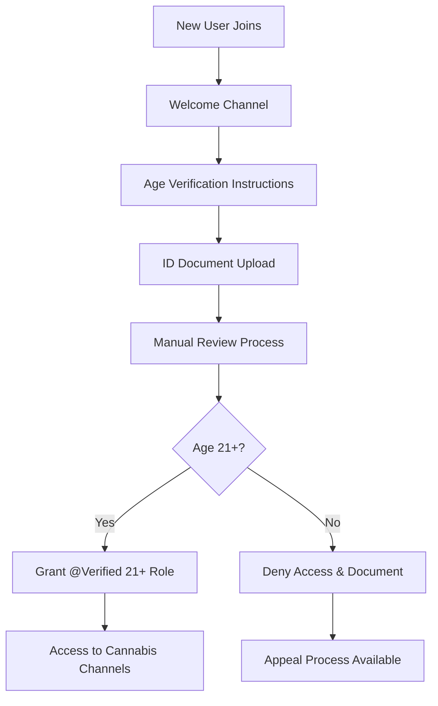
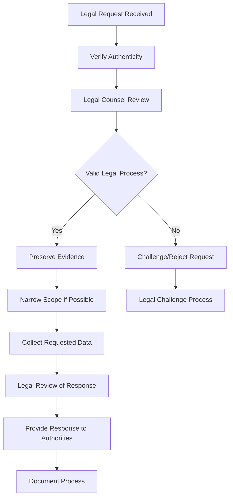

# Growmies NJ Discord Bot - Security & Cannabis Compliance

## 🛡️ Complete New Jersey Cannabis Law Compliance & Security Framework

**Target Audience**: Legal compliance officers, server administrators, security teams  
**Estimated Time**: 60-90 minutes for complete implementation  
**Prerequisites**: Understanding of NJ cannabis laws, Discord security features, GDPR/CCPA requirements

---

## 📋 Table of Contents

1. [New Jersey Cannabis Law Overview](#new-jersey-cannabis-law-overview)
2. [Age Verification Compliance](#age-verification-compliance)
3. [Content Moderation & Legal Boundaries](#content-moderation--legal-boundaries)
4. [Data Privacy & Security](#data-privacy--security)
5. [User Safety & Protection](#user-safety--protection)
6. [Incident Response Procedures](#incident-response-procedures)
7. [Legal Documentation & Audit Trail](#legal-documentation--audit-trail)
8. [Third-Party Compliance](#third-party-compliance)
9. [Regular Compliance Audits](#regular-compliance-audits)
10. [Emergency Legal Procedures](#emergency-legal-procedures)

---

## ⚖️ New Jersey Cannabis Law Overview

### Current Legal Framework (2025)

#### Adult-Use Cannabis Laws
```json
{
  "legalStatus": {
    "possession": {
      "legalAge": 21,
      "limits": {
        "flower": "6 ounces",
        "concentrates": "170 grams",
        "edibles": "No specific limit"
      },
      "locations": ["Private residences", "Licensed facilities"],
      "prohibited": ["Public spaces", "Vehicles", "Federal property"]
    },
    "cultivation": {
      "homeGrow": {
        "allowed": true,
        "plantLimit": 6,
        "matureLimit": 6,
        "location": "Private residence only",
        "landlordConsent": "Required for rentals"
      }
    },
    "sharing": {
      "allowed": "Up to 1 ounce between adults 21+",
      "prohibited": "Sales without license",
      "location": "Private only"
    }
  }
}
```

#### Compliance Requirements for Online Communities
- **Age Verification**: Mandatory 21+ verification for cannabis content access
- **No Sales Facilitation**: Prohibition of commercial transactions
- **Educational Focus**: Content must be educational, not promotional
- **Privacy Protection**: User data protection following state privacy laws
- **Record Keeping**: Maintenance of compliance documentation

### Discord Server Legal Positioning

#### Legal Classification
```
Community Type: Educational Cannabis Discussion Forum
Legal Status: Private Educational Community
Jurisdiction: New Jersey, United States
Age Restriction: 21+ (Cannabis Content Areas)
Content Type: Educational Information Only
Commercial Activity: Prohibited
```

#### Liability Limitations
- **Platform Immunity**: Discord Terms of Service protection
- **Educational Exemption**: First Amendment protection for educational content
- **Private Community**: Invitation-only reduces regulatory scope
- **Content Moderation**: Proactive compliance measures demonstrate good faith

---

## 🔒 Age Verification Compliance

### Mandatory 21+ Verification System

#### Primary Age Verification Process
```javascript
// Age verification implementation
const ageVerification = {
  required: true,
  minimumAge: 21,
  methods: [
    "Government ID verification",
    "Third-party age verification service",
    "Legal attestation with penalties"
  ],
  verification: {
    documentation: "required",
    retention: "2 years minimum",
    encryption: "AES-256",
    access: "compliance team only"
  }
}
```

#### Age Verification Workflow


#### Implementation Requirements

##### ID Document Verification
```json
{
  "acceptedDocuments": [
    "Driver's License (US)",
    "State ID Card", 
    "Passport",
    "Military ID"
  ],
  "requiredElements": [
    "Photo",
    "Date of birth",
    "Government seal/watermark",
    "Clear, unedited image"
  ],
  "securityMeasures": {
    "encryption": "AES-256",
    "storage": "Secure encrypted database",
    "access": "Two-person authorization",
    "retention": "2 years then secure deletion"
  }
}
```

##### Legal Attestation Alternative
```
"I hereby attest under penalty of perjury that:
1. I am at least 21 years of age
2. I am legally permitted to access cannabis information in my jurisdiction
3. I understand that providing false information may result in legal consequences
4. I agree to use this information for educational purposes only

Signature: ___________________ Date: ___________
IP Address: [Logged] Browser: [Logged] Timestamp: [Logged]"
```

#### Role-Based Access Control

##### Age-Gated Channel Structure
```yaml
Public Channels (No Age Restriction):
  - #welcome
  - #rules-and-info
  - #general-chat
  - #off-topic
  - #support

Verified 21+ Only:
  - #age-verification
  - #growing-basics
  - #advanced-techniques
  - #strain-discussion
  - #harvest-help
  - #equipment-reviews
  - #legal-updates

Staff Only:
  - #compliance-monitoring
  - #verification-queue
  - #incident-reports
```

##### Permission Matrix
```json
{
  "@everyone": {
    "publicChannels": "read/write",
    "cannabisChannels": "denied",
    "verification": "read-only"
  },
  "@Verified 21+": {
    "publicChannels": "read/write", 
    "cannabisChannels": "read/write",
    "sharing": "educational content only"
  },
  "@Moderator": {
    "all": "read/write",
    "moderation": "full access",
    "verification": "review authority"
  },
  "@Compliance Officer": {
    "all": "read-only",
    "verification": "full access",
    "legal": "documentation authority"
  }
}
```

---

## 📝 Content Moderation & Legal Boundaries

### Prohibited Content Categories

#### Strictly Prohibited Content
```json
{
  "prohibitedContent": {
    "commercial": {
      "description": "Any sales, trading, or commercial activity",
      "examples": [
        "Selling cannabis products",
        "Price discussions",
        "Commercial recommendations",
        "Vendor promotions",
        "Payment method sharing"
      ],
      "consequences": "Immediate ban + legal documentation"
    },
    "illegal": {
      "description": "Content violating federal or state laws",
      "examples": [
        "Interstate transport plans",
        "Federal property usage",
        "Unlicensed sales",
        "Tax evasion discussions",
        "Minor access information"
      ],
      "consequences": "Immediate ban + law enforcement report"
    },
    "medical": {
      "description": "Unauthorized medical advice or claims",
      "examples": [
        "Specific medical recommendations",
        "Dosage advice for medical conditions",
        "Drug interaction information",
        "Treatment claims",
        "Prescription alternatives"
      ],
      "consequences": "Content removal + warning + documentation"
    },
    "harmful": {
      "description": "Content promoting unsafe practices",
      "examples": [
        "Dangerous extraction methods",
        "Unsafe consumption methods",
        "Driving under influence",
        "Workplace usage",
        "Academic dishonesty"
      ],
      "consequences": "Immediate removal + education + monitoring"
    }
  }
}
```

#### Permitted Educational Content
```json
{
  "permittedContent": {
    "cultivation": {
      "description": "Legal home cultivation education",
      "scope": "Within NJ legal limits (6 plants)",
      "focus": "Techniques, equipment, best practices",
      "disclaimers": "Legal compliance required"
    },
    "legal": {
      "description": "Cannabis law education and updates",
      "scope": "New Jersey and federal law information",
      "focus": "Rights, responsibilities, compliance",
      "disclaimers": "Not legal advice"
    },
    "science": {
      "description": "Cannabis science and research",
      "scope": "Academic and scientific information",
      "focus": "Plant biology, chemistry, research findings",
      "disclaimers": "Educational purposes only"
    },
    "community": {
      "description": "Community building and support",
      "scope": "Legal adult community activities",
      "focus": "Events, meetups, discussions",
      "disclaimers": "Age verification required"
    }
  }
}
```

### Automated Content Filtering

#### AI-Powered Content Analysis
```javascript
const contentFilter = {
  aiModeration: {
    provider: "OpenAI Moderation API",
    categories: [
      "illegal-drug-sales",
      "minor-exploitation", 
      "harmful-advice",
      "commercial-content"
    ],
    confidence: 0.8,
    action: "flag-for-review"
  },
  keywordFiltering: {
    salesTerms: ["selling", "buying", "$", "price", "paypal", "venmo"],
    illegalTerms: ["minor", "underage", "fake id", "interstate"],
    medicalTerms: ["cure", "treatment", "medicine", "doctor"],
    action: "immediate-removal"
  },
  contextAnalysis: {
    enabled: true,
    lookbackMessages: 5,
    userHistory: "30 days",
    escalation: "human-review"
  }
}
```

#### Human Moderation Escalation
```yaml
Escalation Levels:
  Level 1 - Automated:
    - Keyword detection
    - Link filtering
    - Spam prevention
    
  Level 2 - Community Moderator:
    - Context-dependent content
    - User behavior patterns
    - Educational vs commercial intent
    
  Level 3 - Compliance Officer:
    - Legal boundary questions
    - Age verification appeals
    - Law enforcement inquiries
    
  Level 4 - Legal Counsel:
    - Subpoenas or legal requests
    - Major compliance violations
    - Policy interpretation disputes
```

### Legal Content Disclaimers

#### Required Disclaimers Template
```markdown
## 📜 Legal Disclaimers

**Educational Content Only**
All information shared in this server is for educational purposes only and does not constitute legal, medical, or professional advice.

**Age Requirement** 
You must be 21+ years old to access cannabis-related content in accordance with New Jersey state law.

**Legal Compliance**
Users are responsible for following all applicable federal, state, and local laws in their jurisdiction.

**No Medical Advice**
Nothing in this server constitutes medical advice. Consult healthcare professionals for medical questions.

**No Commercial Activity**
This server prohibits all sales, purchases, and commercial activities related to cannabis.

**Privacy Notice**
We collect and store data necessary for legal compliance. See our privacy policy for details.

**Disclaimer of Liability**
Server administrators are not responsible for user actions or consequences of information shared.
```

---

## 🔐 Data Privacy & Security

### User Data Protection Framework

#### Data Classification System
```json
{
  "dataClassification": {
    "public": {
      "data": ["Usernames", "Public messages", "Join dates"],
      "protection": "Standard encryption",
      "retention": "Indefinite",
      "access": "Community members"
    },
    "sensitive": {
      "data": ["Age verification status", "Moderation history"],
      "protection": "Enhanced encryption + access controls",
      "retention": "2 years",
      "access": "Compliance team only"
    },
    "confidential": {
      "data": ["ID documents", "Verification photos", "Appeals"],
      "protection": "Maximum encryption + two-person authorization",
      "retention": "Legal minimum only",
      "access": "Authorized personnel with audit trail"
    },
    "restricted": {
      "data": ["Law enforcement communications", "Legal holds"],
      "protection": "Maximum encryption + legal counsel access",
      "retention": "Legal requirement + 1 year",
      "access": "Legal team only"
    }
  }
}
```

#### Privacy-by-Design Implementation

##### Data Minimization
```javascript
const dataMinimization = {
  collection: {
    principle: "Collect only necessary data",
    ageVerification: {
      required: ["Birth date", "Document type", "Verification status"],
      prohibited: ["Full SSN", "Financial info", "Unrelated personal data"]
    },
    messaging: {
      required: ["Message content", "Timestamp", "Channel"],
      optional: ["Reaction data", "Edit history"],
      prohibited: ["Private DMs", "Off-platform data"]
    }
  },
  processing: {
    purpose: "Cannabis law compliance only",
    limitations: "Specific to legal requirements",
    consent: "Explicit opt-in required"
  }
}
```

##### Encryption Standards
```yaml
Encryption Requirements:
  Data at Rest:
    Algorithm: AES-256-GCM
    Key Management: Hardware Security Module (HSM)
    Key Rotation: Every 90 days
    
  Data in Transit:
    Protocol: TLS 1.3 minimum
    Certificate: Extended Validation (EV)
    Perfect Forward Secrecy: Required
    
  Application Level:
    User Data: Individual encryption keys
    ID Documents: Additional application-layer encryption
    Database: Transparent Data Encryption (TDE)
```

### GDPR/CCPA Compliance

#### User Rights Implementation
```json
{
  "userRights": {
    "accessRight": {
      "description": "Right to access personal data",
      "implementation": "/privacy data-access command",
      "timeframe": "30 days maximum",
      "format": "Structured data export"
    },
    "rectificationRight": {
      "description": "Right to correct personal data",
      "implementation": "Support ticket system",
      "timeframe": "30 days maximum", 
      "verification": "Identity confirmation required"
    },
    "erasureRight": {
      "description": "Right to delete personal data",
      "implementation": "/privacy delete-account command",
      "timeframe": "30 days maximum",
      "exceptions": "Legal compliance requirements"
    },
    "portabilityRight": {
      "description": "Right to data portability", 
      "implementation": "Machine-readable export",
      "timeframe": "30 days maximum",
      "format": "JSON structured data"
    },
    "objectionRight": {
      "description": "Right to object to processing",
      "implementation": "Opt-out mechanisms",
      "timeframe": "Immediate",
      "scope": "Non-essential processing only"
    }
  }
}
```

#### Privacy Policy Implementation
```markdown
# Growmies NJ Privacy Policy

## Data We Collect
- **Identity Data**: Age verification information (21+ requirement)
- **Usage Data**: Server activity for community management
- **Communication Data**: Messages in compliance-monitored channels
- **Technical Data**: IP addresses and device information for security

## Why We Collect Data
- **Legal Compliance**: New Jersey cannabis law age verification
- **Community Safety**: Moderation and security purposes
- **Service Provision**: Discord server functionality

## Data Sharing
- **Law Enforcement**: When legally required
- **Discord Inc**: Platform functionality only
- **Third Parties**: Only with explicit consent

## Your Rights
- Access your data
- Correct inaccurate data
- Delete your data (subject to legal requirements)
- Object to processing
- Data portability

## Contact
- Privacy Officer: privacy@growmiesnj.com
- Data Protection Officer: dpo@growmiesnj.com
```

---

## 👥 User Safety & Protection

### Anti-Harassment & Safety Framework

#### Zero-Tolerance Policies
```json
{
  "zeroTolerancePolicies": {
    "harassment": {
      "definition": "Repeated unwanted contact or behavior",
      "examples": [
        "Persistent unwanted DMs",
        "Targeted personal attacks", 
        "Doxxing or personal information sharing",
        "Sexual harassment",
        "Discriminatory language"
      ],
      "response": "Immediate ban + documentation + possible law enforcement report"
    },
    "threats": {
      "definition": "Any threat of violence or harm",
      "examples": [
        "Physical violence threats",
        "Property damage threats",
        "Self-harm encouragement",
        "Stalking behavior"
      ],
      "response": "Immediate ban + law enforcement report + evidence preservation"
    },
    "exploitation": {
      "definition": "Attempting to exploit vulnerable users",
      "examples": [
        "Targeting minors for cannabis access",
        "Financial scams related to cannabis",
        "Fake medical advice for profit",
        "Identity theft attempts"
      ],
      "response": "Immediate ban + law enforcement report + victim support"
    }
  }
}
```

#### Mental Health & Crisis Support

##### Crisis Response Protocol
```yaml
Crisis Response Levels:
  Level 1 - Wellness Check:
    Triggers: ["feeling depressed", "having trouble", "really struggling"]
    Response: "Automated mental health resources + moderator notification"
    Timeline: "Immediate resource sharing + 1 hour human follow-up"
    
  Level 2 - Mental Health Crisis:
    Triggers: ["want to die", "killing myself", "not worth living"]
    Response: "Immediate crisis resources + staff alert + offer of private support"
    Timeline: "Immediate response + ongoing monitoring"
    
  Level 3 - Imminent Danger:
    Triggers: ["going to kill myself", "have plan", "tonight"]
    Response: "Crisis hotline resources + consider law enforcement wellness check"
    Timeline: "Immediate action + documentation + follow-up"
```

##### Mental Health Resources Database
```json
{
  "mentalHealthResources": {
    "crisis": {
      "national": "988 Suicide & Crisis Lifeline",
      "text": "Text HOME to 741741",
      "lgbt": "1-866-488-7386 (Trevor Project)",
      "veterans": "1-800-273-8255"
    },
    "newJersey": {
      "crisis": "1-866-202-HELP (4357)",
      "mental": "NJ Mental Health Cares - 1-866-202-4357",
      "addiction": "1-844-ReachNJ (732-2465)"
    },
    "cannabis": {
      "addiction": "1-800-662-4357 (SAMHSA)",
      "support": "Marijuana Anonymous - ma-online.org",
      "counseling": "Psychology Today Cannabis Counselors"
    }
  }
}
```

### Minor Protection Protocols

#### Under-21 Detection & Response
```javascript
const minorProtection = {
  detection: {
    ageVerification: "Primary prevention method",
    behaviorAnalysis: [
      "School-hour activity patterns",
      "Language patterns indicating age",
      "References to parents/guardians",
      "Mentions of high school"
    ],
    contentAnalysis: [
      "Questions about circumventing age restrictions",
      "Requests for help accessing cannabis underage",
      "Fake ID discussions"
    ]
  },
  response: {
    immediate: [
      "Block access to all cannabis content",
      "Document the incident",
      "Alert compliance team",
      "Preserve evidence"
    ],
    investigation: [
      "Review user's complete history",
      "Check verification documents",
      "Interview involved staff",
      "Legal consultation if needed"
    ],
    reporting: [
      "Internal incident report",
      "Legal team notification",
      "Consider law enforcement report",
      "Update prevention measures"
    ]
  }
}
```

---

## 🚨 Incident Response Procedures

### Legal Incident Classification

#### Incident Severity Levels
```yaml
Severity 1 - Critical Legal Emergency:
  Examples:
    - Law enforcement subpoena received
    - Minor exposed to cannabis content
    - Commercial activity facilitating illegal sales
    - Threat of violence or illegal activity
  Response Time: "Immediate (< 30 minutes)"
  Response Team: "Legal counsel + compliance officer + server owner"
  Actions: "Content preservation + legal consultation + possible server lock"

Severity 2 - Major Compliance Violation:
  Examples:
    - Age verification system bypass
    - Repeated prohibited content sharing
    - Data privacy violation
    - Harassment with legal implications
  Response Time: "2 hours"
  Response Team: "Compliance officer + senior moderator"
  Actions: "Investigation + documentation + corrective measures"

Severity 3 - Minor Policy Violation:
  Examples:
    - Single instance of prohibited content
    - Minor age verification concern
    - Content moderation appeal
    - Technical compliance issue
  Response Time: "24 hours"
  Response Team: "Moderator + compliance documentation"
  Actions: "Standard moderation + education + monitoring"
```

#### Evidence Preservation Protocol

##### Digital Evidence Collection
```json
{
  "evidenceCollection": {
    "immediate": {
      "timeframe": "Within 30 minutes of incident",
      "actions": [
        "Screenshot all relevant content",
        "Export message logs with timestamps",
        "Document user profiles and roles",
        "Preserve moderation logs",
        "Record IP addresses and connection data"
      ]
    },
    "comprehensive": {
      "timeframe": "Within 24 hours",
      "actions": [
        "Complete user history export",
        "Voice recording preservation (if applicable)",
        "Image/file attachment backup",
        "Cross-reference with other platforms",
        "Witness statement collection"
      ]
    },
    "legal": {
      "timeframe": "As required by legal counsel",
      "actions": [
        "Chain of custody documentation",
        "Digital signature verification",
        "Forensic-level preservation",
        "Legal hold implementation",
        "Expert witness preparation"
      ]
    }
  }
}
```

### Law Enforcement Cooperation

#### Legal Request Processing


#### Cooperation Guidelines
```json
{
  "lawEnforcementCooperation": {
    "requiredDocuments": [
      "Valid subpoena",
      "Court order",
      "Search warrant",
      "Legal process with jurisdiction"
    ],
    "responseTimeframes": {
      "emergency": "Immediate (life threatening)",
      "standard": "30 days",
      "complex": "60 days with extensions"
    },
    "dataProvision": {
      "scope": "Limited to legally required information",
      "format": "Structured data export",
      "verification": "Legal counsel approval required",
      "userNotification": "Unless legally prohibited"
    },
    "limitations": {
      "fishing": "Reject overly broad requests",
      "jurisdiction": "Verify legal authority",
      "privacy": "Assert user privacy rights where applicable",
      "minimization": "Provide least intrusive data possible"
    }
  }
}
```

---

## 📊 Legal Documentation & Audit Trail

### Compliance Documentation System

#### Required Documentation Categories
```yaml
Legal Documents:
  - Terms of Service
  - Privacy Policy  
  - Community Guidelines
  - Age Verification Procedures
  - Incident Response Plan
  - Data Retention Policy

Operational Records:
  - Age verification logs
  - Moderation action logs
  - Content removal records
  - User appeals and responses
  - Staff training records
  - Policy update history

Incident Documentation:
  - Incident report forms
  - Investigation findings
  - Corrective action plans
  - Legal consultation records
  - Law enforcement interactions
  - User notification records
```

#### Audit Trail Requirements
```json
{
  "auditTrail": {
    "retention": "7 years minimum",
    "immutability": "Write-once, read-many storage",
    "encryption": "AES-256 with integrity verification",
    "access": "Role-based with full logging",
    "elements": {
      "timestamp": "UTC with millisecond precision",
      "actor": "User ID + role + IP address",
      "action": "Detailed description of action taken",
      "target": "Affected user/content/system component",
      "justification": "Policy or legal basis for action",
      "evidence": "Supporting documentation links"
    }
  }
}
```

### Legal Hold Procedures

#### Legal Hold Implementation
```javascript
const legalHold = {
  triggers: [
    "Litigation notice",
    "Government investigation",
    "Regulatory inquiry",
    "Internal policy violation requiring investigation"
  ],
  scope: {
    userData: "All data related to specified users",
    timeframe: "From specified date range",
    content: "Messages, files, metadata, logs",
    preservation: "Original format + readable copies"
  },
  process: {
    notification: "Legal team initiates hold",
    implementation: "IT team executes preservation",
    monitoring: "Ongoing compliance verification",
    release: "Legal authorization required"
  }
}
```

---

## 🔍 Regular Compliance Audits

### Monthly Compliance Review

#### Monthly Audit Checklist
```markdown
## Monthly Compliance Audit - [Month/Year]

### Age Verification System
- [ ] Verification queue processed within SLA
- [ ] ID document storage security verified
- [ ] Role assignments accurate and current
- [ ] Appeal process functioning properly
- [ ] Staff training up to date

### Content Moderation
- [ ] Automod rules effectiveness review
- [ ] False positive/negative rate analysis
- [ ] Prohibited content detection accuracy
- [ ] Moderator action consistency review
- [ ] User appeal resolution times

### Privacy & Security
- [ ] Data retention policy compliance
- [ ] User rights requests processed
- [ ] Security incident review
- [ ] Third-party service compliance
- [ ] Encryption key rotation completed

### Legal Compliance
- [ ] Policy updates implemented
- [ ] Staff training completion verified
- [ ] Incident response procedure testing
- [ ] Documentation completeness review
- [ ] Legal consultation recommendations reviewed

### Compliance Metrics
- Age verification completion rate: ____%
- Content removal accuracy: ____%  
- Privacy request resolution time: ___ days average
- Incident response time: ___ hours average
- Staff training completion: ____%
```

### Quarterly Legal Review

#### Comprehensive Quarterly Assessment
```json
{
  "quarterlyReview": {
    "legalUpdates": {
      "newJerseyLaw": "Review state law changes",
      "federalLaw": "Monitor federal policy shifts", 
      "caselaw": "Track relevant court decisions",
      "enforcement": "Analyze enforcement trends"
    },
    "policyUpdates": {
      "termOfService": "Annual review requirement",
      "privacyPolicy": "Update for new practices",
      "guidelines": "Refine based on experience",
      "procedures": "Optimize based on metrics"
    },
    "riskAssessment": {
      "legalRisks": "Identify new legal exposure",
      "operationalRisks": "Process improvement needs",
      "technicalRisks": "Security and privacy gaps",
      "reputationalRisks": "Community trust factors"
    },
    "trainingNeeds": {
      "staffTraining": "Update training materials",
      "communityEducation": "Member awareness programs",
      "leadershipBriefing": "Executive team updates",
      "specialistConsultation": "Expert legal review"
    }
  }
}
```

---

## 🚨 Emergency Legal Procedures

### Critical Legal Emergency Response

#### Emergency Contact Procedures
```yaml
Legal Emergency Contacts:
  Primary Legal Counsel:
    Name: "[Law Firm Name]"
    Phone: "24/7 Emergency: XXX-XXX-XXXX"
    Email: "emergency@lawfirm.com"
    Specialization: "Cannabis law + technology law"
    
  Backup Legal Counsel:
    Name: "[Backup Firm Name]"
    Phone: "Emergency: XXX-XXX-XXXX"
    Email: "urgent@backupfirm.com"
    Specialization: "Digital privacy + compliance"
    
  Compliance Officer:
    Name: "[Officer Name]"
    Phone: "XXX-XXX-XXXX"
    Email: "compliance@growmiesnj.com"
    Available: "24/7 for emergencies"
    
  Technical Emergency:
    Name: "IT Security Team"
    Phone: "XXX-XXX-XXXX"
    Email: "security@growmiesnj.com"
    Response: "Data preservation + system lock"
```

#### Server Lockdown Procedures
```json
{
  "emergencyLockdown": {
    "triggers": [
      "Law enforcement raid notice",
      "Minor safety concern",
      "Major legal violation discovered",
      "Data breach involving compliance data"
    ],
    "procedures": {
      "immediate": {
        "lockServer": "Restrict all non-admin access",
        "preserveEvidence": "Automated backup of current state",
        "notifyLegal": "Alert legal counsel immediately",
        "logIncident": "Create detailed incident record"
      },
      "shortTerm": {
        "assessDamage": "Evaluate scope of legal exposure",
        "containThreat": "Prevent further violations",
        "gatherEvidence": "Comprehensive evidence collection",
        "planResponse": "Develop remediation strategy"
      },
      "recovery": {
        "legalClearance": "Obtain counsel approval for reopening",
        "systemReview": "Complete security and compliance review",
        "policyUpdates": "Implement lessons learned",
        "communityNotification": "Transparent communication plan"
      }
    }
  }
}
```

### Legal Communication Templates

#### Law Enforcement Response Template
```markdown
## Response to Law Enforcement Inquiry

**Date**: [Date]
**Officer/Agent**: [Name and Badge/ID]
**Agency**: [Law Enforcement Agency]
**Legal Process**: [Subpoena/Warrant/Court Order Number]

### Initial Response
"Thank you for contacting us regarding [matter]. We take all legal requests seriously and are committed to complying with valid legal process while protecting user privacy rights.

We request that you provide:
1. Valid legal process (subpoena, warrant, or court order)
2. Specific information being requested
3. Legal basis and jurisdiction for the request
4. Timeline for response

We will review your request with legal counsel and respond within the timeframe required by law."

### Legal Process Verification
- [ ] Document authenticity verified
- [ ] Jurisdiction confirmed
- [ ] Scope of request reviewed
- [ ] Legal counsel consulted
- [ ] Response timeline established

### Response Prepared By
**Legal Counsel**: [Name and Bar Number]
**Compliance Officer**: [Name and Title]
**Date**: [Date]
```

#### User Privacy Breach Notification
```markdown
## Privacy Incident Notification

**Subject**: Important Privacy Notice - Growmies NJ Discord Server

Dear Growmies NJ Community Member,

We are writing to inform you of a privacy incident that may have affected your personal information on our Discord server.

### What Happened
[Detailed but clear explanation of the incident]

### Information Involved
[Specific types of data that were affected]

### What We're Doing
- Immediately secured the affected systems
- Launched a comprehensive investigation
- Notified appropriate authorities as required
- Implemented additional security measures

### What You Should Do
- Review your Discord account security settings
- Be cautious of suspicious communications
- Monitor for any unusual activity
- Contact us with any concerns

### Contact Information
Privacy Officer: privacy@growmiesnj.com
Legal Team: legal@growmiesnj.com
Support: support@growmiesnj.com

We sincerely apologize for this incident and are committed to preventing future occurrences.

Sincerely,
Growmies NJ Legal & Compliance Team
```

---

## 📋 Compliance Checklist Summary

### Daily Compliance Tasks
- [ ] Review overnight moderation actions
- [ ] Process age verification queue
- [ ] Monitor automated content filters
- [ ] Check for legal notices or communications
- [ ] Review privacy request queue

### Weekly Compliance Tasks  
- [ ] Audit moderation decision consistency
- [ ] Review user appeals and responses
- [ ] Update legal knowledge base
- [ ] Staff compliance training check
- [ ] Security incident review

### Monthly Compliance Tasks
- [ ] Complete monthly audit checklist
- [ ] Review and update documentation
- [ ] Analyze compliance metrics
- [ ] Legal counsel consultation
- [ ] Policy effectiveness review

### Quarterly Compliance Tasks
- [ ] Comprehensive legal review
- [ ] Risk assessment update
- [ ] Policy revision process
- [ ] Staff training updates
- [ ] External legal consultation

### Annual Compliance Tasks
- [ ] Complete compliance program review
- [ ] Legal framework update
- [ ] Insurance coverage review
- [ ] Business license renewals
- [ ] Strategic legal planning

---

**🛡️ This security and compliance framework ensures the Growmies NJ Discord community operates within New Jersey cannabis law while protecting user privacy and maintaining the highest standards of legal compliance.**

---

**Last Updated**: January 2025  
**Version**: 1.0.0  
**Legal Review**: [Required]  
**Next Review Date**: April 2025