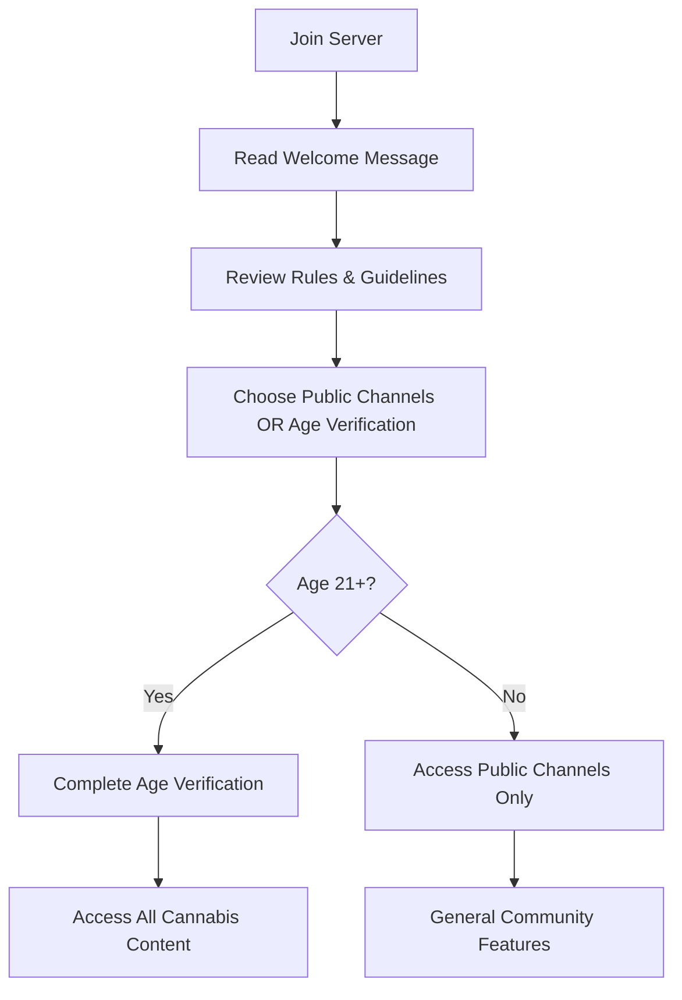
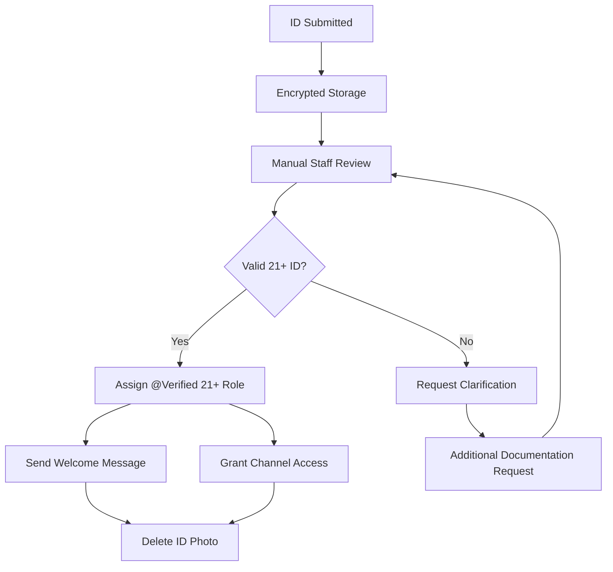
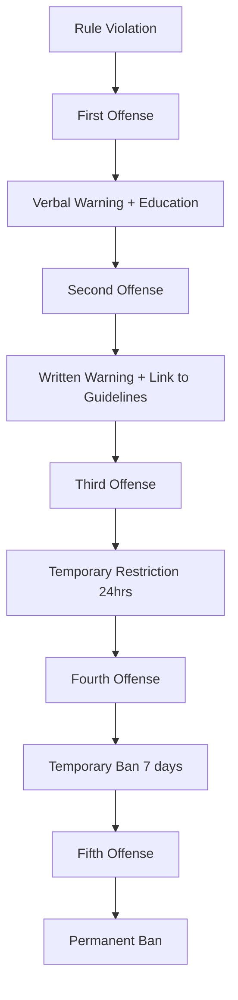
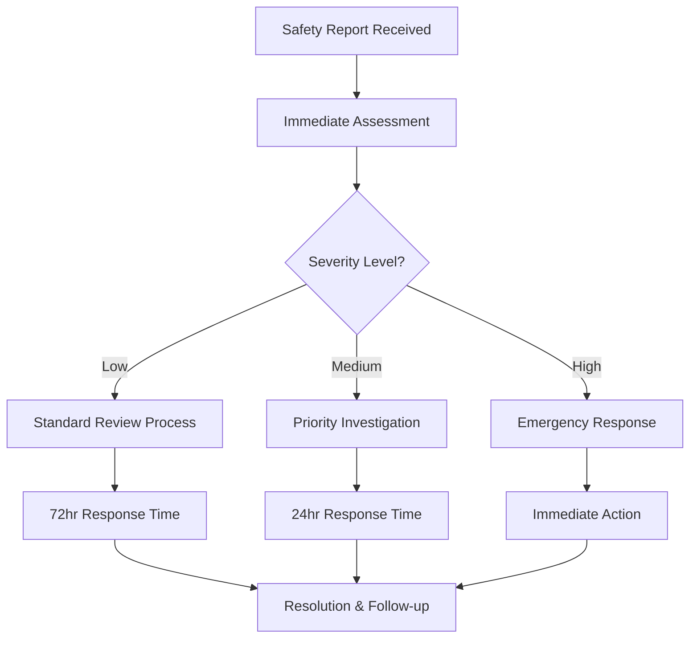

# Growmies NJ Discord Community - User Guide

## 🌱 Welcome to the Growmies NJ Cannabis Community

**Target Audience**: Discord server members, new users, cannabis enthusiasts  
**Estimated Reading Time**: 15-20 minutes  
**Prerequisites**: Discord account, 21+ years of age for cannabis content access

---

## 📋 Table of Contents

1. [Welcome & Community Overview](#welcome--community-overview)
2. [Getting Started Guide](#getting-started-guide)
3. [Age Verification Process](#age-verification-process)
4. [Channel Guide & Navigation](#channel-guide--navigation)
5. [Community Features & Tools](#community-features--tools)
6. [Cannabis Education Resources](#cannabis-education-resources)
7. [Community Guidelines & Rules](#community-guidelines--rules)
8. [Growing Help & Support](#growing-help--support)
9. [Events & Activities](#events--activities)
10. [Privacy & Safety](#privacy--safety)

---

## 🏠 Welcome & Community Overview

### About Growmies NJ

Welcome to **Growmies NJ** - New Jersey's premier Discord community for cannabis education, cultivation knowledge sharing, and adult-focused discussions. Our community is built on the foundation of education, legal compliance, and mutual support for cannabis enthusiasts in the Garden State.

#### Our Mission
```
🎯 Mission Statement:
"To provide a safe, educational, and legally compliant space for New Jersey adults (21+) 
to learn about cannabis cultivation, share knowledge, and build community connections 
while respecting state laws and promoting responsible cannabis use."
```

#### Community Values
- **🎓 Education First**: All content focuses on learning and knowledge sharing
- **⚖️ Legal Compliance**: Strict adherence to New Jersey cannabis laws
- **🤝 Mutual Respect**: Supporting each other's learning journey
- **🔒 Privacy & Safety**: Protecting member privacy and personal information
- **🌱 Responsible Use**: Promoting safe and legal cannabis practices

### What You'll Find Here

#### Educational Content
- **Cultivation Techniques**: From seedling to harvest
- **Strain Information**: Genetics, effects, and growing characteristics
- **Equipment Reviews**: Tools, lights, nutrients, and growing systems
- **Legal Updates**: New Jersey cannabis law changes and compliance
- **Scientific Research**: Latest cannabis studies and findings

#### Community Features
- **Growing Help Desk**: Get expert advice on cultivation challenges
- **Resource Library**: Curated educational materials and guides
- **Member Meetups**: Legal community gatherings and events
- **Expert Q&A Sessions**: Learn from experienced growers and professionals
- **Study Groups**: Collaborative learning on cannabis topics

#### What We DON'T Allow
- ❌ **Sales or Trading**: No buying, selling, or trading of cannabis products
- ❌ **Commercial Promotion**: No advertising or business promotion
- ❌ **Medical Advice**: No specific medical recommendations or dosage advice
- ❌ **Illegal Activity**: No discussion of federal law violations or underage access
- ❌ **Personal Information Sharing**: No sharing of addresses, phone numbers, or identifying details

---

## 🚀 Getting Started Guide

### Step 1: Join the Server

#### Discord Account Setup
If you're new to Discord:
1. **Create Account**: Visit https://discord.com and create your free account
2. **Verify Email**: Check your email and verify your Discord account
3. **Download App**: Install Discord on your device (mobile or desktop)
4. **Join Server**: Use our invitation link: `[INVITE_LINK_HERE]`

#### First Login Experience
When you first join Growmies NJ:


### Step 2: Set Up Your Profile

#### Discord Profile Recommendations
```yaml
Recommended Profile Setup:
  Username: 
    - Keep it friendly and appropriate
    - Avoid anything that could identify your location
    - Cannabis-related names are welcome (e.g., "GrowEnthusiast", "NJGardener")
    
  Avatar:
    - Use a fun, appropriate image
    - Plant photos are popular in our community
    - Avoid personal photos for privacy
    
  About Me:
    - Share your growing experience level
    - Mention your interests (indoor/outdoor, strains, etc.)
    - Keep personal details private
    
  Status:
    - Set your status to show when you're available to chat
    - Use custom statuses to share growing updates
```

#### Privacy Settings
```json
{
  "recommendedPrivacySettings": {
    "directMessages": "Friends only or Server members only",
    "serverNickname": "Allow server members to add you as friend: OFF",
    "activityStatus": "Display currently running game: Your choice",
    "readReceipts": "Your choice - consider privacy implications"
  }
}
```

### Step 3: Explore Public Areas

#### Public Channels (No Age Verification Required)
Before age verification, you can access:

**#welcome** 📢
- Community announcements and important updates
- New member introductions
- Server news and feature announcements

**#general-chat** 💬  
- General discussions about anything (within guidelines)
- Get to know other community members
- Share non-cannabis related interests

**#introductions** 👋
- Introduce yourself to the community
- Share your background and interests
- Connect with other members

**#support** 🆘
- Get help with Discord features
- Report issues or ask questions
- Technical support for server navigation

**#off-topic** 🎮
- Gaming discussions
- Music, movies, and entertainment
- Hobbies and interests outside cannabis

---

## 🔒 Age Verification Process

### Why Age Verification is Required

#### Legal Compliance
New Jersey law requires that individuals be **21 years or older** to legally possess, use, or access information about cannabis cultivation. Our age verification system ensures:
- Compliance with state cannabis laws
- Protection of minors from age-inappropriate content
- Legal protection for our community and members
- Responsible community management

#### What Age Verification Unlocks
Once verified as 21+, you gain access to:
- All cannabis-related channels and discussions
- Growing help and cultivation advice
- Strain information and reviews
- Equipment recommendations and reviews
- Community events and meetups
- Educational resources and guides

### How to Complete Age Verification

#### Method 1: Government ID Verification (Recommended)

**Step-by-Step Process:**
1. **Navigate to #age-verification channel**
2. **Read the verification instructions carefully**
3. **Prepare acceptable identification:**
   - U.S. Driver's License
   - State-issued ID card
   - Valid U.S. Passport
   - Military ID

4. **Take a clear photo of your ID:**
   ```yaml
   Photo Requirements:
     Quality: Clear, well-lit, all text readable
     Coverage: Full ID visible, no parts cut off
     Format: JPG or PNG format
     Privacy: You may cover/block out sensitive info like address
     Required Visible: Name, date of birth, photo, state/government seal
   ```

5. **Submit via secure verification bot:**
   - Upload photo through the verification bot
   - Photo is encrypted and reviewed by authorized staff only
   - Original photo is deleted after verification
   - Only verification status is retained

6. **Wait for manual review:**
   - Staff review within 24-48 hours
   - You'll receive a DM notification when complete
   - @Verified 21+ role automatically assigned

#### Method 2: Legal Attestation (Alternative)

If you cannot provide ID documentation:
1. **Complete legal attestation form**
2. **Provide sworn statement of age**
3. **Understand legal consequences of false information**
4. **Additional verification steps may be required**

**Legal Attestation Text:**
```
"I hereby attest under penalty of perjury under the laws of New Jersey that:

1. I am at least twenty-one (21) years of age
2. I am legally permitted to access cannabis-related information in my jurisdiction
3. I understand that providing false information may result in legal consequences
4. I agree to use information in this server for educational purposes only
5. I will comply with all applicable federal, state, and local laws

Digital Signature: _________________________ Date: _________
IP Address: [Automatically logged] Timestamp: [Automatically logged]"
```

### Verification Review Process

#### What Happens During Review


#### Review Timeline
- **Standard Review**: 24-48 hours
- **Peak Times**: Up to 72 hours (weekends/holidays)
- **Expedited Review**: Available for urgent needs (DM staff)
- **Business Hours**: Monday-Friday 9 AM - 5 PM EST

#### Appeal Process
If your verification is denied:
1. **Review denial reason** (provided via DM)
2. **Correct any issues** with documentation
3. **Resubmit** with improved documentation
4. **Contact staff** if you believe there was an error
5. **Alternative verification** may be available

---

## 🗺️ Channel Guide & Navigation

### Cannabis Education Channels (21+ Verified Only)

#### #growing-basics 🌱
**Purpose**: Beginner-friendly cultivation education
**Best For**:
- New growers asking foundational questions
- Basic growing technique discussions
- Equipment recommendations for beginners
- Common mistake prevention

**Popular Topics**:
- Seed germination techniques
- Seedling care and early growth
- Basic nutrient requirements
- Light cycles and timing
- pH and water quality basics

**Example Discussion:**
```
User: "First time grower here! My seedlings are yellowing. What am I doing wrong?"

Expert Response: "Yellow seedlings can be from several issues:
1. Overwatering (most common) - let soil dry between waterings
2. Light burn - keep lights 24-30 inches away for seedlings  
3. Nutrient deficiency - but unlikely in first 2 weeks
4. pH issues - test your water, should be 6.0-7.0 for soil

Can you share a photo and tell us your setup details?"
```

#### #advanced-techniques 🔬
**Purpose**: Expert-level growing discussions
**Best For**:
- Experienced growers sharing techniques
- Advanced growing methods (hydro, SCROG, LST)
- Breeding and genetics discussions
- Troubleshooting complex issues

**Advanced Topics**:
- SCROG (Screen of Green) training
- Advanced nutrients and supplements
- Environmental control systems
- Breeding and phenotype hunting
- Hash and concentrate production education

#### #strain-discussion 🧬
**Purpose**: Cannabis genetics and strain information
**Best For**:
- Strain reviews and characteristics
- Growing experiences with specific genetics
- Phenotype discussions
- Seed bank recommendations

**Discussion Format**:
```markdown
## Strain Review Template

**Strain**: [Name]
**Genetics**: [Indica/Sativa/Hybrid percentage]
**Breeder**: [Seed company]
**Growing Experience**: 
- Difficulty: [Beginner/Intermediate/Advanced]
- Yield: [Description]
- Growing Time: [Flowering period]
- Special Notes: [Any unique characteristics]

**Educational Value**: [What others can learn from this grow]
```

#### #harvest-help 🌾
**Purpose**: Harvesting, drying, and curing education
**Best For**:
- Harvest timing questions
- Drying and curing techniques
- Storage and preservation methods
- Quality assessment and improvement

**Key Educational Topics**:
- Trichome development and inspection
- Optimal harvest timing
- Proper drying environment setup
- Curing process and jar management
- Long-term storage techniques

#### #equipment-reviews 🔧
**Purpose**: Growing equipment education and reviews
**Best For**:
- LED grow light comparisons
- Nutrient brand discussions
- Tool and equipment recommendations
- DIY growing solutions

**Review Categories**:
- Lighting systems (LED, HPS, etc.)
- Ventilation and air control
- Nutrients and supplements
- Measuring tools (pH, EC, etc.)
- Growing media and containers

### Community Channels

#### #events 📅
**Purpose**: Community events and educational meetups
**Event Types**:
- Virtual Q&A sessions with experts
- Educational webinars
- Legal community meetups (21+ only)
- Guest speaker presentations
- Group learning sessions

**Event Schedule Example:**
```
📅 Upcoming Events:

🌱 Beginner Growing Workshop
Date: Saturday, Feb 10th, 2:00 PM EST
Format: Voice chat + screen sharing
Topic: "Starting Your First Indoor Grow"
RSVP: React with 🌱

🧪 Advanced Nutrients Seminar  
Date: Sunday, Feb 18th, 7:00 PM EST
Format: Expert guest speaker
Topic: "Organic vs Synthetic Feeding Programs"
RSVP: React with 🧪

🤝 NJ Community Meetup
Date: Saturday, Feb 25th, 1:00 PM EST
Location: [Public location in NJ]
Format: In-person gathering
RSVP: DM organizers (21+ verification required)
```

#### #resources 📚
**Purpose**: Curated educational materials and references
**Resource Categories**:
- Scientific research papers
- Legal guides and updates
- Growing guides and tutorials
- Equipment manuals and guides
- Cannabis science education

**Resource Organization:**
```markdown
## Resource Categories

### 📖 Growing Guides
- [Beginner's Complete Growing Guide](link)
- [Advanced Hydroponic Systems](link)  
- [Organic Growing Methods](link)

### ⚖️ Legal Information
- [NJ Cannabis Laws Summary](link)
- [Home Cultivation Regulations](link)
- [Legal Updates and Changes](link)

### 🔬 Scientific Research
- [Cannabis Plant Biology](link)
- [Cannabinoid Research Papers](link)
- [Growing Environment Studies](link)

### 🛠️ Equipment Guides
- [LED Light Comparison Chart](link)
- [Nutrient Mixing Calculator](link)
- [pH and EC Reference Guide](link)
```

### Voice Channels

#### 🎙️ Growing Help Voice
**Purpose**: Real-time voice discussions for complex growing questions
**When to Use**:
- Complex problems requiring detailed explanation
- Equipment setup discussions
- Live troubleshooting sessions
- Group learning conversations

**Voice Chat Etiquette**:
- Use push-to-talk to reduce background noise
- Introduce yourself when joining ongoing conversations
- Be respectful of others' speaking time
- Share your screen for visual explanations when helpful

#### 🎵 Music & Chill
**Purpose**: Casual hangout space for community members
**Activities**:
- Background music while working in the grow room
- Casual conversations about non-cannabis topics
- Community bonding and friendship building
- Gaming voice chat coordination

---

## 🛠️ Community Features & Tools

### Discord Bot Commands

#### Growing Help Commands
```bash
# Get growing stage information
/grow stage seedling
/grow stage flowering  
/grow stage harvest

# Nutrient calculation help
/nutrients calculate
/nutrients deficiency-chart
/nutrients schedule

# Environmental controls
/environment temperature
/environment humidity
/environment light-schedule

# Troubleshooting assistance
/help pest-identification
/help nutrient-deficiency
/help ph-problems
```

#### Legal Information Commands
```bash
# New Jersey law information
/legal nj-laws
/legal home-cultivation
/legal possession-limits

# Compliance reminders
/legal disclaimer
/legal safety-tips
/legal updates
```

#### Community Commands
```bash
# User information
/profile view
/profile update
/profile stats

# Event information
/events upcoming
/events rsvp
/events history

# Resource access
/resources search [topic]
/resources category [category]
/resources latest
```

### Reaction Roles System

#### Interest-Based Roles
React to messages in #roles channel to get interest badges:

**Growing Method Interests:**
- 🌱 = @Indoor Grower
- ☀️ = @Outdoor Grower  
- 💧 = @Hydroponic Enthusiast
- 🌿 = @Organic Grower
- 🔬 = @Advanced Techniques

**Experience Level:**
- 🐣 = @New Grower (< 1 year)
- 🌿 = @Experienced Grower (1-3 years)
- 🌲 = @Expert Grower (3+ years)
- 👨‍🏫 = @Mentor (Willing to help beginners)

**Interest Categories:**
- 🧬 = @Genetics Enthusiast
- 🔧 = @Equipment Tech
- ⚗️ = @Cannabis Science
- 📚 = @Research Reader
- 🎮 = @Gaming
- 🎵 = @Music Lover

#### Notification Preferences
Control what notifications you receive:
- 📢 = @Announcement Alerts
- 📅 = @Event Notifications  
- 🚨 = @Important Updates Only
- 🎓 = @Educational Content
- 🤝 = @Community Events

### Member Recognition System

#### Contribution Badges
Earn special recognition for community participation:

**Knowledge Sharing:**
- 🏆 **Master Grower**: Consistently helpful growing advice
- 🎓 **Educator**: Creates or shares valuable educational content
- 🔬 **Researcher**: Shares scientific studies and research
- 📚 **Resource Curator**: Helps organize and categorize resources

**Community Building:**
- 🤝 **Community Builder**: Welcomes new members and builds connections
- 🎉 **Event Organizer**: Helps plan and run community events
- 🛡️ **Guardian**: Helps maintain community guidelines and safety
- 💬 **Discussion Leader**: Starts and maintains valuable discussions

**Special Recognition:**
- ⭐ **Rising Star**: New member making exceptional contributions
- 🌟 **Community Champion**: Long-term dedicated community member
- 🏅 **Expert Contributor**: Recognized subject matter expert
- 💎 **VIP Member**: Special recognition for outstanding service

---

## 🎓 Cannabis Education Resources

### Learning Pathways

#### Beginner Growing Track
**Duration**: 4-6 weeks self-paced learning
**Prerequisites**: Age verification (21+)

**Week 1: Foundation Knowledge**
- Cannabis plant biology basics
- Legal framework in New Jersey
- Indoor vs outdoor growing considerations
- Equipment overview and budgeting

**Week 2: Setup & Environment**
- Growing space setup and design
- Lighting systems and requirements
- Ventilation and air circulation
- Temperature and humidity control

**Week 3: Cultivation Basics**
- Seed selection and germination
- Nutrient basics and feeding schedules
- Watering techniques and schedules
- pH and EC management

**Week 4: Growth Management**
- Plant training techniques (LST, topping)
- Pest identification and prevention
- Disease recognition and management
- Growth stage transitions

**Week 5: Flowering & Harvest**
- Flowering triggers and management
- Harvest timing and trichome inspection
- Drying and curing processes
- Storage and preservation

**Week 6: Troubleshooting & Advanced Concepts**
- Common problem diagnosis
- Environmental issue resolution
- Introduction to advanced techniques
- Planning your next grow

#### Advanced Cultivation Track
**Duration**: 8-10 weeks advanced study
**Prerequisites**: Beginner track completion or equivalent experience

**Advanced Topics Covered:**
- Advanced training techniques (SCROG, SOG, mainlining)
- Hydroponic and aeroponic systems
- Environmental automation and monitoring
- Breeding basics and phenotype selection
- Extraction and processing education
- Commercial-scale considerations
- Sustainability and efficiency optimization

### Educational Resource Library

#### Scientific Research Collection
```markdown
## Research Categories

### Plant Biology & Genetics
- Cannabis genome mapping studies
- Cannabinoid and terpene biosynthesis
- Plant stress responses and adaptation
- Genetic variation and breeding research

### Cultivation Science
- Environmental optimization studies
- Nutrient uptake and plant nutrition research
- Light spectrum and photosynthesis research
- Integrated pest management studies

### Legal & Policy Research
- Cannabis legalization impact studies
- Medical cannabis efficacy research
- Social and economic impact analysis
- Regulatory framework comparisons
```

#### Video Learning Series
**Hosted in #resources channel with weekly releases:**

**Growing Fundamentals Series** (12 episodes)
- Episode 1: "Setting Up Your First Grow Space"
- Episode 2: "Understanding Cannabis Plant Biology"  
- Episode 3: "Nutrients: What Plants Need and When"
- Episode 4: "Training Techniques for Better Yields"
- Episode 5: "Pest and Disease Prevention"
- [Additional episodes covering complete growing cycle]

**Advanced Techniques Series** (8 episodes)
- Episode 1: "SCROG: Screen of Green Training"
- Episode 2: "Hydroponic Systems Setup and Management"
- Episode 3: "Environmental Automation and Monitoring"
- Episode 4: "Advanced Nutrients and Supplements"
- [Additional advanced topics]

### Study Groups & Learning Circles

#### Weekly Study Sessions
**Format**: Voice chat with screen sharing
**Duration**: 60-90 minutes
**Participation**: Open to all verified members

**Monday - Beginner Focus**
- Time: 7:00 PM EST
- Topic: Rotating beginner topics
- Format: Q&A and guided discussion
- Led by: Experienced community members

**Wednesday - Advanced Discussion**
- Time: 8:00 PM EST
- Topic: Advanced techniques and research
- Format: Peer-to-peer knowledge sharing
- Led by: Expert community members

**Saturday - Research Review**
- Time: 2:00 PM EST
- Topic: Recent scientific studies and findings
- Format: Study analysis and discussion
- Led by: Science-focused members

#### Self-Paced Learning Challenges

**Monthly Growing Challenge**
- Theme-based growing projects
- Educational goals and milestones
- Peer support and progress sharing
- Recognition for completion

**Example Challenge: "First Indoor Grow"**
```yaml
Challenge Duration: 16 weeks (full grow cycle)
Participation: Open to verified beginners
Support: Assigned mentor + group support

Weekly Milestones:
  Week 1: Space setup and documentation
  Week 2: Germination and seedling care
  Week 4: First training session
  Week 6: Transition to flowering
  Week 12: Pre-harvest preparation
  Week 16: Harvest and curing completion

Learning Objectives:
  - Complete a full growing cycle
  - Document the entire process
  - Learn troubleshooting skills
  - Build community connections
  - Gain confidence for future grows
```

---

## 📏 Community Guidelines & Rules

### Core Community Rules

#### Rule 1: Age Verification Required 🔞
**Description**: Cannabis-related content access requires verified 21+ age
**Enforcement**:
- Automatic content filtering for unverified users
- Age verification required within 7 days for full access
- False age claims result in permanent ban

**Examples of Compliance**:
✅ Complete age verification before participating in cannabis discussions
✅ Respect that some channels are age-restricted
✅ Report suspected underage users to staff

**Examples of Violations**:
❌ Attempting to bypass age verification
❌ Providing false age information
❌ Sharing cannabis content with unverified users

#### Rule 2: Educational Focus Only 🎓
**Description**: All cannabis content must be educational in nature
**Enforcement**:
- Content review and removal of non-educational posts
- Warning system for repeat violations
- Escalation to temporary restrictions

**Examples of Compliance**:
✅ "I'm learning about LST techniques, here's what I discovered..."
✅ "This study on LED spectrums shows interesting results..."
✅ "New growers should understand pH because..."

**Examples of Violations**:
❌ "Check out my sick bud pics!"
❌ "Who else is getting high tonight?"
❌ "Rate my stash!"

#### Rule 3: No Sales or Trading 🚫💰
**Description**: Strictly prohibited commercial activity or exchanges
**Enforcement**:
- Immediate message deletion
- Automatic temporary ban (24-48 hours)
- Permanent ban for repeat violations

**Examples of Violations**:
❌ "Selling quality indoor, $200/oz"
❌ "Looking to buy some seeds, who's got them?"
❌ "Trade my harvest for equipment"
❌ "Check out my dispensary's prices"

#### Rule 4: No Medical Advice 🏥
**Description**: No specific medical recommendations or dosage advice
**Enforcement**:
- Content removal and educational response
- Warning for first violation
- Temporary restriction for repeat violations

**Examples of Compliance**:
✅ "General information about cannabinoids..."
✅ "Research shows that some people find..."
✅ "You should consult with a doctor about..."

**Examples of Violations**:
❌ "Take 5mg of THC for your anxiety"
❌ "Cannabis cures cancer, stop chemo"
❌ "Here's the dosage you need for pain"

#### Rule 5: Respect & Civility 🤝
**Description**: Treat all community members with respect and kindness
**Enforcement**:
- Warning system for minor violations
- Temporary mute for escalating behavior
- Ban for severe harassment or discrimination

**Examples of Compliance**:
✅ "I respectfully disagree because..."
✅ "That's an interesting perspective, I think..."
✅ "Thanks for sharing your experience!"

**Examples of Violations**:
❌ Personal attacks or insults
❌ Discriminatory language or behavior
❌ Harassment or unwanted contact

### Content Guidelines

#### Appropriate Cannabis Content
**Educational Sharing** ✅
- Growing technique discussions
- Equipment reviews and comparisons
- Scientific research and studies
- Legal information and updates
- Problem-solving and troubleshooting

**Community Building** ✅
- Experience sharing for learning purposes
- Mentoring and helping new growers
- Resource sharing and recommendations
- Respectful debate and discussion
- Cultural and historical education

#### Prohibited Content Types
**Commercial Content** ❌
- Sales posts or advertisements
- Business promotion or marketing
- Pricing discussions or negotiations
- Product endorsements for profit
- Commercial social media promotion

**Inappropriate Cannabis Content** ❌
- Consumption photos or videos
- "Stash pics" or showing off quantities
- Impairment-related content
- Party or recreational use content
- Non-educational personal use stories

**Harmful Content** ❌
- Dangerous or illegal growing methods
- Unsafe consumption practices
- Driving under influence discussions
- Workplace consumption advice
- Underage access information

### Enforcement & Appeals

#### Warning System


#### Immediate Ban Offenses
- Age fraud or circumventing verification
- Sales or commercial transactions
- Harassment or threats
- Sharing personal information (doxxing)
- Spam or repeated rule violations
- Illegal activity discussions

#### Appeal Process
1. **Submit Appeal**: Use ModMail or DM senior staff
2. **Provide Context**: Explain your perspective on the violation
3. **Review Period**: Staff review within 48-72 hours
4. **Decision**: Upheld, reduced, or overturned
5. **Documentation**: All appeals and decisions logged

---

## 🌱 Growing Help & Support

### Getting Growing Help

#### How to Ask Effective Questions

**Good Question Format:**
```markdown
## My Growing Question

**Problem**: [Brief description of what's wrong]

**Setup Details**:
- Growing method: [Soil/Hydro/etc.]
- Light: [Type, wattage, distance]
- Environment: [Temp, humidity, ventilation]
- Nutrients: [Brand, schedule, last feeding]
- Plant age: [From seed/clone]
- Photos: [Clear, well-lit photos attached]

**What I've tried**: [Previous solutions attempted]

**Specific questions**: 
1. [Specific question 1]
2. [Specific question 2]
```

**Example Good Question:**
```
## Yellowing leaves on 3-week old seedlings

**Problem**: Lower leaves turning yellow and dropping off

**Setup Details**:
- Growing method: Fox Farm Ocean Forest soil in 3-gallon fabric pots
- Light: Mars Hydro TS1000 at 24" height, 18/6 schedule
- Environment: 75°F, 60% humidity, exhaust fan running
- Nutrients: None yet (waiting for 4-week mark)
- Plant age: 3 weeks from germination
- Photos: [Attached clear photos showing affected leaves]

**What I've tried**: 
- Checked pH (6.5), seems good
- Reduced watering frequency
- Moved light up 2 inches

**Specific questions**:
1. Is this normal nutrient usage from the soil?
2. Should I start feeding nutrients early?
3. Any other causes I should investigate?
```

#### Growing Help Channels

**#growing-basics** - Best for:
- First-time grower questions
- Basic technique guidance
- Simple troubleshooting
- Equipment recommendations for beginners

**#advanced-techniques** - Best for:
- Complex growing problems
- Advanced training methods
- System optimization
- Experienced grower discussions

**#harvest-help** - Best for:
- Harvest timing questions
- Drying and curing problems
- Quality issues
- Storage and preservation

**🎙️ Growing Help Voice** - Best for:
- Complex problems needing real-time discussion
- Visual explanations with screen sharing
- Emergency growing situations
- Group troubleshooting sessions

### Expert Help System

#### Community Mentors
**How to Find a Mentor:**
1. Look for members with @Mentor role
2. Check their expertise areas in bio
3. Reach out via DM to introduce yourself
4. Respect their time and availability

**Mentor Specializations:**
- **Indoor Growing Mentors**: Focus on indoor cultivation techniques
- **Organic Growing Mentors**: Specialize in organic and sustainable methods
- **Hydroponic Mentors**: Expert in soilless growing systems
- **Beginner Mentors**: Dedicated to helping first-time growers
- **Advanced Technique Mentors**: SCROG, breeding, and expert methods

#### Expert Q&A Sessions
**Monthly Schedule:**
```
First Saturday: "Beginner Growing Basics"
- Time: 2:00 PM EST
- Format: Voice chat + text Q&A
- Duration: 2 hours
- Focus: New grower questions

Second Saturday: "Advanced Techniques"
- Time: 7:00 PM EST  
- Format: Voice chat with expert guests
- Duration: 90 minutes
- Focus: Complex growing methods

Third Saturday: "Troubleshooting Clinic"
- Time: 3:00 PM EST
- Format: Live problem-solving
- Duration: 2 hours
- Focus: Diagnosing and fixing issues

Fourth Saturday: "Equipment & Technology"
- Time: 6:00 PM EST
- Format: Product reviews and recommendations
- Duration: 90 minutes
- Focus: Gear and growing technology
```

### Problem-Solving Resources

#### Common Issues Quick Reference

**Seedling Problems:**
```yaml
Yellowing Seedlings:
  Likely Causes: [Overwatering, nutrient burn, light burn]
  Quick Fixes: [Reduce watering, check pH, raise lights]
  Prevention: [Start with less nutrients, monitor daily]

Stretchy Seedlings:
  Likely Causes: [Insufficient light, wrong light spectrum]
  Quick Fixes: [Lower lights, increase intensity]
  Prevention: [Proper light setup from start]

Damping Off:
  Likely Causes: [Overwatering, poor air circulation, contaminated soil]
  Quick Fixes: [Stop watering, increase airflow, fungicide if severe]
  Prevention: [Sterile growing medium, proper watering]
```

**Vegetative Stage Problems:**
```yaml
Nutrient Deficiencies:
  Nitrogen (N): [Lower leaves yellow, whole plant light green]
  Phosphorus (P): [Dark leaves, purple stems, slow growth]
  Potassium (K): [Leaf edges brown/burnt, yellowing between veins]
  
Environmental Issues:
  Heat Stress: [Leaves curling up, growth slowing]
  Light Burn: [Bleaching, leaves closest to light affected]
  pH Problems: [Nutrient lockout, various deficiency symptoms]
```

**Flowering Stage Problems:**
```yaml
Bud Development Issues:
  Small Buds: [Insufficient light, poor genetics, stress]
  Airy Buds: [Light penetration, environmental stress]
  Slow Flowering: [Light schedule issues, genetics, stress]

Harvest Timing:
  Too Early: [Clear trichomes, low potency]
  Too Late: [Amber trichomes, degraded cannabinoids]
  Perfect Time: [Milky trichomes, peak potency]
```

#### Diagnostic Tools & Calculators

**Available Bot Commands:**
```bash
# Environmental calculators
/calculate vpd [temperature] [humidity]
/calculate ppfd [light-power] [distance] [coverage-area]
/calculate air-exchange [room-volume] [fan-cfm]

# Nutrient calculators  
/nutrients ppm-calculator [nutrients] [water-volume]
/nutrients deficiency-chart [symptoms]
/nutrients feeding-schedule [growth-stage]

# Problem diagnosis
/diagnose leaf-problems [symptoms]
/diagnose growth-issues [description]
/diagnose environmental [conditions]
```

---

## 🎉 Events & Activities

### Regular Community Events

#### Weekly Educational Events

**"Growing Talk Tuesdays"** 🌱
- **Time**: Every Tuesday, 8:00 PM EST
- **Duration**: 60 minutes
- **Format**: Voice chat discussion
- **Topic**: Rotating educational topics
- **Audience**: All skill levels welcome

**Recent Topics:**
- "Understanding pH and Why It Matters"
- "LED vs HPS: Choosing Your Growing Light"
- "Organic Soil Building for Beginners"
- "Training Techniques: LST, HST, and SCROG"
- "Harvest Timing: Reading Trichomes"

**"Ask the Experts Wednesdays"** 🎓
- **Time**: Every Wednesday, 7:30 PM EST
- **Duration**: 90 minutes
- **Format**: Q&A with community experts
- **Focus**: Live problem-solving and advice
- **Preparation**: Submit questions in advance

**"Strain Spotlight Fridays"** 🧬
- **Time**: Every Friday, 6:00 PM EST
- **Duration**: 45 minutes
- **Format**: Educational discussion about specific strains
- **Content**: Genetics, growing characteristics, effects
- **Goal**: Build strain knowledge database

#### Monthly Special Events

**"New Grower Orientation"** (First Saturday)
- Complete introduction to cannabis cultivation
- Server navigation and community guidelines
- Q&A session for newcomers
- Mentor matching program introduction

**"Advanced Techniques Workshop"** (Second Saturday)
- Deep-dive into complex growing methods
- Guest expert presentations
- Hands-on problem-solving
- Equipment demonstrations

**"Community Meetup"** (Third Saturday)
- In-person gathering for local members (21+ only)
- Educational activities and discussions
- Networking and community building
- Legal compliance and safety focus

**"Research Review Session"** (Fourth Saturday)
- Latest cannabis research and studies
- Scientific literature discussion
- Practical applications of research findings
- Future research directions

### Seasonal Activities

#### Spring Events (March - May)
**"Spring Growing Prep Season"**
- Outdoor growing preparation workshops
- Seed selection and genetics discussions
- Equipment maintenance and upgrades
- Legal compliance review for outdoor grows

#### Summer Events (June - August)
**"Outdoor Growing Season"**
- Weekly outdoor growing check-ins
- Pest and disease management workshops
- Environmental control for outdoor grows
- Summer growing challenge participation

#### Fall Events (September - November)
**"Harvest Season Celebration"**
- Harvest timing and technique workshops
- Drying and curing masterclasses
- Growing season retrospectives
- Preparation for indoor growing season

#### Winter Events (December - February)
**"Indoor Growing Focus Season"**
- Indoor setup optimization workshops
- Equipment reviews and recommendations
- Advanced technique education
- Planning for next year's outdoor season

### Special Interest Groups

#### Study Groups

**"Cannabis Science Circle"** 🔬
- **Meeting**: Bi-weekly Sundays, 3:00 PM EST
- **Focus**: Scientific research and studies
- **Activities**: Research paper reviews, study discussions
- **Level**: Intermediate to advanced

**"Organic Growing Group"** 🌿
- **Meeting**: Weekly Thursdays, 7:00 PM EST
- **Focus**: Sustainable and organic growing methods
- **Activities**: Recipe sharing, technique discussions
- **Level**: All levels welcome

**"Hydroponic Enthusiasts"** 💧
- **Meeting**: Bi-weekly Saturdays, 4:00 PM EST
- **Focus**: Soilless growing systems
- **Activities**: System builds, troubleshooting
- **Level**: Intermediate to advanced

**"New Grower Support Group"** 🐣
- **Meeting**: Weekly Mondays, 6:30 PM EST
- **Focus**: Beginner-friendly education and support
- **Activities**: Q&A, basic tutorials, peer support
- **Level**: Beginners and mentors

#### Project Groups

**"Community Grow Challenge"**
- Seasonal growing challenges with themes
- Progress tracking and peer support
- Educational milestones and achievements
- Recognition and celebration of completion

**"Resource Development Team"**
- Creating educational content for community
- Organizing and curating resource library
- Developing tutorials and guides
- Community documentation projects

### Event Participation Guide

#### How to Join Events

**RSVP Process:**
1. **Check Events Calendar**: #events channel or `/events upcoming`
2. **React to RSVP**: Use specified emoji reactions
3. **Add to Calendar**: Optional calendar integration
4. **Receive Reminders**: Automatic reminders 24hr and 1hr before
5. **Join on Time**: Click voice channel or follow posted instructions

**Event Etiquette:**
```yaml
Before Events:
  - RSVP in advance when possible
  - Prepare questions or topics if applicable
  - Test your microphone and audio
  - Have notebook ready for educational content

During Events:
  - Arrive on time or slightly early
  - Mute microphone when not speaking
  - Use push-to-talk to reduce background noise
  - Be respectful of speaking order and time limits
  - Ask questions during designated Q&A periods

After Events:
  - Thank organizers and speakers
  - Share key takeaways in text channels
  - Follow up on action items or resources
  - Provide feedback for future improvements
```

#### Creating Community Events

**Event Proposal Process:**
1. **Submit Proposal**: DM staff with event idea
2. **Include Details**: Format, duration, topic, target audience
3. **Review Process**: Staff review and approval
4. **Scheduling**: Coordinate with community calendar
5. **Promotion**: Announcement and RSVP setup
6. **Execution**: Run event with staff support

**Event Ideas We Love:**
- Educational workshops on specific topics
- Guest expert presentations
- Community challenges and competitions
- Peer-to-peer knowledge sharing sessions
- Tool and equipment review sessions
- Legal update and compliance discussions

---

## 🔒 Privacy & Safety

### Protecting Your Privacy

#### Personal Information Guidelines

**Never Share:**
❌ Real name (unless you choose to)
❌ Home address or specific location
❌ Phone number or personal contact info
❌ Photos showing your face or identifying features
❌ License plate numbers or identifying property features
❌ Financial information or payment details

**Safe to Share:**
✅ General location (state or region)
✅ Growing experience and interests
✅ Plant photos without identifying features
✅ Equipment and setup photos
✅ Educational content and resources
✅ Username or Discord handle

#### Discord Privacy Settings

**Recommended Privacy Configuration:**
```json
{
  "privacySettings": {
    "allowDirectMessages": "Friends only",
    "allowFriendRequests": "Server members only",
    "showOnlineStatus": "Your choice",
    "allowGameActivity": "Your choice", 
    "readReceipts": "Disabled for privacy",
    "allowServerNicknameChanges": "Enabled",
    "dataSyncSettings": "Review and minimize"
  }
}
```

**Profile Privacy Tips:**
- Use a pseudonym or growing-related username
- Choose an avatar that doesn't reveal your identity
- Keep "About Me" section focused on growing interests
- Don't link other social media accounts
- Be mindful of what your activity status reveals

### Digital Security Best Practices

#### Account Security

**Strong Authentication:**
- Use a unique, strong password for Discord
- Enable Two-Factor Authentication (2FA)
- Use a password manager for all accounts
- Regularly review account access and permissions
- Log out from shared or public devices

**Communication Security:**
- Be cautious about what you share in DMs
- Verify the identity of people contacting you
- Report suspicious messages or friend requests
- Don't click on unknown links from other users
- Use Discord's built-in safety features

#### Content Security

**Photo and Media Safety:**
```yaml
Before Sharing Images:
  Check for EXIF data: Remove location and device information
  Review background: Ensure no identifying features visible
  Consider timing: Avoid real-time posting of activities
  File names: Use generic names, not personal identifiers

Safe Photo Practices:
  - Use photo editing apps to remove metadata
  - Crop out identifying features or backgrounds
  - Focus on the educational aspect of what you're sharing
  - Consider using stock photos for examples when appropriate
```

**Screen Sharing Safety:**
- Close personal browsers and applications
- Use a clean desktop without personal files visible
- Check taskbar for personal applications or files
- Consider using a separate user account for streaming
- Be aware of notifications that might pop up

### Legal Protection & Compliance

#### New Jersey Cannabis Law Compliance

**Legal Reminders:**
```markdown
## Legal Compliance Checklist

✅ I am 21+ years old
✅ I understand NJ home cultivation laws
✅ I keep growing within legal limits (6 plants max)
✅ I don't sell or trade cannabis products
✅ I don't transport across state lines
✅ I consume only in private, legal locations
✅ I don't share with anyone under 21
✅ I follow all local/municipal regulations
```

**Documentation Privacy:**
- Age verification documents are encrypted and secure
- Only verification status is retained long-term
- Personal documents are deleted after verification
- Access to verification data is strictly limited
- You can request data deletion (with legal exceptions)

#### Content Liability Protection

**Educational Content Focus:**
- Always frame discussions as educational
- Include disclaimers about following local laws
- Focus on cultivation techniques, not consumption
- Share research and factual information
- Avoid specific medical or legal advice

**Disclaimer Understanding:**
All content in this server is for educational purposes only. Members are responsible for following all applicable federal, state, and local laws. This community does not provide legal, medical, or professional advice. Always consult with qualified professionals for specific guidance.

### Reporting Safety Concerns

#### When to Report

**Immediate Reporting Required:**
- Threats or harassment from other members
- Requests for personal information or meetups
- Suspicious or predatory behavior
- Underage users attempting to access cannabis content
- Commercial solicitation or sales attempts
- Sharing of illegal content or activities

**How to Report:**
1. **ModMail System**: Send detailed report to @ModMail bot
2. **Direct Staff Contact**: DM available staff members
3. **Emergency Channel**: Use #report channel for urgent issues
4. **Discord Safety**: Use Discord's built-in reporting tools
5. **External Authorities**: Contact law enforcement if necessary

#### Safety Response Process

**Staff Response Protocol:**


**Member Protection Measures:**
- Temporary restrictions while investigating
- Content removal and evidence preservation
- Member notification of resolution
- Follow-up support and resources
- Additional safety measures if needed

### Emergency Procedures

#### Crisis Support Resources

**Mental Health Crisis:**
```
National Suicide Prevention Lifeline: 988
Crisis Text Line: Text HOME to 741741
NJ Mental Health Crisis Line: 1-866-202-4357
LGBTQ+ Support (Trevor Project): 1-866-488-7386
```

**Legal Emergency:**
```
If contacted by law enforcement:
1. Remain calm and polite
2. Ask for identification and legal authority
3. Request to see warrant or legal documents
4. Contact legal counsel immediately
5. Do not volunteer information
6. Remember your rights
```

**Community Emergency Response:**
- Staff available 24/7 for urgent safety issues
- Emergency contact system for critical situations
- Coordination with appropriate authorities when necessary
- Member support and resources during crises
- Post-incident community care and recovery

---

**🌟 Welcome to the Growmies NJ community! We're here to learn, grow, and support each other on this educational journey. Remember: education first, safety always, and community above all. Happy growing! 🌱**

---

**Last Updated**: January 2025  
**Version**: 1.0.0  
**For Support**: Contact staff via ModMail or #support channel